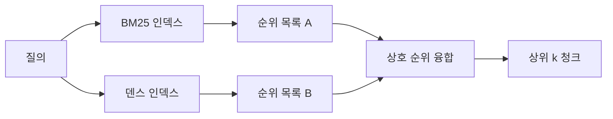

> 🇰🇷 이 문서는 한국어 번역본입니다(ELI5 스타일). 원문: [en.md](en.md)

# BM25와 덴스 임베딩을 활용한 하이브리드 검색

> 어휘(lexical) 검색과 의미(semantic) 검색은 서로 다른 질의 분포에서 각각 실패합니다. 상호 순위 융합(reciprocal rank fusion)을 쓰는 하이브리드 검색은 절충하지 않고 투표합니다 — 그리고 그 투표가 모든 질의 유형에서 이깁니다.

**유형:** Build
**언어:** Python
**선수 지식:** 페이즈 11 레슨 04(임베딩), 06(RAG); 페이즈 19 트랙 B 기초(레슨 20-29); 페이즈 19 레슨 64(청킹 전략)
**시간:** ~90분

## 학습 목표
- Robertson과 Sparck Jones 공식부터 BM25를 직접 구현합니다. 필드 가중치, 문서 길이 정규화, 조정 가능한 k1과 b를 포함합니다.
- 결정론적 목 임베딩 위에 덴스 검색기를 만들어 루프가 오프라인에서 돌게 합니다.
- Cormack, Clarke, Buettcher가 2009년에 발표한 그대로 상호 순위 융합(RRF)을 구현하고, 점수 가중 절충보다 왜 우세한지 설명합니다.
- RRF k 상수와 모달리티별 가중치를 조정하며 작은 고정 코퍼스에서 트레이드오프를 읽습니다.

## 문제

질의가 코퍼스에 글자 그대로 담긴 식별자를 갖고 있을 때는 어휘 검색이 이깁니다. `AbortMultipartOnFail` 검색은 BM25로 마이크로초 안에 맞는 Go 함수를 돌려줍니다. 같은 질의를 임베딩하면 세 유사도 클러스터의 경계에 놓이고, 덴스 검색기는 엉뚱한 파일을 1위로 매깁니다.

질의가 코퍼스의 글자 그대로의 토큰에서 의역되어 있을 때는 덴스 검색이 이깁니다. "취소된 업로드는 어떻게 처리하지?"라고 묻는 사용자는 abort나 multipart라는 단어를 전혀 입력하지 않았습니다. BM25는 그 페이지에 uploads라는 단어가 있다는 이유로 "큰 파일 업로드하기" 문서 청크를 돌려줍니다. 덴스 검색은 요약에 cancellation을 언급하는 abort 함수를 찾아 냅니다.

둘 중 하나를 고르는 일은 고정된 선택이 아닙니다. 질의 분포가 변하는 변수입니다. 프로덕션 RAG 시스템은 같은 엔드포인트에서 두 부류를 모두 처리하므로, 검색도 둘 다 한꺼번에 처리해야 합니다. 그것이 하이브리드 검색입니다. 그리고 병합 단계가 정확해야 하는 부분입니다.

## 개념



### 한 문단으로 보는 BM25

BM25는 질의-문서 쌍에 점수를 매기는데, 질의 각 용어에 대해 역문서빈도 계수와, 길이 정규화 보정을 포함한 포화형 용어빈도 계수를 곱한 값들을 합산합니다. 손잡이는 두 개입니다. `k1`은 용어빈도 포화를 조절합니다; 기본값 1.5가 발표된 권장값이며 벤치마크 없이는 손대지 마세요. `b`는 문서 길이가 얼마나 중요한지 조절합니다; 기본값 0.75는 긴 문서가 감점을 받되 선형적으로는 그렇지 않다는 뜻입니다.

IDF 공식은 스무딩된 Robertson-Sparck Jones 정의, 즉 `log((N - df + 0.5) / (df + 0.5) + 1)`을 씁니다. 로그 안의 +1은 용어가 코퍼스 절반 이상에 등장해도 IDF가 양수로 남게 합니다. 불용어(stopword)가 기술적으로는 드문 작은 코퍼스에서 이것이 중요합니다.

필드 가중치를 쓰면 BM25에게 심볼 이름에서의 매칭이 본문에서의 매칭보다 더 중요하다고 알려 줄 수 있습니다. 구현은 점수 계산 시점이 아니라 인덱싱 시점에 용어 수에 곱수를 얹는 방식입니다. 수학은 동일하게 유지되고 필드별 별도 점수를 피합니다.

### 한 문단으로 보는 덴스 검색

각 청크를 임베딩 모델로 고정 차원 벡터에 담습니다. 질의 시점에 질의를 임베딩하고, 유사도로 모든 청크의 코사인 순위를 매겨 상위 k를 돌려줍니다. 품질을 결정하는 변수는 모델입니다. 검색 알고리즘 자체는 두 줄입니다: 내적과 정렬.

이 레슨은 네트워크 호출 없이 융합 수학을 읽을 수 있도록 결정론적 해시 기반 임베딩을 씁니다. 해시는 토큰별 오프셋을 96차원 벡터에 더하고 정규화합니다. 코사인 순위는 실행마다 결정론적이며, 테스트 스위트가 요구하는 것도 바로 이것입니다.

### 상호 순위 융합, 발표된 공식

순위 목록 두 개. 어느 목록에든 등장하는 각 후보에 대해 역순위 기여분을 합산합니다. 2009년 논문은 `1 / (k + rank)`에 k = 60을 기본으로 썼습니다. 총점순으로 정렬합니다. 알고리즘은 그게 전부입니다.

발표된 상수 k = 60은 아무렇게나 정해진 게 아닙니다. k = 60이면 1위 기여분은 1 / 61이고 10위 기여분은 1 / 70입니다. 기여분이 천천히 감쇠하기 때문에 아래쪽 후보도 여전히 투표합니다. k가 작으면 상위 결과가 지배합니다. k가 크면 기여 곡선이 평평해집니다.

우리 구현에는 조정 가능한 손잡이가 둘 있습니다. `k` 상수. 그리고 BM25나 덴스 중 어느 쪽이 여러분 코퍼스에서 더 낫다는 사전 증거가 있을 때 한쪽을 부스트할 수 있게 해 주는 모달리티별 가중치 쌍. 순위 기여분에 가중치를 곱하는 것이 가장 단순하고 원칙적인 구현입니다; 순위 감쇠 형태를 보존하고 스케일 자유롭게 유지됩니다.

### 융합이 점수 가중 절충을 이기는 이유

BM25 점수는 상한이 없고 코퍼스에 따라 달라집니다. 코사인 유사도는 -1부터 1로 한정됩니다. `alpha * bm25 + (1 - alpha) * cosine` 같은 선형 조합은 코퍼스마다 alpha를 조정해야 하고, 재인덱싱할 때마다 깨집니다. 순위 기반 융합은 그렇지 않습니다. 순위끼리는 모달리티를 넘어 비교 가능합니다. 발표된 RRF 베이스라인은 2010년 이후 모든 공개 TREC 트랙에서 점수 절충을 이겼습니다.

Vespa와 Weaviate 문서에서 들을 수 있는 RankFusion vs RRF 논쟁도 같은 이야기입니다. 둘 다 같은 결론에 도달했습니다: 점수를 절충할 아주 강한 증거가 없다면 순위 기반에 머물 것.

```figure
rrf-fusion
```

## 만들어 보기

`code/main.py`는 다음을 구현합니다:

- `tokenize(text)` - 빠른 정규식 토크나이저.
- `BM25Index` - 필드 가중치 지원, `add`와 `search`, 조정 가능한 k1, b.
- `mock_embed`, `DenseIndex` - 청크를 비교할 수 있도록 레슨 64와 같은 결정론적 임베딩.
- `rrf(rankings, k, weights)` - 모달리티별 가중치를 지원하는 발표된 융합.
- `HybridRetriever` - BM25와 덴스를 결합.
- 데모 `main()` - 작은 고정 코퍼스를 읽어 들이고, 각 검색기의 강점과 약점을 겨냥한 세 질의를 돌리고, 각 모달리티가 만든 순위 목록과 융합 목록을 출력합니다.

실행:

```bash
python3 code/main.py
```

데모 출력을 나란히 읽어 보세요. 글자 그대로의 식별자 질의는 BM25 1위, 덴스 4위, RRF 1위에 놓입니다. 의역된 질의는 BM25 6위, 덴스 1위, RRF 1위입니다. 애매한 질의는 BM25 3위, 덴스 3위, RRF 1위입니다. 융합은 동점 처리 도구가 아니라, 모든 질의 부류에서 이기는 시스템입니다.

## 손잡이 조정하기

| 손잡이 | 기본값 | 올릴 때 | 내릴 때 |
|------|---------|----------------|------------------|
| BM25 k1 | 1.5 | 문서 안에서 용어가 반복되고 빈도가 더 중요해야 할 때 | 문서가 짧고 용어 반복이 잡음일 때 |
| BM25 b | 0.75 | 긴 문서가 실제로 단어당 전달하는 정보가 적을 때 | 문서 길이와 주제가 무관할 때 |
| RRF k | 60 | 아래쪽 후보도 계속 투표해야 할 때 | 상위 1이 지배해야 할 때 |
| BM25 가중치 | 1.0 | 코퍼스에 글자 그대로의 식별자가 있고 질의가 그것에 맞을 때 | 질의가 사용자 의역일 때 |
| 덴스 가중치 | 1.0 | 질의가 의역됐을 때 | 질의가 글자 그대로일 때 |

직관이 아니라, 홀드아웃 질의 집합에 레슨 68의 평가 하니스를 다시 돌려서 조정하세요.

## 데모가 숨겨 주는 실패 모드

**어휘 밖 토큰.** BM25의 IDF는 코퍼스에서 계산되므로 질의에만 있는 용어는 기여분이 0입니다. 덴스 임베딩은 같은 용어에 그럴듯한 벡터를 지어 냅니다. 코퍼스 밖 식별자에서 덴스 모달리티는 그럴듯해 보이지만 틀린 이웃들을 돌려줍니다. 융합은 BM25가 아무것도 돌려주지 않으면 순위 기여분이 빠지기 때문에 이를 흡수합니다 — 하지만 청크가 아니라 문서 단위로 중복 제거할 때만 그렇습니다.

**불용어 지배.** BM25에 "the" 같은 단어로 검색하면 코퍼스 전체에 균일한 순위가 나옵니다. 인덱서에서 불용 토큰을 거르거나, 고IDF 용어가 자연스럽게 지배한다는 사실을 받아들이세요.

**모달리티 간 동일한 내용.** 코퍼스가 작아서 BM25의 1위가 덴스의 1위와 같다면, RRF도 같은 1위를 같은 이웃과 함께 돌려줍니다. 이는 실패가 아니라 올바른 행동이지만, 융합이 안 보이게 만듭니다. 평가에 공격적인 질의 쌍을 추가해 융합이 실제로 작동하는지 검증하세요.

## 활용하기

프로덕션 패턴:

- BM25는 프로세스 안에서 인덱스하세요. 병목은 벡터가 아니라 용어빈도 사전입니다.
- 덴스 벡터는 별도 스토어에 인덱스하세요(이 레슨은 평면 리스트를 씁니다; 프로덕션에서는 HNSW를 씁니다).
- 두 검색을 병렬로 실행하세요. 융합은 합집합 위의 상수 시간 병합입니다.
- 검색된 히트마다 모달리티를 저장해서, 다운스트림 리랭커가 어떤 모달리티가 투표했는지 볼 수 있게 하세요.

## 출시하기

레슨 66은 이 레슨의 융합 상위 k를 받아 크로스 인코더로 리랭크합니다. 레슨 68은 파이프라인 전체를 정밀도, 리콜, MRR, nDCG로 평가합니다. 이 레슨의 하이브리드 검색기는 레슨 69 엔드투엔드 시스템의 1단계입니다.

## 연습 문제

1. `mock_embed`를 여러분 제공자의 실제 모델로 바꿉니다. 데모를 다시 돌리고 의역된 질의에서 덴스 전용 순위가 어떻게 바뀌는지 보고하세요.
2. 세 번째 모달리티를 추가합니다: 청크 요약을 별도로 인덱싱해 세 번째 순위 목록으로 융합합니다. 이득을 측정하세요.
3. RRF k를 10, 30, 60, 100, 200으로 훑습니다. 레슨 68의 recall@k 곡선을 그리고, 여러분 코퍼스에서 곡선이 정점에 도달하는 k를 보고하세요.
4. BM25F를 제대로 구현합니다(곱수 트릭 대신 필드별 길이 정규화)하고, 심볼 매칭이 가장 중요한 코퍼스에서 비교하세요.

## 핵심 용어

| 용어 | 사람들의 표현 | 실제 의미 |
|------|-----------------|------------------------|
| BM25 | "어휘 검색" | idf x 포화 tf x 길이 정규화를 쓰는 확률적 순위 매기기 |
| RRF | "순위 융합" | 순위 목록들에 걸쳐 1 / (k + rank)를 합산; 기본 k = 60 |
| k1 | "TF 포화" | 반복된 용어가 얼마나 빨리 추가 점수를 못 얻게 되는지 조절 |
| b | "길이 페널티" | 0은 문서 길이 무시, 1은 완전 정규화 |
| 필드 가중치 | "심볼 부스트" | 해당 필드의 매칭을 부스트하려고 인덱싱 때 토큰을 반복 |
| 순위 기반 vs 점수 기반 융합 | "RRF가 선형을 이기는 이유" | 순위는 모달리티를 넘어 비교 가능하지만 점수는 그렇지 않음 |

## 더 읽을거리

- Cormack, Clarke, Buettcher, "Reciprocal Rank Fusion outperforms Condorcet and individual rank learning methods", SIGIR 2009
- Robertson, Walker, Beaulieu, Gatford, Payne, "Okapi at TREC-3" (BM25 원논문)
- [Vespa: Hybrid Retrieval with BM25 and Embeddings](https://docs.vespa.ai/en/tutorials/hybrid-search.html)
- [Weaviate: Hybrid Search](https://weaviate.io/developers/weaviate/search/hybrid)
- 페이즈 11 레슨 06 - RAG 기초
- 페이즈 19 레슨 64 - 여기서 인덱싱되는 청크를 만드는 청커
- 페이즈 19 레슨 66 - 융합 상위 k를 소비하는 크로스 인코더 리랭커
