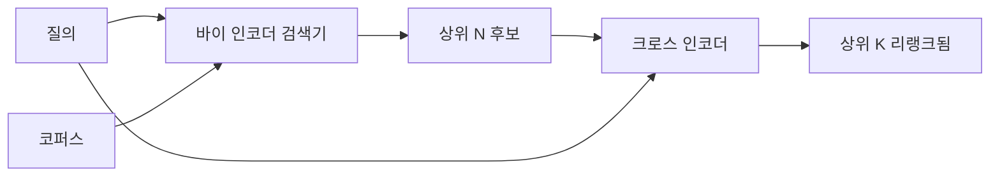

> 🇰🇷 이 문서는 한국어 번역본입니다(ELI5 스타일). 원문: [en.md](en.md)

# 크로스 인코더 리랭커

> 바이 인코더(bi-encoder)는 질의와 문서를 독립적으로 임베딩합니다. 크로스 인코더는 둘을 이어 붙여 한 번에 읽습니다. 크로스 인코더는 가장 똑똑한 독자이면서 가장 느립니다. 바이 인코더의 상위 k에 2단계로 붙이면 그 값어치를 합니다.

**유형:** Build
**언어:** Python
**선수 지식:** 페이즈 11 레슨 06(RAG), 페이즈 11 레슨 07(고급 RAG); 페이즈 19 트랙 B 기초(레슨 20-29); 페이즈 19 레슨 65(이 단계에 먹이를 주는 하이브리드 검색)
**시간:** ~90분

## 학습 목표
- 입력 형태, 파라미터 수, 질의당 비용으로 바이 인코더 검색기와 크로스 인코더 리랭커를 구분합니다.
- 패킹된 (질의, 문서) 시퀀스를 받아 관련도 스칼라 하나를 내놓는 트랜스포머 블록으로 작은 크로스 인코더를 직접 구현합니다.
- 검색 후 리랭크 2단계 파이프라인을 연결합니다: 저렴한 검색기로 상위 N을 검색하고, 크로스 인코더로 N을 상위 K로 리랭크해 K를 돌려줍니다.
- 작은 고정 코퍼스에서 지연 시간 대 품질 트레이드오프를 측정하고, 주어진 지연 시간 예산에 맞는 N을 고릅니다.

## 문제

바이 인코더는 질의와 문서를 같은 벡터 공간에 매핑하고 코사인으로 순위를 매깁니다. 두 인코딩은 서로를 결코 보지 못합니다. 모델은 질의를 보지 못한 채 문서에 관한 유용한 모든 것을 단일 벡터에 압축해야 합니다. 인덱싱 시점에 문서당 임베딩 한 번, 질의 시점에 질의당 임베딩 한 번으로 끝나므로 빠릅니다 — 그리고 코퍼스 규모의 순위 매기기에는 이것만이 유일한 방법입니다.

대가는 정밀도입니다. 전체 주제가 같은 두 문서는, 하나가 질의에 답하고 다른 하나가 답하지 않더라도 거의 동일한 임베딩을 가질 수 있습니다. 바이 인코더는 둘을 구분하지 못합니다.

크로스 인코더는 질의와 문서를 함께 읽어 이 문제를 해결합니다. 모델은 `[query] [SEP] [document]`를 단일 시퀀스로 받고, 이어지는 지점 전체에 걸쳐 완전한 어텐션을 실행하며, 관련도 스칼라 하나를 만듭니다. 문서의 모든 토큰이 질의의 모든 토큰을 주시할 수 있습니다. 모델은 완전한 맥락을 갖고 점수를 결정합니다.

대가는 처리량(throughput)입니다. 바이 인코더는 한 번 임베딩해서 영원히 질의하는 반면, 크로스 인코더는 (질의, 문서) 쌍마다 한 번씩 돕니다. 1천만 문서 코퍼스라면 질의마다 천만 번의 포워드 패스입니다. 요청 예산 안에서는 불가능합니다.

해답은 단계 나누기입니다. 바이 인코더로 상위 N을 검색합니다. 크로스 인코더로 그 N을 상위 K로 리랭크합니다. N은 작고(50~200) 크로스 인코더의 품질 상승분은 정말 중요한 곳에 집중됩니다. 총 지연 시간은 요청 예산 안에 머뭅니다. 총 품질은 크로스 인코더의 품질이되, N 지점에서의 바이 인코더 리콜이 상한이 됩니다.

## 개념



### 크로스 인코더의 입력 형태

표준 패킹은 `[CLS] query_tokens [SEP] document_tokens [SEP]`입니다. CLS 위치의 출력을 관련도 스칼라를 내놓는 단일 선형 헤드에 먹입니다. 일부 구현은 CLS 대신 평균 풀링을 씁니다; 차이는 작습니다. 요점은 모델이 쌍당 숫자 하나를 만든다는 것입니다.

22M 파라미터 크로스 인코더(공개된 `ms-marco-MiniLM-L-6-v2` 웨이트 클래스)가 전형적인 프로덕션 지점입니다. 더 작은 모델은 지연 시간을 아끼는 것보다 품질을 더 빨리 잃습니다. 더 큰 모델(예: 568M 파라미터의 `bge-reranker-v2-m3`)은 오프라인 리랭킹이나, K가 작은 첫 페이지 리랭킹에 아껴 둡니다.

### 이 레슨이 아주 작은 것을 학습하는 이유

진짜 크로스 인코더는 파인튜닝된 인코더 트랜스포머입니다. 프로덕션에서는 체크포인트를 불러와 돌립니다. 이 레슨의 목표는 최첨단 랭커를 학습시키는 것이 아니라 모델의 형태와 지연-품질 곡선의 형태를 보여 주는 것입니다. 그래서 트랜스포머 블록 하나, 멀티헤드 어텐션(기본 4헤드), 회귀 헤드 하나를 가진 작은 `nn.Module`을 만듭니다. 시드로 결정론적으로 초기화되므로 디스크의 가중치 없이도 데모가 재현됩니다.

장난감 모델은 고정 코퍼스에서 올바른 형태를 배웁니다: 관련 있는 질의-문서 쌍이 관련 없는 쌍보다 높은 예측 점수를 받습니다. 엔드투엔드 파이프라인은 바이 인코더의 출력을 리랭크하고, 리랭크의 상위 k는 골드 레이블과 상관됩니다.

### 지연 시간 대 품질

2단계 파이프라인에는 조정점이 하나 있습니다: N입니다. 홀드아웃 질의 집합에서 N을 5부터 100까지 훑으면 곡선이 나옵니다.

| N | 2단계의 Recall@1 | 질의당 크로스 인코더 포워드 패스 | 지연 시간 |
|---|--------------------|---------------------------------------|---------|
| 5 | 0.62 | 5 | 낮음 |
| 20 | 0.81 | 20 | 중간 |
| 50 | 0.86 | 50 | 높음 |
| 100 | 0.86 | 100 | 매우 높음 |

위 숫자는 형태를 보여 주는 예시이며 이 고정 코퍼스에서 측정한 값이 아닙니다. 형태 자체는 진짜입니다. 리랭크 상승분이 포화되는 무릎(knee)이 항상 20~50 후보 근처에 있습니다. 무릎을 지나면 아무것도 얻지 못한 채 돈을 쓰는 겁니다.

N은 평가 곡선과 지연 시간 예산에서 고릅니다. 크로스 인코더는 N 지점의 바이 인코더 리콜 이상으로 리콜을 끌어올릴 수 없으므로, 낮은 N은 지연 시간만이 아니라 품질의 상한이 됩니다.

```figure
rerank-funnel
```

## 만들어 보기

`code/main.py`는 다음을 구현합니다:

- `CrossEncoder` - 작은 `torch.nn.Module`: 토큰 임베딩, 멀티헤드 어텐션과 피드포워드를 갖춘 트랜스포머 블록 하나, 스칼라 하나를 만드는 평균 풀링 헤드.
- `tokenize_pair(query, document)` - 두 문자열을 경계를 표시하는 타입 id와 함께 단일 id 시퀀스로 패킹. 결정론적이며 표준 라이브러리만 사용.
- `train_tiny(pairs)` - 손으로 레이블을 단 (질의, 문서, 관련도) 삼중 항목 목록 위의 지도 학습 한 패스. 고정 코퍼스에서 그럴듯한 점수를 내게 함.
- `rerank(query, candidates, top_k)` - 프로덕션 인터페이스.
- `pipeline(query, retriever, top_n, top_k)` - 2단계 흐름.
- 데모 `main()` - 레슨 65 패턴의 코퍼스를 읽어 들이고, 상위 N을 검색하고, 상위 K로 리랭크하고, 두 목록을 나란히 출력하며, 각 단계의 지연 시간을 보고합니다.

실행:

```bash
python3 code/main.py
```

출력은 바이 인코더의 상위 N, 크로스 인코더의 상위 K, 타이밍 요약을 보여 줍니다. 크로스 인코더는 호출당 더 오래 걸리지만 전체 코퍼스 위에서는 돌지 않습니다. 2단계 총합은 요청 예산 안에 머물면서, 바이 인코더가 2위나 3위로 놓았던 답을 고릅니다.

## 데모가 숨겨 주는 실패 모드

**크로스 인코더는 대칭이 아닙니다.** `rerank(q, d)`와 `rerank(d, q)`는 다른 점수입니다. 항상 질의를 먼저 넣으세요. 실수로 뒤집으면 리콜이 무너집니다.

**N이 너무 낮아 버그가 드러나지 않음.** N = K로 두면 크로스 인코더는 순서를 바꿀 수 없습니다. 가중치를 다시 매길 수만 있습니다. 상승분이 0처럼 보입니다. N을 최소 K의 세 배로 두세요.

**학습 데이터가 평가로 새어 들어감.** 손 레이블 학습 쌍에 평가 질의가 포함되면 리랭크가 마법처럼 보입니다. 고정 코퍼스에서조차 학습과 평가를 철저히 분리하세요.

**프로덕션 가중치는 조밀합니다.** 22M 파라미터 크로스 인코더는 float32로 88MB입니다. 100ms 미만 p95를 약속하기 전에 모델 서버의 메모리를 계획하세요.

**배칭이 중요합니다.** 진짜 크로스 인코더는 N 후보를 한 배치로 돌립니다. 이 레슨은 그 일을 `_batch_encode`에서 합니다 — `torch.tensor(...)`로 배치된 id와 타입 id 텐서를 만들어 포워드 패스 한 번을 돌립니다. 배칭을 건너뛰면 지연 시간이 N배가 됩니다.

## 활용하기

프로덕션 패턴:

- 바이 인코더, 크로스 인코더, N을 함께 고정(pin)하세요. 하나라도 바꾸면 평가가 무효화됩니다.
- (질의, 문서_id) 해시로 리랭커 출력을 캐시하세요. 안정된 코퍼스에 대한 같은 질의는 같은 순서로 리랭크됩니다; 캐시 히트는 공짜 지연 시간 절감입니다.
- 크로스 인코더의 1위 점수를 로그에 남기세요. 최상위 점수가 코퍼스별 임계값 아래인 질의는 도메인 밖 히트입니다; LLM에게 "확신이 없다"고 전달하세요.

## 출시하기

레슨 68은 이 2단계 파이프라인을 엔드투엔드로 평가합니다. 레슨 69는 이 리랭커를 레슨 65의 하이브리드 검색기 뒤, 답변 생성기 앞에 연결합니다. 리랭커는 엔드투엔드 시스템의 2단계입니다.

## 연습 문제

1. N을 5부터 50까지 훑고 리랭크된 출력의 recall@1을 그립니다. 이 고정 코퍼스에서 무릎을 찾으세요.
2. 크로스 인코더를 1에포크 대신 10에포크 학습합니다. 각 에포크마다 양성 쌍과 음성 쌍 사이의 점수 마진을 측정하세요.
3. 평균 풀링을 CLS 토큰 헤드로 바꿉니다. 이 고정 코퍼스에서 수렴을 비교하세요.
4. "이 답변이 문서 안에 있는가"라는 이진 레이블을 예측하는 두 번째 크로스 인코더 헤드를 추가합니다. 추론 때 두 헤드를 모두 씁니다; 하나는 순위 매기기에, 하나는 임계값 판정에.
5. 결정론적 목 바이 인코더를 레슨 65의 것으로 바꿔 두 단계를 연결합니다. 바이 인코더 단독과 비교한 상위 K 변화를 측정하세요.

## 핵심 용어

| 용어 | 사람들의 표현 | 실제 의미 |
|------|-----------------|------------------------|
| 바이 인코더 | "벡터 검색기" | 질의와 문서를 독립적으로 인코딩; 코사인으로 순위 매김 |
| 크로스 인코더 | "리랭커" | (질의, 문서)를 함께 인코딩; 관련도 스칼라 하나를 출력 |
| 2단계 파이프라인 | "검색 후 리랭크" | 저렴한 검색기가 N을 돌려주고, 비싼 리랭커가 K를 남김 |
| N (후보 예산) | "리랭크 풀" | 크로스 인코더가 질의당 점수를 매기는 후보 수 |
| 평균 풀링 헤드 | "마지막 히든의 평균" | 인코더 마지막 층 출력들을 하나의 벡터로 평균 |

## 더 읽을거리

- Nogueira, Cho, "Passage Re-ranking with BERT", 2019 - 크로스 인코더 랭커의 정석 논문
- Reimers, Gurevych, "Sentence-BERT: Sentence Embeddings using Siamese BERT-Networks", 2019 - 바이 인코더 vs 크로스 인코더
- [SentenceTransformers Cross-Encoders documentation](https://www.sbert.net/examples/applications/cross-encoder/README.html)
- [BGE Reranker v2 model card](https://huggingface.co/BAAI/bge-reranker-v2-m3)
- 페이즈 19 레슨 65 - 이 리랭크 단계에 먹이를 주는 하이브리드 검색기
- 페이즈 19 레슨 68 - 이 리랭크가 전달하는 상승분을 측정하는 평가
