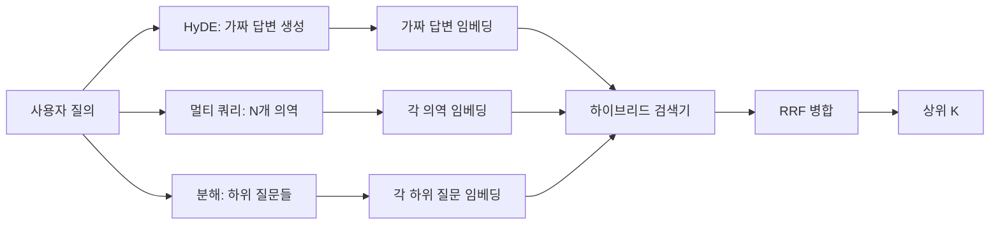

> 🇰🇷 이 문서는 한국어 번역본입니다(ELI5 스타일). 원문: [en.md](en.md)

# 질의 재작성: HyDE, 멀티 쿼리, 분해

> 사용자가 입력하는 질의는 검색기가 원하는 질의가 아닙니다. 재작성은 검색 전에 그 간극을 메워서, 인덱스가 답의 모습과 더 가까운 것을 보게 만듭니다.

**유형:** Build
**언어:** Python
**선수 지식:** 페이즈 11 레슨 04(임베딩), 06(RAG); 페이즈 19 트랙 B 기초(레슨 20-29); 페이즈 19 레슨 64, 65
**시간:** ~90분

## 학습 목표
- 가상 문서 임베딩(HyDE)을 구현합니다: 가짜 답변을 생성하고, 그것을 임베딩하고, 질의 벡터 대신 그 벡터로 검색합니다.
- 멀티 쿼리 확장을 구현합니다: 질의 하나를 N개 의역으로 다시 쓰고, 각각으로 검색하고, 그 합집합을 상호 순위 융합으로 병합합니다.
- 질의 분해를 구현합니다: 복잡한 질문을 하위 질문들로 쪼개고, 하위 질문별로 검색하고, 병합합니다.
- 세 재작성기를 고정 코퍼스에서 나란히 비교하고, 각 전략이 언제 이기는지 설명합니다.
- 결정론적이고 고정 코퍼스에 맞는 출력을 내는 목 LLM을 연결해 재작성기 루프가 오프라인에서 돌게 합니다.

## 문제

사용자가 "업로드가 실패하고 예산도 사라졌을 때 우리 팀은 뭘 하지?"라고 입력합니다. 코퍼스에는 "AbortMultipartOnFail은 진행 중인 S3 멀티파트 업로드를 중단(aborts)하고 업로드 실패 시 버킷별 재시도 예산을 감소시킨다"고 쓴 문서가 있습니다. 질의와 문서는 명사구를 하나도 공유하지 않습니다. BM25는 놓칩니다. 바이 인코더는 문서를 3위나 4위로 매깁니다. 질의 벡터가 임베딩 공간에서 취소된 작업(canceled jobs) 문서를 선호하는 영역에 착지했기 때문입니다. 레슨 66의 2단계 리랭크는 그 답이 상위 N 안에만 들어 있다면 건져 올릴 수 있습니다. 하지만 상위 N조차 못 들어가면 리랭커는 그것을 영영 보지 못합니다.

해법은 질의가 검색기에 닿기 전에 다시 쓰는 것입니다. 2023년 논문 "Precise Zero-Shot Dense Retrieval without Relevance Labels" (Gao et al.)가 HyDE를 소개했습니다: LLM에게 질의에 답할 문서를 쓰라고 하고, 그 가상 문서를 임베딩하고, 그 임베딩을 검색 벡터로 씁니다. 가상 문서는 코퍼스의 말투로 쓰였기 때문에 임베딩 공간의 올바른 영역에 놓입니다. 질의 벡터는 그러지 못했죠.

HyDE와 짝을 이루는 사촌 기술이 둘 있습니다. 멀티 쿼리 확장(마이크로소프트 GraphRAG가 쓴 용어)은 질의의 N개 의역을 생성해 각각으로 검색한 뒤 병합합니다. 분해(2024년 스탠퍼드 DSPy 연구에서 "subquery decomposition"으로 널리 알려짐)는 "업로드가 실패하고 예산도 사라졌을 때 우리 팀은 뭘 하지"를 두 질문으로 쪼갭니다: "업로드가 실패하면 무슨 일이 벌어지나", "재시도 예산이 사라지면 무슨 일이 벌어지나". 검색 두 번, 병합된 결과 하나, 답의 두 조각 모두 도달 가능.

이 레슨은 셋 모두를 구현하고 같은 고정 코퍼스에서 돌립니다.

## 개념



### HyDE 상세

HyDE는 사용자의 질의 벡터를 LLM이 쓴 가상 문서 벡터로 바꿉니다. 프롬프트는 짧습니다:

```
You are a domain expert. Write a one-paragraph passage that answers the question
below. Use the same vocabulary and phrasing the documentation in this domain would
use. Do not refuse. Do not say you do not know.

Question: {user_query}

Passage:
```

LLM의 답변은 사실적 답변으로서는 틀립니다. LLM은 여러분의 코퍼스를 모르니까요. 괜찮습니다. 검색기는 사실 정확성이 아니라 토큰 분포만 봅니다. 가상 문단에는 "abort", "multipart", "bucket", "budget" 같은 단어가 들어 있습니다. 이 주제의 문서 문단이라면 그렇게 쓸 테니까요. 그 문단을 임베딩하세요. 그 벡터는 진짜 문단 근처에 착지합니다.

프로덕션에서는 가상 문서를 두세 문장으로 제한하세요. 긴 가상 문서는 잡음을 더 모읍니다. 짧으면 HyDE에 필요한 어휘 신호를 잃습니다.

### 멀티 쿼리 확장 상세

사용자 질의의 N개 의역을 생성합니다. 가장 단순한 프롬프트:

```
Rewrite the following question in {N} different ways. Each rewrite must preserve
the original intent. Number them 1 to {N}. Do not add explanations.
```

각 의역에 대해 상위 k를 검색합니다. N개의 순위 목록을 RRF로 병합합니다(레슨 65와 같은 알고리즘). 저렴하고, 병렬이고, 결정론적입니다.

멀티 쿼리는 사용자의 표현이 똑같이 유효한 여러 표현 중 하나이고, 어떤 의역이든 원본보다 더 잘 물었을 때 이깁니다. 원본이 틀린 방식으로 틀려서 모든 의역이 똑같이 나쁠 때는 집니다.

### 분해 상세

단일 검색으로는 여러 면을 가진 질문을 충족할 수 없습니다. 분해는 LLM에게 질문을 하위 질문들로 쪼개라고 하고, 시스템은 하위 질문별로 검색합니다. 프롬프트:

```
The following question may require information from multiple distinct topics.
Decompose it into a list of sub-questions. Each sub-question must be answerable
independently. If the question is already atomic, return it unchanged.

Question: {user_query}
```

하위 질문별로 검색합니다. 병합합니다. 분해는 접속사, 다중 절 비교, 서로 무관한 두 주제를 담은 질문에 맞는 도구입니다. 원자적 질문에는 잘못된 도구입니다; 거기서 분해기의 임무는 질문 하나를 그대로 돌려주고 가짜 하위 질문을 지어내지 않는 것입니다.

### 셋이 모두 존재하는 이유

셋은 상호 보완적입니다. HyDE는 질의-코퍼스 토큰 간극을 메웁니다. 멀티 쿼리는 의역 분산을 커버합니다. 분해는 다중 주제 질의를 커버합니다. 프로덕션 시스템은 셋 모두를 돌리고 질의별로 전략을 고릅니다(레슨 69의 엔드투엔드 시스템이 그 선택기를 보여 줍니다).

## 목 LLM

이 레슨은 오프라인에서 돕니다. 목 LLM은 사용자 질의를 키로 하는 작은 조회 테이블과, 본 적 없는 질의용 폴백으로 이루어집니다. 조회 테이블에는:

- 고정 코퍼스 질의마다: 쓰여진 가상 문단 하나, 의역 셋, 분해 하나.
- 알 수 없는 질의에는: 결정론적 변환 — 질의의 내용어를 뽑아 동의어 맵으로 확장해 결과를 돌려줍니다.

중요한 것은 데이터가 아니라 목의 형태입니다. 프로덕션에서는 목을 실제 모델 호출로 바꿉니다. 검색기는 바뀌지 않습니다.

```figure
cd-hyde-vector
```

## 만들어 보기

`code/main.py`는 다음을 구현합니다:

- `MockLLM` - 위에서 설명한 결정론적 대역.
- `HyDERewriter` - LLM을 호출해 가상 문서를 쓰게 하고, 가상 텍스트와 검색기가 써야 할 질의를 담은 `RewriteResult`로 재작성기 출력을 돌려줍니다.
- `MultiQueryRewriter` - LLM에 N개 의역을 요청하고 질의 리스트를 돌려줍니다.
- `DecomposeRewriter` - LLM에 분해를 요청하고 하위 질문들을 돌려줍니다.
- `retrieve_with_rewriter` - 재작성기와 검색기를 받아 재작성을 실행하고 결과를 융합합니다.
- 데모 - 고정 코퍼스에서 세 재작성기를 돌리고, 어느 전략이 골드 답변 문서를 가장 먼저 돌려줬는지 출력합니다.

검색기 형태는 레슨 65(하이브리드 BM25 + 덴스)에서 재사용합니다. 융합도 같은 RRF입니다. 새로운 형태는 작은 재작성기 인터페이스뿐입니다.

실행:

```bash
python3 code/main.py
```

출력은 전략별 순위와 최종 요약입니다. 표현이 어긋난 질의에서는 HyDE가 이깁니다. 의역 분산 질의에서는 멀티 쿼리가 이깁니다. 다중 주제 질의에서는 분해가 이깁니다. 폴백(재작성기 없음)은 셋 중 최소 하나에서 집니다.

## 데모가 숨겨 주는 실패 모드

**HyDE가 코퍼스별 식별자를 잘못 지어냅니다.** 모델이 함수 이름을 만들어 냅니다. 지어낸 이름이 인덱스에 없는 고가중 토큰이 되면서, 올바른 문서에 대한 가상 문서의 BM25 점수가 무너집니다. 가상 문서 길이를 제한하고 융합에서 BM25 가중치를 낮추세요.

**멀티 쿼리 의역이 전부 수렴합니다.** 약한 모델은 거의 동일한 의역 셋을 만듭니다. N개 검색이 같은 상위 k를 돌려줍니다. RRF 병합이 단일 검색보다 나을 게 없습니다. 재작성 프롬프트에 명시적 다양성 지시를 넣고, Jaccard로 중복을 탐지하세요.

**분해가 과하게 쪼갭니다.** 분해기가 원자적 질문을 목록으로 만들어 버립니다. 검색들이 모두 같은 문서를 더 낮은 순위로 돌려줍니다. 병합이 원본보다 나빠집니다. 확산(fan-out) 전에 "이 하위 질문들이 충분히 구별되는가" 판사를 돌려 탐지하세요.

**지연 시간이 곱해집니다.** HyDE는 LLM 호출 한 번입니다. 멀티 쿼리는 N개 재작성 생성에 LLM 호출 한 번, 그다음 N번 검색입니다. 분해는 분해에 LLM 호출 한 번, 그다음 M번 검색입니다. 검색은 병렬로 돕니다; 바닥은 LLM 호출입니다.

## 활용하기

프로덕션 패턴:

- 질의 길이별 전략 선택: 원자적인 짧은 질의에는 멀티 쿼리, 복잡한 다중 절 질의에는 분해, 전문 용어가 많은 질의에는 HyDE.
- 질의 해시로 재작성기 출력을 캐시하세요. 같은 질의가 많이 반복됩니다.
- 셋을 모두 병렬로 돌리고 세 결과 집합을 RRF로 하나로 융합하세요. 비용은 LLM 호출 셋과 융합 한 번이고, 품질은 세 전략 커버리지의 합집합입니다.

## 출시하기

레슨 69는 이 재작성기 단계를 레슨 65의 검색기와 레슨 66의 리랭커 앞에 연결합니다. 레슨 68은 재작성기가 검색 리콜에 더하는 상승분을 평가합니다.

## 연습 문제

1. RAG-Fusion(멀티 쿼리의 2024년 변형)을 구현합니다. 재작성기의 의역이 의도적으로 다양하고, 리랭크 단계(레슨 66)가 최종 목록을 고릅니다.
2. 네 번째 전략을 추가합니다: 스텝백 프롬프팅(step-back prompting) — LLM에게 더 일반적인 질문을 청하고, 그것으로 검색한 뒤 좁힙니다. 고정 코퍼스에서 비교하세요.
3. 분해기에 "질문이 원자적인가" 헤드를 더해 원자적 질의를 알아보게 학습합니다. 과분해 비율을 전후로 측정하세요.
4. 목 LLM을 실제 모델 호출로 바꿉니다. 여러분 스택에서 전략별 지연 시간을 측정하세요.
5. 재작성마다 신뢰도 점수를 추가합니다. 임계값 아래 재작성은 버립니다. 리콜에 미치는 영향을 측정하세요.

## 핵심 용어

| 용어 | 사람들의 표현 | 실제 의미 |
|------|-----------------|------------------------|
| HyDE | "가짜 문서 검색" | LLM이 답을 씀; 질의 대신 그것을 임베딩해 검색 |
| 멀티 쿼리 | "의역 확장" | 질의를 N개로 재작성; N번 검색하고 RRF로 병합 |
| 분해 | "하위 질의 분할" | 다중 주제 질의를 하위 질문으로 쪼개 각각 검색 |
| 원자적 질의 | "단일 주제" | 가짜 하위 질문을 지어내지 않고는 분해할 수 없음 |
| 스텝백 | "질의 추상화" | 더 일반적인 질문을 청하고 검색한 뒤 좁힘 |

## 더 읽을거리

- Gao, Ma, Lin, Callan, "Precise Zero-Shot Dense Retrieval without Relevance Labels" (HyDE), 2023
- Microsoft Research, "Multi-Query Expansion for Retrieval"
- Stanford DSPy, "Subquery Decomposition for Multi-Hop QA"
- [LlamaIndex query transformations documentation](https://docs.llamaindex.ai/en/stable/optimizing/advanced_retrieval/query_transformations/)
- 페이즈 11 레슨 07 - 고급 RAG 패턴
- 페이즈 19 레슨 65 - 이 재작성기가 먹이를 주는 검색기
- 페이즈 19 레슨 68 - 재작성기 상승분을 측정하는 평가
