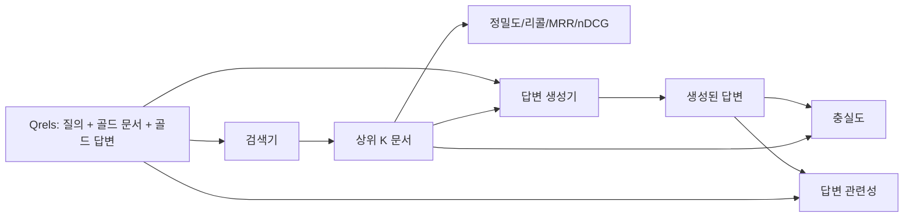

> 🇰🇷 이 문서는 한국어 번역본입니다(ELI5 스타일). 원문: [en.md](en.md)

# RAG 평가: 정밀도, 리콜, MRR, nDCG, 충실도, 답변 관련성

> 검색과 답변을 동시에 채점할 수 없다면 시스템을 출시할 수 없습니다. 둘은 같은 지표가 아니며, 같은 프롬프트도 축마다 다르게 실패합니다.

**유형:** Build
**언어:** Python
**선수 지식:** 페이즈 11 레슨 06(RAG), 10(평가); 페이즈 19 트랙 B 기초(레슨 20-29); 페이즈 19 레슨 64, 65, 66, 67
**시간:** ~90분

## 학습 목표
- 골드 qrels로부터 네 가지 검색 지표를 계산합니다: precision@k, recall@k, MRR(평균 역순위), nDCG@k.
- 두 가지 답변 채점 지표를 계산합니다: 충실도(모든 주장이 검색된 맥락에 근거함)와 답변 관련성(답변이 질문에 부합함).
- 평가가 끝까지 읽을 수 있는 고정 qrels 파일(질의, 골드 문서 id, 골드 답변 텍스트)을 만듭니다.
- 지표 값을 읽어 파이프라인이 어디서 실패하는지 — 검색, 순위 매기기, 생성, 근거 붙이기 — 진단합니다.

## 문제

RAG 시스템에는 움직이는 부품이 최소 넷 있습니다: 청커, 검색기, 리랭커, 생성기. 틀린 답변의 원인은 셋 중 어느 것이든 될 수 있습니다. 단계별 지표가 없으면 눈을 감고 나는 격입니다.

사용자가 틀린 답변을 신고했습니다. 청커가 답변 스팬을 잘라 버렸기 때문일까요? 검색기가 그 청크를 상위 k에 넣지 않았기 때문일까요? 리랭커가 맞는 청크를 1위에서 밀어냈기 때문일까요? 생성기가 청크를 무시하고 뭔가 지어냈기 때문일까요? 답변만 봐서는 알 수 없습니다. 필요한 것:

- 검색기에서 나온 것을 채점할 검색 지표.
- 맞는 청크가 순서에서 어디에 놓였는지 채점할 순위 지표.
- 생성기가 검색된 맥락 안에 머물렀는지 채점할 충실도.
- 답변이 질문에라도 부합하는지 채점할 답변 관련성.

이 레슨은 고정 qrels 파일 위에 이 여섯을 모두 만듭니다. 평가는 오프라인이며 결정론적입니다; 프로덕션에서는 목 LLM 판사(LLM-as-judge)를 실제 판사로 바꿉니다.

## 개념



### Precision@k

검색기가 돌려준 상위 k 문서 중 골드 집합에 속하는 비율은 얼마일까요? 골드에 문서 셋이 있고 상위 3이 그중 둘과 엉뚱한 하나를 돌려줬다면, precision@3은 2 / 3입니다. 관련 없는 검색 결과의 비용이 높을 때(생성기가 거기에 토큰을 낭비하거나, 그 청크가 답변을 오염시킬 때) 정밀도를 씁니다.

### Recall@k

골드 문서 중 상위 k에 들어간 비율은 얼마일까요? 골드에 문서 셋이 있고 상위 5가 셋 모두를 담고 있다면, recall@5는 1.0입니다. 놓친 답변의 비용이 높을 때(답변 청크를 완전히 놓치는 것보다 엉뚱한 청크가 하나 더 보이는 편이 낫을 때) 리콜을 씁니다.

프로덕션 RAG에서 사람들이 보통 인용하는 지표는 recall@k입니다. 생성은 관련 없는 청크를 쉽게 버릴 수 있습니다; 하지만 한 번도 본 적 없는 청크에서 답을 지어낼 수는 없습니다.

### MRR (Mean Reciprocal Rank)

각 질의에 대해 순위 목록에서 첫 번째 관련 문서의 위치를 찾습니다. 역순위는 1 / 위치입니다. 질의 집합 전체에서 평균을 냅니다. MRR은 검색기가 최고의 답을 맨 위에 올리는 능력을 한 숫자로 요약합니다.

MRR은 1위에 큰 가중치를 둡니다. 골드 문서가 1위인 질의는 1.0을 기여합니다. 2위는 0.5입니다. 10위는 0.1입니다. 지표는 목록의 꼭대기가 지배합니다.

### nDCG@k

정규화 할인 누적 이득(Normalized Discounted Cumulative Gain). 전체 공식은 검색된 각 문서에 이득을 부여하고(보통 관련이면 1, 아니면 0), 위치의 로그로 할인하고, 합산한 뒤 이상적 DCG(완벽하게 순위를 매겼을 때의 DCG)로 나눕니다. 범위는 0부터 1입니다.

nDCG는 등급화된 관련도를 다룹니다: 골드가 "문서 A는 3, 문서 B는 2, 문서 C는 1"이라고 말할 수 있습니다. MRR과 recall@k는 모든 것을 이진으로 평평하게 만듭니다. 질의마다 부분적으로 관련된 문서가 여럿인 코퍼스에서는 nDCG를 쓰세요.

### 충실도

생성된 답변의 각 주장에 대해, 그 주장이 검색된 맥락에 의해 뒷받침되는지 검사합니다. 표준 구현은 (주장, 맥락)을 받아 예나 아니오를 돌려주는 LLM 판사 프롬프트를 씁니다. 지표는 통과한 주장의 비율입니다.

충실도는 모델이 내용을 지어내는 생성기 실패 모드를 잡아 냅니다. 검색기가 맞는 청크를 돌려줬더라도, 환각하는 생성기는 고장 난 것입니다. 충실도는 groundedness, support, attribution이라고도 부릅니다.

이 레슨은 결정론적 목 판사로 충실도를 구현합니다. 각 주장의 토큰이 검색된 맥락과 임계값 이상 겹치는지 검사합니다. 프로덕션에서는 실제 모델 호출로 바꿉니다. 지표의 형태는 같습니다.

### 답변 관련성

답변이 정말 질문에 부합할까요? 충실도는 "답변이 맥락에 근거하는가?"를 묻습니다. 답변 관련성은 "답변이 질문에 근거하는가?"를 묻습니다. 충실하지만 주제를 벗어난 답변은 충실도는 높고 관련성은 낮습니다. 맥락을 무시하는 짧고 주제에 맞는 답변은 관련성은 높고 충실도는 낮습니다.

표준 구현은 여기서도 LLM 판사를 씁니다: (질문, 답변)을 받아 답변이 질문에 부합하는지 묻습니다. 이 레슨은 토큰 겹침 + 판사 대역을 구현합니다.

## 고정 qrels

```python
{
  "qid": "q1",
  "query": "what is the abort threshold for multipart uploads",
  "gold_doc_ids": ["d1", "d3"],
  "gold_answer_substring": "three failed parts",
  "graded_relevance": {"d1": 3, "d3": 2},
}
```

각 질의는 다음을 담습니다:
- 질의 문자열,
- 골드 문서 id 집합 (정밀도 / 리콜 / MRR용),
- 등급화된 관련도 dict (nDCG용),
- 골드 답변 부분 문자열(각 qrel에 참조 메타데이터로 유지; 이 레슨의 충실도는 이 부분 문자열이 아니라 추출한 주장들을 검색된 맥락에 대고 판정해 계산합니다).

프로덕션에서는 이것들을 직접 레이블링합니다. 이 레슨은 평가가 바로 돌도록 손으로 만든 고정 파일을 실어 보냅니다.

```figure
ci-rag-metric-ladder
```

## 만들어 보기

`code/main.py`는 다음을 구현합니다:

- `precision_at_k(retrieved, gold, k)` - 문자 그대로의 정의.
- `recall_at_k(retrieved, gold, k)` - 문자 그대로의 정의.
- `mean_reciprocal_rank(retrieved_list_of_lists, gold_list)` - 질의들에 대한 평균.
- `ndcg_at_k(retrieved, graded_relevance, k)` - 이진 또는 등급화된 이득을 쓰는 DCG / IDCG.
- `extract_claims(answer)` - 답변을 문장 모양의 주장들로 나눔.
- `faithfulness(claims, context_texts, judge)` - 뒷받침된다고 판정된 주장의 비율.
- `answer_relevance(question, answer, judge)` - 답변이 질문에 부합하는지 판사에게 물어봄.
- `MockJudge` - 평가가 오프라인에서 돌도록 하는 결정론적 토큰 겹침 판사.
- `evaluate_pipeline(pipeline_fn, qrels, ks)` - 모든 지표를 도는 오케스트레이터.
- 데모 - 세 파이프라인 변형(청커 베이스라인, 하이브리드 검색, 하이브리드 + 리랭크)을 qrels에 대고 돌리고 지표 테이블을 출력합니다.

실행:

```bash
python3 code/main.py
```

출력은 각 변형의 precision@k, recall@k, MRR, nDCG@k, 충실도, 답변 관련성을 하나의 지표 테이블에 보여 줍니다. 하이브리드 검색 행은 리콜에서 청커 베이스라인을 이기고, 리랭크 행은 MRR에서 하이브리드를 이깁니다.

## 지표를 읽어 실패 진단하기

| 증상 | 가능성 높은 원인 | 고쳐야 할 것 |
|---------|-------------|-------------|
| recall@k 낮음, precision@k 낮음 | 청커가 답변을 잘랐거나 검색기가 찾지 못함 | 청커 경계(레슨 64) 또는 검색기 모달리티(레슨 65) |
| recall@k 무난, MRR 낮음 | 맞는 청크가 상위 k 안에 있지만 1위가 아님 | 리랭커(레슨 66) |
| MRR 높음, 충실도 낮음 | 맥락이 맞는데도 생성기가 내용을 지어냄 | 생성 프롬프트; 인용 강제 또는 거절 |
| 충실도 높음, 관련성 낮음 | 답변은 근거가 있지만 주제를 벗어남 | 질의 재작성기(레슨 67) 또는 생성 프롬프트 |
| 네 지표 모두 높음, 그런데도 사용자 불만 | 평가 집합이 대표성이 없음 | 실제 사용자 질의로 qrels 확장 |

## 데모가 숨겨 주는 실패 모드

**LLM 판사 편향.** 모델은 자기 출력을 실제보다 충실하다고 판정합니다. 생성기와 다른 모델 계열을 판사로 쓰거나, 표본을 손으로 채점하세요.

**Qrels 썩음.** 코퍼스가 바뀌면 골드 답변도 흐릅니다. 2024년 1월에 q1의 골드였던 문서는 팀이 함수 이름을 바꾼 뒤인 2024년 10월에는 더 이상 정답이 아닙니다. 분기별 qrels 검토 일정을 잡으세요.

**충실도 미시 검사가 거시 주장을 놓칩니다.** 문장별 충실도는 통과해도 전체 답변의 구조가 오해를 낳을 수 있습니다. 자동 지표 위에 샘플 수준의 정성 검토를 더하세요.

**recall@k가 질의별 실패를 가립니다.** 90% 평균 리콜은 한 질의 부류가 항상 놓친다는 사실을 숨길 수 있습니다. qrels를 질의 부류(글자 그대로, 의역, 다중 주제)로 슬라이스해 슬라이스별로 보고하세요.

## 활용하기

프로덕션 패턴:

- 검색기나 생성기가 바뀔 때마다 평가를 돌리세요. recall@k 하락을 테스트 실패처럼 다루세요.
- 질의별 지표 트레이스를 저장하세요. 사용자 불만이 들어오면 맞는 qrels 항목을 찾아 잡았을 문제였는지 확인합니다.
- qrels를 계층화하세요: CI에서 도는 20개 질의 스모크 집합, 매일 밤 도는 200개 회귀 집합, 매주 도는 2000개 심층 집합.

## 출시하기

레슨 69는 파이프라인 전체(청커, 검색기, 리랭커, 생성기)를 연결하고 이 평가를 엔드투엔드 시스템에 대고 돌립니다.

## 연습 문제

1. 다섯 번째 검색 지표를 추가합니다: hit-rate@k. recall@k와 비교하고 언제 다른지 설명하세요.
2. 등급화된 충실도를 구현합니다: 0(뒷받침 없음), 1(부분적으로 뒷받침됨), 2(완전히 뒷받침됨). 지표를 그에 맞게 갱신하세요.
3. 목 판사를 실제 모델 호출로 바꿉니다. 고정 코퍼스에서 목 판사와 실제 판사의 불일치를 측정하세요.
4. 질의 부류 슬라이스("글자 그대로", "의역", "다중 주제")를 추가합니다. 슬라이스별 지표를 보고하세요.
5. "답변 길이" 지표를 추가하고 충실도와 상관시킵니다. 곡선을 그리세요.

## 핵심 용어

| 용어 | 사람들의 표현 | 실제 의미 |
|------|-----------------|------------------------|
| Precision@k | "검색 결과 기준 히트율" | 상위 k 중 골드의 비율 |
| Recall@k | "골드 기준 히트율" | 골드 중 상위 k에 들어간 비율 |
| MRR | "첫 히트 위치" | 첫 관련 문서의 1 / 순위의 평균 |
| nDCG@k | "등급화된 순위 품질" | 상위 k의 DCG를 이상적 DCG로 나눈 값 |
| 충실도 | "groundedness" | 검색된 맥락에 뒷받침되는 답변 주장의 비율 |
| 답변 관련성 | "질문에 부합했나?" | 답변이 질문의 의도와 맞는지 |
| Qrels | "골드 레이블" | 질의와 골드 문서·답변의 레이블링된 집합 |

## 더 읽을거리

- Buckley, Voorhees, "Evaluating Evaluation Measure Stability", SIGIR 2000 - 순위 지표의 정석 논문
- Jarvelin, Kekalainen, "Cumulated Gain-based Evaluation of IR Techniques" - nDCG 논문
- [Ragas: Automated Evaluation of RAG Pipelines](https://docs.ragas.io)
- [Anthropic, Evaluating RAG](https://www.anthropic.com/news/evaluating-rag)
- 페이즈 11 레슨 10 - 평가 프레임워크 기초
- 페이즈 19 레슨 64-67 - 여기서 평가되는 구성 요소들
- 페이즈 19 레슨 69 - 이 평가가 채점하는 엔드투엔드 파이프라인
