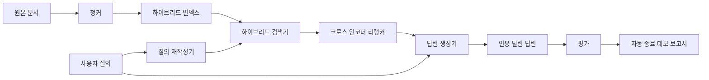

> 🇰🇷 이 문서는 한국어 번역본입니다(ELI5 스타일). 원문: [en.md](en.md)

# 엔드투엔드 RAG 시스템

> 구성 요소 여섯 레슨. 파이프라인 하나. 평가 루프 하나. 스스로 끝나는 데모 하나. 이것이 여러분이 출시할 시스템입니다.

**유형:** Build
**언어:** Python
**선수 지식:** 페이즈 11 레슨 06(RAG), 10(평가); 페이즈 19 트랙 B 기초(레슨 20-29); 페이즈 19 레슨 64, 65, 66, 67, 68
**시간:** ~90분

## 학습 목표
- 청커, 하이브리드 검색기, 질의 재작성기, 크로스 인코더 리랭커, 답변 생성기를 하나의 엔드투엔드 파이프라인으로 조립합니다.
- 낮은 신뢰도에서는 거절하는 폴백과 함께, 청크 앵커로 주장을 인용하는 답변 생성기를 구현합니다.
- 조립된 파이프라인에 레슨 68 평가를 돌려, 각 구성 요소 단독 데모 대비 단계적으로 만든 시스템이 모든 지표에서 이긴다는 것을 증명합니다.
- 고정 코퍼스를 받아들이고 고정 질의 집합을 돌리고 요약 보고서와 함께 상태 0으로 종료하는, 스스로 끝나는 CLI 데모를 만듭니다.

## 문제

여섯 구성 요소가 각자 따로 놀아서는 아무것도 증명하지 못합니다. 청커는 코퍼스에 대한 recall@5에서 이겨도, 검색기가 청커가 내놓는 것의 순위를 매길 수 없다면 시스템의 recall@5에서 집니다. 리랭커는 합성 후보 풀에서는 MRR을 끌어올리지만, 리랭크 예산 지점에서의 바이 인코더 리콜이 너무 낮으면 실제 바이 인코더 후보에서 실패합니다. 질의 재작성기는 한 질의에서 골드 문서를 끌어올리다가도, LLM 목이 퇴화된 가상 문서를 돌려주면 다음 질의에서 망가집니다.

통합 테스트는 같은 고정 qrels에, 같은 지표로, 모든 것을 한데 묶는 오케스트레이터 파일 하나로 파이프라인 전체를 엔드투엔드로 돌리는 것입니다. 이 레슨이 만드는 게 바로 그것입니다. 통합 파이프라인의 지표가 각 단계의 단독 데모 지표를 이기면, 시스템을 증명한 것입니다.

## 개념



### 연결 선택

파이프라인은 작은 그래프입니다. 각 단계는 명확한 시그니처를 가진 함수입니다.

| 단계 | 입력 | 출력 |
|-------|-------|--------|
| 청커 | 문서 텍스트 | Chunk 레코드 목록 |
| 검색기 | 질의 문자열 | 상위 N Chunk 레코드 |
| 재작성기 (선택) | 질의 문자열 | 재작성 목록 + 가상 문서 |
| 리랭커 | 질의, 후보 | 크로스 점수가 붙은 상위 K Chunk 레코드 |
| 생성기 | 질의, 상위 K Chunk 레코드 | 인용 달린 답변 문자열 |

각 시그니처가 안정적이면 조립은 단순합니다. 레슨의 `Pipeline` 클래스는 다섯 단계와, 이들을 순서대로 돌리는 `query` 메서드를 쥐고 있습니다. 모든 단계는 교체 가능합니다: 다른 청커, 검색기, 재작성기, 리랭커, 생성기를 넘겨도 파이프라인은 계속 돌아갑니다.

### 인용 달린 답변 생성기

생성기는 마지막 단계이고 가장 깨지기 쉽습니다. 레슨은 결정론적 목 생성기를 실어 보냅니다:

1. 리랭크된 상위 K 청크를 받습니다.
2. 질의와의 내용 토큰 겹침이 가장 높은 청크를 최대 두 개 고릅니다.
3. 선택된 청크 각각에서 한 문장씩 이어 붙인 답변을 만들고, 각 문장 뒤에 `[doc_id:chunk_index]` 앵커를 붙입니다.
4. 겹침이 거절 임계값을 넘는 청크가 없으면, 인용 없이 "모르겠습니다"를 출력합니다.

프로덕션에서는 목을 프롬프트 템플릿을 갖춘 실제 LLM 호출로 바꿉니다:

```
You are answering a question using only the snippets below.
Cite every claim with the anchor in parentheses.
If the snippets do not answer the question, say "I do not know".

Question: {query}

Snippets:
{enumerated chunks with anchors}

Answer:
```

저신뢰 거절 경로가 바로 크로스 인코더 1위 점수를 로그에 남기는 이유입니다. 점수가 코퍼스 임계값 아래면 생성기는 거절합니다. 환각 답변을 막는 안전 밸브입니다.

### 자동 종료 데모

데모는 모든 것을 엔드투엔드로 돌립니다. 질의 하나의 단계별 내역을 출력하고, 네 개 고정 qrels에 평가를 돌리고, 지표 테이블을 출력하고, 모든 레슨 68 지표가 데모가 정한 임계값을 충족하면 상태 0으로 종료합니다. 지표 하나라도 임계값 아래면, 데모는 0이 아닌 상태와 실패한 지표 이름을 밝히는 메시지로 종료합니다.

CI 스모크 테스트가 취하는 형태가 바로 이것입니다. 파이프라인은 오프라인에서, 빠르게, 결정론적으로 돕니다. 임계값은 고정 코퍼스에서 의도적으로 빡빡해서, 여섯 레슨 중 어느 하나의 회귀도 데모를 실패시킵니다.

```figure
rag-pipeline-flow
```

## 만들어 보기

`code/main.py`는 다음을 구현합니다:

- `Chunk` - 모든 단계를 통과하는 레코드(레슨 64의 형태를 chunk_index와 원본 doc_id로 확장).
- `Chunker` - 레슨 64의 전략을 고름(기본 재귀 분할).
- `HybridIndex` - 레슨 65의 BM25 + 덴스 + RRF를 묶음.
- `Rewriter` (선택) - 질의 길이와 접속사 유무로 레슨 67의 HyDE, 멀티 쿼리, 분해 중 하나를 고름.
- `Reranker` - 레슨 66의 학습된 크로스 인코더. 몇 초 안에 수렴하도록 더 작은 고정 학습 집합을 씀.
- `Generator` - 인용과 저신뢰 거절을 갖춘 결정론적 목 생성기.
- `Pipeline` - 다섯 단계를 조립하고 `Result(answer, top_k, latency_ms_per_stage)`를 돌려주는 `query(question)` 메서드를 제공.
- `run_demo()` - 코퍼스를 받아들이고, 고정 질의 셋을 돌리고, 평가를 돌리고, 결과를 출력하고, 임계값으로 종료 코드를 정함.

실행:

```bash
python3 code/main.py
```

출력은 질의 트레이스 하나, 전체 평가 테이블, 최종 통과/실패 상태입니다. 고정 코퍼스에서는 종료 코드 0을 돌려줍니다.

## 데모가 숨겨 주는 실패 모드

**청커 경계 표류.** 평가 qrels 레이블링 패스와 데모 사이에 청커 전략을 바꾸면, 골드 문서 id가 더 이상 맞지 않습니다. 청커 전략을 qrels 파일에 잠그세요. 데모에는 청커 이름을 밝히는 헤더가 들어 있습니다.

**리랭커 학습 집합이 평가로 새어 들어감.** 레슨 66의 14개 학습 삼중 항목에는 평가 질의와 닮은 질의들이 있습니다. 프로덕션에서는 평가 질의를 철저히 홀드아웃하세요. 데모의 평가 질의는 리랭크 학습 집합과 의도적으로 겹치지 않습니다.

**목 생성기가 환각 위험을 가려 줌.** 목은 검색된 청크의 텍스트만 출력하므로 환각할 수 없습니다. 레슨은 이 점을 짚고 프로덕션 교체 경로를 실제 모델로 안내합니다.

**스트리밍 없음.** 파이프라인은 매 단계 끝에 전체 답변을 돌려줍니다. 프로덕션 시스템이라면 생성기 출력을 스트리밍할 것입니다. 스트리밍은 범위 밖입니다; 답변 채점 지표는 어느 쪽이든 최종 문자열 위에서 동작합니다.

**지연 시간은 오프라인 값.** 목 LLM 호출은 상수 시간입니다. 실제 LLM 호출이 지배합니다. 요청 범위에서 지연 시간 예산을 계획하세요; 레슨의 단계별 타이밍은 CPU 작업만 측정합니다.

## 활용하기

프로덕션 패턴:

- 파이프라인 파일을 명시적 단계 인터페이스를 가진 하나의 오케스트레이터 아래에서 출시하세요. 연결 코드가 저장소 곳곳에 흩어지지 않게.
- 단계에 손대는 모든 병합 전에 평가를 돌리세요. 평가가 떨어지면 병합은 머지되지 않습니다.
- CI 실행마다 지표 트레이스를 저장해서, 성능 하락을 단계 교체로 귀속할 수 있게 하세요.
- 30초 안에 도는 20개 질의 스모크 집합(회귀 집합의 부분 집합)을 추가하세요; 전체 회귀 집합은 매일 밤 돕니다.

## 출시하기

이 레슨의 파이프라인 파일은 페이즈 19 트랙 F 나머지 레슨들이 가정하는 형태입니다. 이후 레슨들은 여기에 수집 자동화, 증분 재인덱싱, 텔레메트리, 서빙 계층을 얹을 것입니다. 검색, 리랭크, 재작성, 평가 절반은 여기서 완성입니다.

## 연습 문제

1. 재작성기 안에 질의별 전략 선택기를 추가합니다: 레슨 67의 휴리스틱(길이, 접속사, 전문 용어 비율)이 HyDE, 멀티 쿼리, 분해 중 하나를 고릅니다.
2. 환경 플래그 뒤에 생성기용 실제 LLM 호출을 추가합니다. 기본은 목으로 둡니다. 지연 시간 델타를 측정하세요.
3. 데모에 실제 코퍼스를 읽어 들이는 `--corpus path` 플래그를 추가합니다. 평가와 임계값 검사를 다시 돌리세요.
4. 청커에 `--strategy` 플래그를 추가합니다. 각 전략이 엔드투엔드 리콜에 기여하는 바를 측정하세요.
5. 스트리밍 생성기 인터페이스를 추가하고 평가에 먹입니다. 충실도가 스트리밍된 접두어가 아니라 최종 문자열 위에서 계산되는지 확인하세요.

## 핵심 용어

| 용어 | 사람들의 표현 | 실제 의미 |
|------|-----------------|------------------------|
| 파이프라인 | "RAG 파이프라인" | 수집부터 인용 달린 답변까지 조립된 단계들 |
| 인용 앵커 | "출처 링크" | 각 주장에 붙는 (doc_id, chunk_index) 참조 |
| 저신뢰 거절 | "모르겠습니다" | 리랭커 1위 점수가 임계값 아래면 생성기가 답변 없이 거절 |
| 스모크 집합 | "CI 평가" | 모든 PR 검사에서 도는 최소 qrels 부분 집합 |
| 단계 인터페이스 | "함수 시그니처" | 각 파이프라인 단계의 안정적인 입력·출력 타입 |

## 더 읽을거리

- [Anthropic, Building search and retrieval](https://www.anthropic.com/news/contextual-retrieval)
- [Pinterest, MCP internal search](https://medium.com/pinterest-engineering) - 참고용 프로덕션 아키텍처
- [Ragas: Automated Evaluation of RAG Pipelines](https://docs.ragas.io)
- 페이즈 11 레슨 06 - RAG 기초
- 페이즈 19 레슨 64-68 - 여기서 조립되는 구성 요소들
