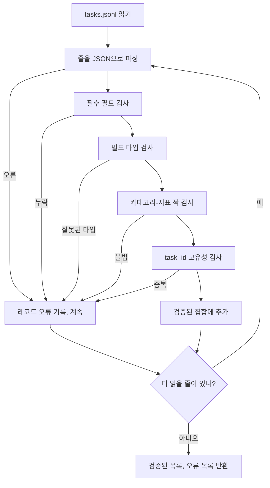

> 🇰🇷 이 문서는 한국어 번역본입니다(ELI5 스타일). 원문: [en.md](en.md)

# 작업 명세 포맷

> 평가 하니스는 작업이 지키는 계약만큼만 좋습니다. 채점 함수를 하나라도 쓰기 전에 JSONL 형태와 지표 어휘를 고정하세요.

**유형:** Build
**언어:** Python
**선수 지식:** 페이즈 19 트랙 B 기초
**시간:** ~90분

## 학습 목표

- 산술, 객관식, 코드 실행, 분류, 자유 텍스트 요약을 하나의 형태로 커버하는 JSONL 작업 레코드 스키마를 정의합니다.
- 지표 이름의 닫힌 어휘를 고정해서, 하위 레슨들(71-73)이 단일 필드로 디스패치할 수 있게 합니다.
- 퓨샷 예시와 후처리 규칙을 러너가 아니라 작업의 일부로 명세해서, 같은 프롬프트가 모든 모델에서 같은 목표를 만들게 합니다.
- 형식이 틀린 레코드가 러너에 닿기 전에 거부하는 엄격한 검증기를 구현합니다.
- 명세의 모든 분기를 지나게 하는 10개 작업 고정 집합을 출시해서, 검증기가 진짜 뭔가를 씹어 보게 합니다.

```figure
ci-task-spec-gate
```

## 왜 명세를 고정하는가

연구 코드베이스는 테스트보다 평가 스크립트를 더 빨리 쌓아 올립니다. 6개월 뒤에는 노트북마다 자기만의 JSON 형태를 갖고, 지표는 두 번씩 재구현되고, 실행 간에 비교 가능한 것이 하나도 없습니다. 해법은 지루합니다. 스키마를 고르고. 검증기를 쓰고. 나머지는 전부 거부하는 것. 이 레슨이 하는 일이 바로 그겁니다.

형태는 BIG-bench, HELM, lm-eval 스타일 하니스에서 아이디어를 빌리지만, 필드 이름은 우리 것입니다. 모든 필드에는 소유자가 하나씩 있습니다. 러너는 작업을 읽습니다. 지표는 목표를 읽습니다. 후처리 단계는 생성물을 정규화합니다. 파이프라인 중간에 바뀌는 필드는 없습니다.

## 레코드 형태

작업은 한 줄짜리 JSON 객체입니다. 하니스는 `tasks.jsonl`을 읽고 각 줄을 독립적으로 검증합니다. 나쁜 줄은 그 레코드만 중단시키지, 실행 전체를 중단시키지 않습니다.

```json
{
  "task_id": "arith_001",
  "category": "arithmetic",
  "prompt": "Compute the result. Question: 17 + 24\nAnswer:",
  "targets": ["41"],
  "metric_name": "exact_match",
  "few_shot_examples": [
    {"prompt": "Question: 2 + 2\nAnswer:", "completion": "4"}
  ],
  "post_process": "strip_whitespace",
  "metadata": {"difficulty": "easy"}
}
```

필수 필드는 `task_id`, `category`, `prompt`, `targets`, `metric_name`, `post_process`입니다. `few_shot_examples`와 `metadata`는 선택입니다. 알 수 없는 최상위 필드는 검증에 실패합니다.

## 필드 규칙

`task_id`는 공백이 없는 문자열입니다. 검증기는 파일 전체에서 고유성을 강제합니다.

`category`는 `arithmetic`, `mcq`, `code_exec`, `classification`, `summary` 중 하나입니다. 카테고리는 어느 지표와 후처리 짝이 합법인지 제약합니다. `code_exec` 작업은 `metric_name = code_exec`을 써야 하고, `mcq` 작업은 글자 하나짜리 목표에 대해 `metric_name = exact_match`를 써야 합니다.

`prompt`는 비어 있지 않은 문자열입니다. 검증기는 뒤따르는 공백을 금지하고, 프롬프트 본문에 이미 퓨샷 블록이 들어 있는 레코드는 거부합니다. 퓨샷 렌더링은 작성자가 아니라 러너에서 일어납니다.

`targets`는 비어 있지 않은 문자열 목록입니다. `exact_match`에서는 일치하는 요소가 하나만 있으면 됩니다. `f1`과 `rouge_l`에서는 가장 높은 점수의 목표가 이깁니다. `mcq`에서는 목록이 정확히 한 요소를 담습니다.

`metric_name`은 `exact_match`, `f1`, `bleu_4`, `rouge_l`, `accuracy`, `code_exec` 중 하나입니다. 어휘는 닫혀 있습니다. 새 지표는 새 레슨과 여기에 새 항목을 요구합니다.

`few_shot_examples`는 `{prompt, completion}` 쌍의 목록입니다. 검증기는 프롬프트가 무한정 커지지 않도록 목록을 여덟 항목으로 제한합니다.

`post_process`는 `none`, `strip_whitespace`, `lower`, `extract_letter`, `extract_code_block`, `extract_first_line` 중 하나입니다. 각 규칙은 단일한 결정론적 행동을 가집니다. 검증기는 규칙을 조합하는 것을 금지합니다.

## 검증기 행동



검증기는 두 목록을 돌려줍니다: 검증된 레코드들과, 문제의 줄과 어긋난 규칙과 잘못된 필드를 담은 오류 레코드들. 오류 목록이 비어 있지 않으면 명시적인 `--allow-bad-tasks` 플래그가 없는 한 러너는 시작을 거부합니다.

## 퓨샷 렌더링

러너는 퓨샷 예시들을 프롬프트 앞에 빈 줄 구분자로 이어 붙입니다. 같은 코드 경로가 모든 모델에서 돌기 때문에, 분산의 원천은 모델 자신뿐입니다. 작성자는 예시를 제공자마다 한 번씩이 아니라 한 번만 씁니다.

```python
def render(task):
    parts = []
    for ex in task.get("few_shot_examples", []):
        parts.append(ex["prompt"] + " " + ex["completion"])
    parts.append(task["prompt"])
    return "\n\n".join(parts)
```

## 후처리 규칙

후처리 단계는 생성 후, 지표 전에 돕니다. 결정론적이고 상태가 없습니다.

- `none`은 문자열을 그대로 돌려줍니다.
- `strip_whitespace`는 앞뒤 공백을 제거합니다.
- `lower`는 문자열을 소문자로 바꿉니다.
- `extract_letter`는 `[A-E]`에 맞는 첫 문자를 돌려줍니다. MCQ용입니다.
- `extract_code_block`은 첫 삼중 백틱 펜스 블록의 본문을 돌려줍니다. 코드 실행용입니다.
- `extract_first_line`은 첫 비어 있지 않은 줄을 돌려줍니다. 요약 분류용입니다.

이 목록 밖의 규칙이 필요한 작업은 새 레슨에 속합니다.

## 이 레슨이 하지 않는 것

채점하지 않습니다. 모델을 호출하지 않습니다. 코드를 돌리지 않습니다. 그것들은 레슨 71, 72, 75에서 옵니다. 이 레슨은 그 모두가 지킬 계약을 고정합니다.

10개 작업 고정 집합은 산술 두 항목, MCQ 두 항목, 코드 실행 두 항목, 분류 두 항목, 요약 두 항목을 커버합니다. 검증기는 10개 모두를 통과시킵니다. 별도 고정 파일(`tasks_bad.jsonl`)은 모든 규칙을 하나씩 어기고, 검증기는 정확히 그만큼의 오류를 돌려줍니다.

## 코드 읽는 법

`main.py`는 `TaskSpec`, `validate_task`, `validate_file`, CLI 진입점을 정의합니다. 고정 파일 로더는 `load_fixtures`입니다. 렌더와 후처리 도우미는 검증 코드 옆에 있어서, 레슨 75의 러너가 모듈 하나만 임포트하면 됩니다.

`main.py`를 위에서 아래로 읽으세요. 그다음 `code/tests/test_spec.py`를 읽으세요. 테스트는 모든 검증 규칙과 모든 후처리 행동을 고정합니다. `main.py` 맨 아래의 데모는 번들된 고정 파일을 검증하고 요약을 출력합니다.

## 더 나아가기

실제 평가 스위트는 스키마가 열을 늘리는 방식으로 카테고리를 늘립니다. 냉정한 선택은, 지표와 후처리 규칙과 최소 하나의 고정 작업을 함께 추가하지 않고는 카테고리를 추가하지 않는 것입니다. 명세를 데이터베이스 마이그레이션처럼 다루세요. 모든 변경은 검토되고, 버전 관리되고, 테스트와 함께 나옵니다. 이 레슨의 검증기가 그 관문입니다.
