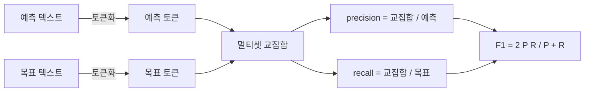
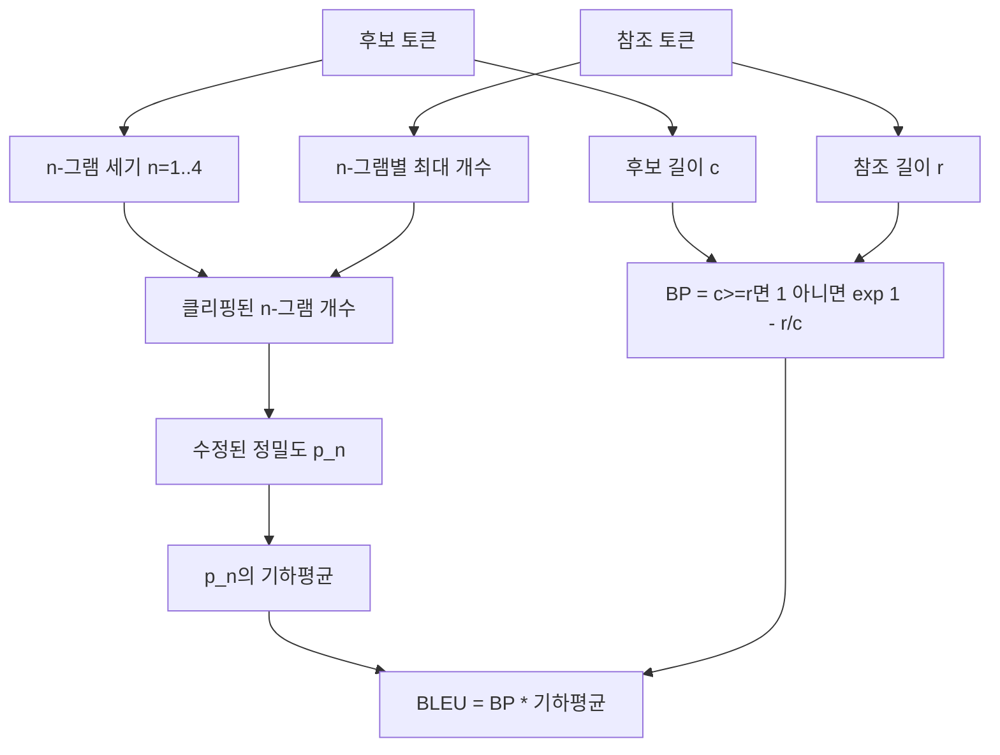

> 🇰🇷 이 문서는 한국어 번역본입니다(ELI5 스타일). 원문: [en.md](en.md)

# 고전 지표

> BLEU, ROUGE-L, F1, 정확 일치, 정확도. 발표된 LLM 평가 숫자의 대부분을 여전히 차지하는 다섯 지표입니다. 각각을 원리부터 구현해서, 그 숫자가 무엇을 뜻하는지 알게 됩니다.

**유형:** Build
**언어:** Python
**선수 지식:** 페이즈 19 트랙 B 기초, 레슨 70
**시간:** ~90분

## 학습 목표

- 명시적인 토큰화 규칙을 갖춰 토큰 수준의 정확 일치, F1, 정확도를 구현합니다.
- BLEU-4를 바닥부터 구현합니다: 수정된 n-그램 정밀도, n이 1부터 4까지의 기하평균, 가짜 패널티.
- 최장 공통 부분수열(LCS)으로 ROUGE-L을 구현하고, 정밀도와 리콜의 F-beta 조합을 적용합니다.
- 레슨 70의 metric_name 필드로 디스패치해서 러너가 지표에 독립적이게 유지합니다.
- 서드파티 라이브러리가 아니라 손으로 푼 예제에서 뽑은 참조 벡터로 행동을 고정합니다.

```figure
cd-bleu-overlap
```

## 왜 다시 구현하는가

BLEU 28.3을 보고하는 논문과 BLEU 0.283을 보고하는 논문을 읽게 될 겁니다. 하나는 소문자로 자르고 다른 하나는 그러지 않아서 두 라이브러리 사이에 10포인트씩 차이 나는 ROUGE-L 점수를 만나게 될 겁니다. 혼란을 멈추는 가장 빠른 길은 지표를 직접 써 보고, 토크나이저가 정해지는 줄과 스무딩이 적용되는 줄을 손가락으로 가리키는 것입니다. 그다음부터 논문 간 숫자 비교는 라이브러리 논쟁이 아니라 지표 설정을 읽는 일이 됩니다.

표준 라이브러리에 numpy만 더하면 충분합니다. BLEU는 세고 clamp하는 일입니다. ROUGE-L은 동적 계획법입니다. F1은 토큰의 집합 교집합입니다. 가장 어려운 부분은 토크나이저를 고르고 그것에 헌신하는 일입니다.

## 토큰화

토크나이저는 `re.findall(r"\w+", text.lower())`입니다. 소문자화, 영숫자 덩어리, 구두점 제거. 이 레슨의 모든 지표가 바로 이 토크나이저를 씁니다. 러너는 고를 권한이 없습니다. 토크나이저를 바꾸면 다른 벤치마크를 돌리는 겁니다.

```python
TOKEN_RE = re.compile(r"\w+", re.UNICODE)
def tokenize(text):
    return TOKEN_RE.findall(text.lower())
```

이것은 의도적인 단순화입니다. 프로덕션 설정은 CJK, 축약형, 코드 식별자를 신경 쓸 것입니다. 레슨의 요점은 토크나이저가 손잡이가 아니라 계약이라는 것입니다.

## 정확 일치

```python
def exact_match(pred, targets):
    return float(any(pred.strip() == t.strip() for t in targets))
```

작업당 1.0 또는 0.0을 돌려줍니다. 데이터셋에 대한 집계는 평균입니다. 산술, MCQ, 짧은 분류 작업의 일용직 노동자입니다.

## 토큰 수준 F1

예측과 목표의 토큰 멀티셋을 준비합니다. 정밀도는 멀티셋 교집합을 예측 멀티셋으로 나눈 값입니다. 리콜은 같은 교집합을 목표 멀티셋으로 나눈 값입니다. F1은 조화평균입니다. 구현은 빈 예측과 빈 목표의 경계 사례를 처리합니다.



다중 목표 작업에서는 목표 목록 위에서 가장 좋은 F1을 킵니다. 이것은 문헌에 널리 보고되는 SQuAD 스타일 행동과 일치합니다.

## BLEU-4

BLEU는 정석 기계 번역 지표이며 요약 연구에도 여전히 등장합니다. 우리가 쓰는 공식은 코퍼스 수준 BLEU-4에 표준 가짜 패널티를 더하고, 수정된 n-그램 개수에 +1 스무딩을 적용한 것입니다. 덕분에 4-그램 하나 빠졌다고 점수가 0으로 떨어지지 않습니다.

각 후보-참조 쌍에 대해 n이 1, 2, 3, 4일 때의 수정된 n-그램 정밀도를 셉니다. 수정된 정밀도는 후보 n-그램 개수를 어떤 참조에서든 그 n-그램이 가진 최대 개수로 클리핑합니다. 덕분에 후보가 구절 하나를 반복해서 부풀릴 수 없습니다. 네 정밀도의 기하평균을 가짜 패널티가 감쌉니다.



스무딩 규칙은 Lin과 Och가 방법 1이라 부른 것입니다: 로그를 취하기 전에 모든 n-그램 정밀도의 분자와 분모에 1을 더합니다. 참조에 매칭되는 4-그램이 없을 때 `log 0`을 피하고, 긴 후보에서는 비스무딩 값에 가깝게 유지됩니다.

## ROUGE-L

ROUGE-L은 후보와 참조 토큰 시퀀스의 최장 공통 부분수열을 비교합니다. LCS는 연속성을 강요하지 않으면서 단어 순서를 잡아냅니다. 요약 기본 지표로 쓰이는 이유입니다. LCS 길이를 표준 동적 계획법 표로 계산한 뒤, 리콜은 `lcs / 참조 길이`, 정밀도는 `lcs / 후보 길이`로 두고, 베타가 1인 대칭 F1 형태의 F-beta로 결합합니다.

```python
def lcs_length(a, b):
    n, m = len(a), len(b)
    dp = numpy.zeros((n + 1, m + 1), dtype=int)
    for i in range(n):
        for j in range(m):
            if a[i] == b[j]:
                dp[i+1, j+1] = dp[i, j] + 1
            else:
                dp[i+1, j+1] = max(dp[i+1, j], dp[i, j+1])
    return int(dp[n, m])
```

numpy 표는 구현을 읽기 쉽게 만듭니다; 순수 파이썬 리스트로도 됩니다. ROUGE-L을 택한 작업은 작업당 O(n m) 비용을 냅니다. 전형적인 요약 길이에서는 1밀리초 아래입니다.

## 정확도

다중 목표 분류 작업에서 정확도는 정규화된 단일 목표에 대한 정확 일치로 환원됩니다. 러너 내부에서 문자열 비교를 거치지 않고 디스패처가 `metric_name`으로 디스패치할 수 있도록 별도 함수로 노출합니다.

## 디스패치 계약

단일 진입점은 `score(metric_name, prediction, targets)`입니다. `[0, 1]`의 float를 돌려줍니다. 러너는 지표 이름으로 분기하지 않습니다. 호출을 넘기고 결과를 기록합니다. 레슨 75가 레슨 70의 작업 명세에 접착할 표면이 바로 이것입니다.

```python
def score(metric_name, pred, targets):
    if metric_name == "exact_match":
        return exact_match(pred, targets)
    if metric_name == "f1":
        return max(f1_score(pred, t) for t in targets)
    if metric_name == "bleu_4":
        return max(bleu4(pred, t) for t in targets)
    if metric_name == "rouge_l":
        return max(rouge_l(pred, t) for t in targets)
    if metric_name == "accuracy":
        return accuracy(pred, targets)
    raise ValueError(f"unknown metric_name: {metric_name}")
```

`code_exec`은 레슨 72에서 처리되고 거기서 디스패처에 끼워집니다.

## 이 레슨이 하지 않는 것

모델을 호출하지 않습니다. 레슨 70의 후처리 규칙이 이미 한 것 이상으로 생성물을 정규화하지 않습니다. 신뢰 구간을 계산하지 않습니다. BLEURT나 BERTScore도 하지 않습니다(모델이 필요하고 다른 레슨에 삽니다). 요점은 바닥입니다: 다섯 지표, 토크나이저 하나, 디스패치 테이블 하나.

## 코드 읽는 법

`main.py`는 각 지표를 자유 함수로 정의하고 디스패처를 더합니다. 참조 벡터는 파일 맨 아래 `_reference_examples` 블록에 삽니다. 데모는 여덟 예제에 디스패처를 돌리고 지표별 점수를 출력합니다. `code/tests/test_metrics.py`의 테스트는 참조 벡터를 고정하고 모든 경계 사례(빈 예측, 빈 참조, 공유 토큰 없음, 정확 일치, 반복 구절 클리핑)를 스트레스 테스트합니다.

`main.py`를 위에서 아래로 읽으세요. 함수는 복잡도 순입니다. exact_match와 accuracy는 각각 한 줄입니다. F1은 여섯 줄입니다. BLEU와 ROUGE-L이 무거운 부분이고, 스무딩 규칙과 LCS 점화식에 대한 상세 주석이 달려 있습니다.

## 더 나아가기

고전 지표는 필요하지만 충분하지 않습니다. 표면 겹침에 보상하고 의미를 놓칩니다. 고전 바닥을 신뢰하게 되면 모델 기반 지표(BLEURT, BERTScore, GEval)를 그 위에 얹는 것이 해법입니다. 그건 나중 레슨입니다. 지금은: 다섯 지표를 작동시키고, 테스트로 고정하면, 감사 가능하고 빠르고 재현 가능한 지표 스택을 갖게 됩니다.
