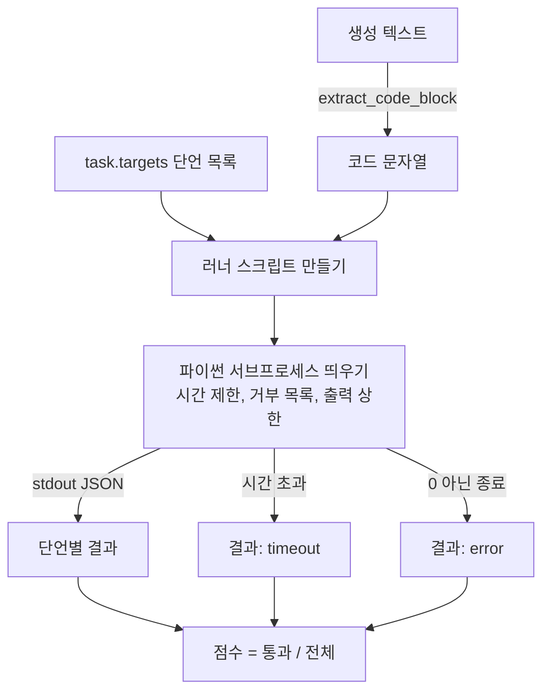
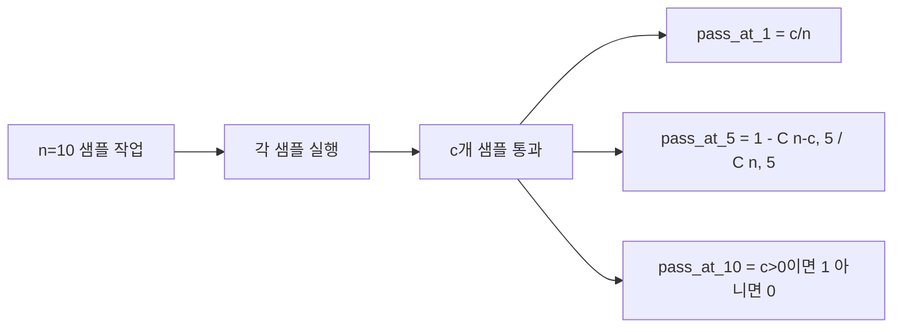

> 🇰🇷 이 문서는 한국어 번역본입니다(ELI5 스타일). 원문: [en.md](en.md)

# 코드 실행 지표

> 생성된 코드는 테스트를 통과할 때 맞습니다. 평가 하니스는 코드를 추출하고, 호스트를 크래시 내지 않고 실행하고, 통과율을 정직하게 집계해야 합니다. 이 레슨이 그 표면을 만듭니다.

**유형:** Build
**언어:** Python
**선수 지식:** 페이즈 19 트랙 B 기초, 레슨 70과 71
**시간:** ~90분

## 학습 목표

- 자유 형식 생성물에서 레슨 70의 후처리 규칙과 맞는 방식으로 코드 블록을 추출합니다.
- 후보 코드를 벽시계 시간 제한, 출력 상한, 임포트 거부 목록을 갖춘 격리된 서브프로세스에서 실행합니다.
- 작업 점수를 제공된 단언 문자열 중 후보에 대해 통과한 비율로 계산합니다.
- 하나의 모델에서 여러 생성을 샘플링하는 작업에 대해 pass-at-k를 계산합니다.
- 샌드박스 크래시, 문법 오류, 시간 초과를 러너가 로그에 남길 수 있는 별도 종료 코드를 가진 1급 실패 모드로 다룹니다.

```figure
sandbox-runner
```

## 왜 격리된 서브프로세스인가

인라인 `exec`는 보안과 안정성 모두에서 위험합니다. 생성된 `while True: pass`는 평가를 영원히 막습니다. 생성된 `import shutil; shutil.rmtree('/')`는 들리는 대로 재앙입니다. 해법은 후보마다 새 파이썬 인터프리터를 띄우고, 코드를 stdin으로 넘기고, 단언 결과를 stdout에 쓰고, 시간을 넘기면 프로세스를 죽이는 것입니다. 호스트 평가 프로세스는 계속 돕니다.

HumanEval, MBPP, BigCodeBench, LiveCodeBench 같은 실제 평가들이 모두 서브프로세스 샌드박스를 씁니다. 어떤 것들은 그 위에 Docker를 얹습니다. 우리는 이유가 있어서 서브프로세스에서 멈춥니다: 이식 가능하고, 표준 라이브러리만 쓰고, 교육용 평가에 중요한 실패 모드를 잡아 냅니다. 프로덕션 배포는 seccomp, 네트워크 격리, 읽기 전용 파일시스템을 더합니다. 강화에 관한 다음 레슨은 이 트랙 밖에 삽니다.

## 코드 실행 작업의 형태

`code_exec` 작업은 `targets`에 단언 문자열을 담습니다. 러너는 생성물에서 펜스 친 코드 블록을 추출하고, 그 주위에 테스트 하니스를 만들고, 결과를 실행합니다.



점수는 `[0, 1]`의 비율입니다. 단언 셋 중 둘이 통과한 작업은 0.667입니다. 러너는 무엇이 실패하든 같은 형태를 돌려줍니다: 서브프로세스 크래시는 정규화된 오류 코드로 매핑되지, 파이썬 트레이스백이 하니스 위로 튀어 올라오지 않습니다.

## 거부 목록

거부 목록은 임포트 기반입니다. 후보 코드를 실행하기 전에, 러너 스크립트는 위험한 모듈의 임포트를 `ImportError("denied")`를 일으키는 스텁으로 재작성합니다. 목록은 의도적으로 보수적입니다: `os.system`, `subprocess`, `socket`, `requests`, `urllib`, `urllib.request`, `urllib.error`, `urllib.parse`, `ctypes`, `shutil`, `http.client`, `asyncio.subprocess`.

이것이 완벽하다고 주장하지 않습니다. 결심한 공격 코드는 파이썬의 어떤 인프로세스 샌드박스든 탈출할 수 있습니다. 거부 목록은 최후의 보루입니다. 실제 무게를 지탱하는 통제는 벽시계 시간 제한과 출력 상한입니다.

```python
DENIED = {
    "os.system": True,
    "subprocess": True,
    "socket": True,
    "shutil": True,
    "requests": True,
    "urllib": True,
    "ctypes": True,
}
```

후보 코드는 `import sys`와 `os.system`을 후킹해 예외를 일으키는 가드를 앞에 붙여 감쌉니다. 전체 템플릿은 `main.py`에 있습니다.

## 벽시계 시간 제한

모든 서브프로세스는 기본 벽시계 3초 예산을 받습니다. 러너는 `subprocess.run(..., timeout=t)`을 씁니다. 시간 제한이 발동하면 러너는 `TimeoutExpired`를 잡아 프로세스를 죽이고, 그 작업에 `timeout` 종료 사유를 기록합니다. 그 작업의 점수는 0입니다. 러너는 다음으로 넘어갑니다.

시간 제한은 `task.metadata.timeout_s`로 작업별 설정 가능합니다. 오래 도는 단위 테스트는 더 요구할 수 있습니다; 레슨 70의 검증기는 스위트가 한계 안에 머물도록 값을 30초로 제한합니다.

## 출력 상한

서브프로세스는 stdout을 홍수처럼 흘려 호스트 메모리를 고갈시킬 수 있습니다. 러너는 stdout을 버퍼로 흘려 받다가 누적량이 256KB를 넘는 순간 자식을 죽입니다. 결과는 상세 문자열 `"output overflow"`와 함께 `exit_code = error`로 기록됩니다. 실전에서는 생성물이 우연히 출력하는 무한 루프를 쓸 때 나타납니다.

## Pass-at-k

Pass-at-k는 HumanEval과 그 친구들이 쓰는 불편 추정량입니다. 작업당 `n`개의 독립 샘플과 그중 `c`개가 통과할 때, `n` 중 크기 `k` 샘플이 최소 하나의 통과 풀이를 담을 확률은:

```
pass_at_k(n, c, k) = 1 - C(n - c, k) / C(n, k)
```

`n - c < k`이면 분자가 정의되지 않고 값은 `1`입니다. 구현은 이 경계 사례를 직접 처리합니다. 우리는 레슨 74의 리더보드 계층이 쓰도록 `pass_at_k(n, c, k)`를 노출합니다.



## 종료 코드

러너는 작업당 다섯 결과 중 하나를 돌려줍니다:

- 모든 단언이 통과했을 때 `pass`.
- 코드는 돌았지만 최소 하나의 단언이 실패했을 때 `assertion_fail`.
- 코드가 임포트되지 않았거나 SyntaxError가 났을 때 `syntax_error`.
- 벽시계 시간이 다했을 때 `timeout`.
- 그 외 모든 크래시(거부 목록 적중과 출력 넘침 포함)는 `error` (넘침은 상세 `"output overflow"`로 드러남).

점수는 그래도 비율입니다. 종료 코드는 메타데이터입니다. 하위 레슨들이 시간 초과를 0으로 셀지 결측 데이터로 셀지 결정할 수 있습니다.

## 이 레슨이 하지 않는 것

진짜 샌드박스를 주지 않습니다. 오픈 웹의 신뢰할 수 없는 코드를 실행하지 않습니다. 파일 입출력이나 네트워크 호출 같은 상태를 가진 작업을 다루지 않습니다. 그것들은 컨테이너나 microVM을 필요로 합니다. 이 레슨의 요점은 계약입니다: 격리된 서브프로세스, 거부 목록, 시간 제한, 출력 상한, 깔끔한 종료 코드 어휘, pass-at-k 수학.

## 코드 읽는 법

`main.py`는 `extract_code`, `run_candidate`, `score_code_exec`, `pass_at_k`를 정의합니다. 서브프로세스 러너 스크립트는 문자열로 만들어 새 파이썬 인터프리터에 `-c`로 넘겨집니다. `code/tests/test_exec.py`의 테스트는 HumanEval 스타일에서 뽑은 손으로 푼 예제들에 대해 네 종료 코드와 pass-at-k를 시험합니다.

`main.py`를 위에서 아래로 읽으세요. 러너 템플릿이 무게를 지탱하는 조각입니다. 단언 루프를, 부모 프로세스에 돌려주는 JSON 봉투를 예측할 수 있을 때까지 들여다보세요.

## 더 나아가기

서브프로세스 형태가 작동하면 다음 관심사는 이식성입니다. 파이썬 버전마다 Windows에서 SIGKILL을 다르게 처리합니다. 가장 깔끔한 해법은 러너를 Docker 이미지에 넣는 것입니다. 그다음은 단언 문자열을 진짜 단위 테스트 파일로 바꿔 평가가 프로덕션 CI가 하는 일과 맞게 만드는 것입니다. 그 지점부터는 단언 문자열을 테스트라고 부르지 마세요. 그것들은 장난감 테스트이고 장난감 실패 모드를 가집니다.
