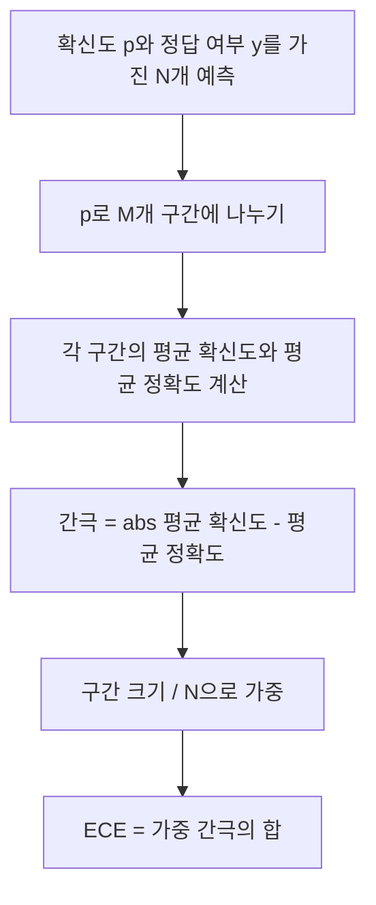
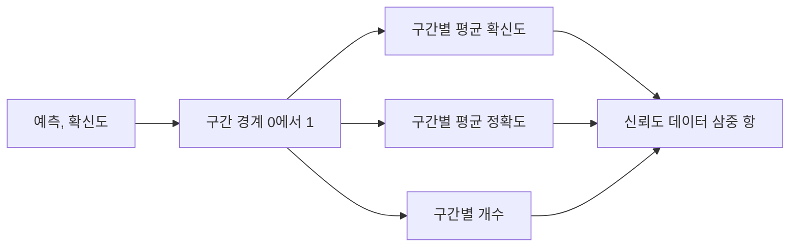

> 🇰🇷 이 문서는 한국어 번역본입니다(ELI5 스타일). 원문: [en.md](en.md)

# 퍼플렉서티와 보정

> 모델이 천 개 답변에 90퍼센트 확신을 말하면서 600개를 맞혔다면, 잘 보정된 것이 아닙니다. 보정은 신뢰할 수 있는 평가의 절반입니다. 나머지 절반은 퍼플렉서티인데, 이것은 모델이 홀드아웃 텍스트를 애초에 그럴듯하게 여기는지 알려 줍니다.

**유형:** Build
**언어:** Python
**선수 지식:** 페이즈 19 트랙 B 기초, 레슨 70과 71
**시간:** ~90분

## 학습 목표

- 모델 어댑터가 제공하는 토큰별 음의 로그확률로 홀드아웃 코퍼스의 토큰 수준 퍼플렉서티를 계산합니다.
- 구간화된 예측 확률로 분류기나 객관식 평가의 기대 보정 오차(ECE)를 계산합니다.
- 브라이어 점수(정답 지시자에 대한 평균 제곱 오차)를 계산하고, ECE가 못 하는 것을 언제 하는지 설명합니다.
- 확신 대 정확도 곡선을 그리는 데 필요한 신뢰도 다이어그램 데이터를 만듭니다.
- 셋 모두를 평가 하니스에 연결해 러너가 모델 보고서에 `perplexity`, `ece`, `brier` 숫자를 붙일 수 있게 합니다.

```figure
cd-reliability-diagram
```

## 퍼플렉서티가 알려 주는 것

퍼플렉서티는 토큰당 음의 로그우도 평균을 지수화한 값입니다. 낮을수록 좋습니다. 퍼플렉서티 1은 모델이 실제 토큰마다 확률 1을 준다는 뜻입니다. 어휘 크기만큼의 퍼플렉서티는 모델이 균등 분포이며 아무것도 배우지 못했다는 뜻입니다. 실제 숫자는 그 사이에 있습니다: 2026년 강력한 베이스 모델이 WikiText-103에서 대략 8~12를 기록합니다. 같은 텍스트에서 나쁜 모델은 50 이상입니다.

하니스는 로그확률을 직접 계산하지 않습니다. 그것들은 모델 어댑터에서 옵니다. 하니스는 집계합니다: 토큰별 로그확률 목록과 시퀀스별 토큰 수 목록을 받아 코퍼스 퍼플렉서티를 돌려줍니다.

```python
def perplexity(neg_log_probs, token_counts):
    total_nll = sum(neg_log_probs)
    total_tokens = sum(token_counts)
    return math.exp(total_nll / total_tokens)
```

구현은 토큰이 0개인 경계 사례를 처리하고 음의 로그확률이 음수가 아님을 단언합니다. 흔한 실수는 부정을 잊는 것입니다: `-log p` 대신 `log p`를 돌려주는 어댑터는 1보다 낮은 퍼플렉서티를 만드는데, 그건 불가능한 값입니다. 함수는 그것을 계약 위반으로 잡아 냅니다.

## ECE가 측정하는 것

기대 보정 오차(ECE)는 예측을 확신도별로 고정된 개수의 구간(bin)에 나눈 뒤, 구간 크기로 가중해 구간들에 걸친 확신도와 정확도 사이 평균 간극을 측정합니다.



표준 공식은 `[0, 1]` 위의 열 개 등폭 구간을 씁니다. 구현은 어떤 양의 정수 개수도 지원합니다. 우리는 `bins` 파라미터를 노출해서 러너가 출판 관례(10)와 비교 관례(15) 사이에서 고를 수 있게 합니다.

ECE는 구간 개수와 표본 크기에 편향됩니다. 열 구간과 백 개 예측으로는 0.02 ECE를 무작위 잡음과 구분할 수 없습니다. 구현은 ECE와 함께 값이 채워진 구간 개수를 돌려줘서, 표본이 너무 적을 때 러너가 숫자 하나를 보고하는 일을 거부할 수 있게 합니다.

## 브라이어 점수가 ECE와 달리 하는 일

ECE는 평균 간극만 봅니다. 절반 구간에서 과신하고 나머지 절반에서 과소신하는 모델은 국소적으로는 잘못 보정됐는데 ECE는 낮을 수 있습니다. 브라이어 점수는 예측마다 실제 결과에 대한 제곱 오차를 측정하므로 분산을 직접 벌점화합니다.

이진 결과에서 브라이어는 `mean((p_i - y_i)^2)`입니다. 신뢰도(reliability), 해상도(resolution), 불확실성(uncertainty)으로 분해됩니다. 우리는 점수와 분해를 함께 계산합니다. 러너는 스칼라를 보고하되 대시보드용으로 분해를 로그에 남깁니다.

```python
def brier(p, y):
    return float(np.mean((p - y) ** 2))
```

## 신뢰도 다이어그램 데이터

신뢰도 다이어그램은 각 구간에서 예측된 확신도를 경험적 정확도에 대고 그립니다. 대각선이 완벽한 보정입니다. 함수는 배열 셋을 돌려줍니다: 구간별 평균 확신도, 구간별 평균 정확도, 구간별 개수. 그리는 코드는 하위 계층에 삽니다; 이 레슨은 데이터 형태에서 멈춥니다.



돌려주는 튜플이 호출 계층이 그림을 그리거나 커스텀 ECE 변형(적응형 ECE, 스윕 ECE 등)을 계산하는 데 필요한 전부입니다. 하위 코드가 변환할 필요가 없도록 numpy 배열로 돌려줍니다.

## 확신도의 출처

하니스는 확신도가 소프트맥스에서 온다고 가정하지 않습니다. 예측마다 `[0, 1]`의 아무 수나 받습니다. 객관식 작업의 자연스러운 확신도는 `옵션 로그우도에 대한 소프트맥스`입니다. 자유 텍스트의 자연스러운 확신도는 모델이 스스로 보고한 확률이나 평균 로그우도의 지수입니다. 평가는 그저 숫자를 소비할 뿐입니다. 어디서 왔는지는 어댑터의 일입니다.

## 경계 사례

- 모든 예측이 틀림: ECE는 평균 확신도, 브라이어는 높음, 퍼플렉서티는 모델이 텍스트를 어떻게 여기는지에 따라 그대로.
- 모든 예측이 높은 확신으로 맞음: ECE 0 근처, 브라이어 0 근처.
- p=0.5의 완벽하게 불확실한 예측기: ECE는 0.5 빼기 정확도, 브라이어는 0.25 빼기 보정항.
- 빈 입력: ECE, 브라이어, 신뢰도는 `0.0`(또는 0으로 채워진 배열)을 돌려줍니다. 퍼플렉서티는 토큰이 0개일 때 `NaN`을 돌려줍니다. 이 경로들 중 어느 것도 경고를 내지 않습니다; 러너가 값을 검사해 보고할지 건너뛸지 결정합니다.

이 사례들은 테스트에 박혀 있습니다. 실제 벤치마크의 실제 모델은 여기에 닿지 않지만, 버그 난 어댑터나 작은 표본은 닿고, 러너는 크래시하지 않아야 합니다.

## 디스패치

보정은 F1 같은 작업별 지표가 아닙니다. 모델별 보고서입니다. 러너는 평가 전체에 걸쳐 `(확신도, 정답 여부)` 쌍을 쌓아 두고 ECE, 브라이어, 신뢰도 데이터를 한 번 계산합니다. 퍼플렉서티는 작업별 채점과 별도로 홀드아웃 텍스트 코퍼스 위에서 계산됩니다.

인터페이스는:

```python
report = CalibrationReport.from_predictions(confidences, correct)
report.ece          # float
report.brier        # float
report.reliability  # numpy 배열 셋의 튜플
report.populated_bins  # int
```

`PerplexityResult.from_token_nll(neg_log_probs, token_counts)`는 퍼플렉서티와 토큰당 평균 음의 로그우도를 돌려줍니다.

## 이 레슨이 하지 않는 것

모델을 호출하지 않습니다. 소프트맥스를 구현하지 않습니다. 출력 토큰에서 확신도를 추정하지 않습니다; 그것은 어댑터의 일입니다. 온도 스케일링이나 Platt 스케일링도 하지 않습니다; 그것들은 사후 수정이고 다른 레슨에 삽니다. 이 레슨의 요점은 세 숫자(퍼플렉서티, ECE, 브라이어)를 신뢰할 수 있고 재현 가능하게 만드는 것입니다.

## 코드 읽는 법

`main.py`는 `perplexity`, `expected_calibration_error`, `brier_score`, `reliability_diagram`, 그리고 `CalibrationReport` / `PerplexityResult` 데이터클래스를 정의합니다. 데모는 정답이 알려진 합성 예측 위에서 돕니다: 잘 보정된 모델, 과신하는 모델, 과소신하는 모델. `code/tests/test_calibration.py`의 테스트는 모든 경계 사례와 합성 예측기의 참조 값을 고정합니다.

`main.py`를 위에서 아래로 읽으세요. 함수 순서는 스칼라에서 벡터로, 보고서로 갑니다. 각 함수에는 수학과 계약을 담은 짧은 docstring이 있습니다.

## 더 나아가기

보정은 발표된 평가에서 가장 많이 무시되는 축입니다. 대부분의 리더보드는 정확도 숫자 하나를 보고하고 끝냅니다. 정확도에서 이기고 브라이어에서 지는 모델은, 정확도가 몇 포인트 낮어도 불확실성을 믿을 수 있게 보고하는 모델보다 더 나쁜 프로덕션 배포입니다. 보정 배관이 갖춰지면, 홀드아웃 검증 슬라이스에서 온도 스케일링을 더하고, ECE를 다시 계산하고, 간극이 줄어드는 지켜 보세요. 그건 별도 레슨이지만, 바닥은 여기 놓입니다.
