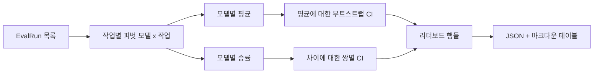
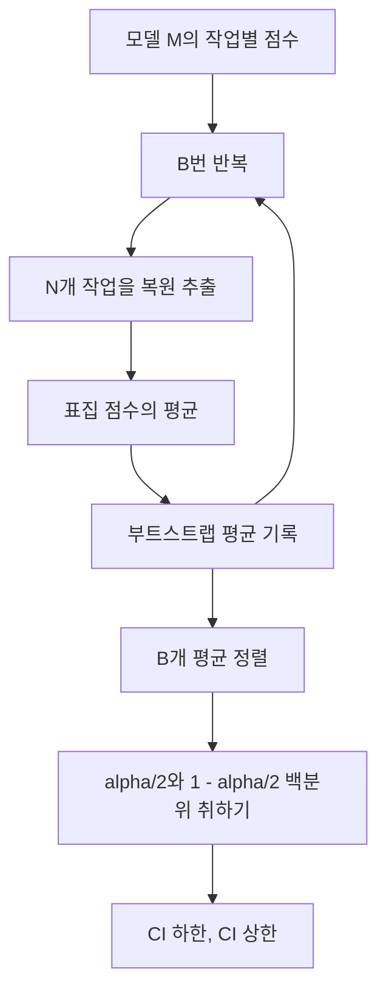

> 🇰🇷 이 문서는 한국어 번역본입니다(ELI5 스타일). 원문: [en.md](en.md)

# 리더보드 집계

> 작업별 점수는 쉽습니다. 이질적인 작업들에 걸친 모델별 순위는 더 어렵습니다. 천 개 예측짜리 리더보드의 통계적 유의성은 모두가 건너뛰는 부분입니다. 이 레슨은 건너뛰지 않습니다.

**유형:** Build
**언어:** Python
**선수 지식:** 페이즈 19 트랙 B 기초, 레슨 70, 71, 73
**시간:** ~90분

## 학습 목표

- 여러 모델과 여러 작업에 걸친 작업별 점수를 깔끔한 모델별 행으로 집계합니다.
- 통과율과 BLEU 값이 집계에 과도하게 영향을 주지 않도록 이질적인 점수를 정규화합니다.
- 모델을 평균과 승률로 순위 매기고, 각각이 옳은 요약인 때를 설명합니다.
- 모델별 평균 점수와 쌍별 차이에 대한 부트스트랩 신뢰 구간을 계산합니다.
- 리더보드를 JSON 보고서와, 레슨 75의 러너가 CI 코멘트에 붙여 넣을 수 있는 마크다운 테이블로 출력합니다.

```figure
ci-leaderboard-ci
```

## 입력의 형태

집계기는 `EvalRun` 레코드 목록을 소비합니다:

```python
@dataclass
class EvalRun:
    model_id: str
    task_id: str
    metric_name: str
    score: float          # in [0, 1]
    category: str
```

레슨 75의 러너는 `(모델, 작업)` 쌍마다 레코드 하나를 내놓습니다. 집계기는 점수가 어떻게 만들어졌는지 신경 쓰지 않습니다. 정규화가 이미 끝났을 것으로 기대합니다: 모든 점수는 `[0, 1]` 안에 있습니다.

## 출력

세 테이블이 나옵니다:



리더보드 행은 `model_id`, `mean_score`, `mean_ci_lo`, `mean_ci_hi`, `win_rate`, `tasks_completed`, 그리고 카테고리별 평균을 위한 선택적 `categories` 맵을 담습니다.

## 정규화

한 작업은 `[0, 1]`로 점수를 매기고 다른 작업은 `[0, 100]`으로 매긴다면, 두 번째가 평균을 조용히 지배합니다. 집계기는 모든 입력 점수가 `[0, 1]` 안에 있는지 검증하고 그렇지 않으면 실행을 거부합니다. 해법은 상류에 삽니다: 지표는 이미 비율을 돌려줘야 합니다. 레슨 71부터 73이 그 계약을 강제합니다.

## 평균과 승률

두 순위 매기기 방식은 다른 목표를 섬깁니다.

평균 점수는 한 모델의 작업별 점수 평균입니다. 리더보드가 보고하는 헤드라인 숫자입니다. 이상값과 작업 불균형에 민감합니다.

승률은 한 모델이 같은 작업에서 다른 모든 모델을 이기는 빈도를 셉니다. 각 작업에서 가장 높은 점수의 모델이 이깁니다(동점은 나눠 가짐). 승률은 승수를 그 모델이 점수를 가진 작업 수로 나눈 값입니다. 이상값과 스케일 차이에는 덜 민감하지만 정보를 잃습니다.

```python
def win_rate(model_id, runs_by_task, all_models):
    wins, total = 0, 0
    for task_id, runs in runs_by_task.items():
        scores = {r.model_id: r.score for r in runs if r.model_id in all_models}
        if model_id not in scores:
            continue
        total += 1
        best = max(scores.values())
        if scores[model_id] >= best:
            wins += 1
    return wins / total if total else 0.0
```

하니스는 둘 다 보고합니다. 레슨 75의 러너는 기본으로 평균으로 순위를 매기지만; 승률용 마크다운 열이 바로 거기 있어서, 사용자가 그쪽을 선호하면 쓸 수 있습니다.

## 부트스트랩 신뢰 구간

모델별 평균에는 작업들 위의 부트스트랩 재표집으로 추정한 신뢰 구간이 따라옵니다. 우리는 작업 id를 복원 추출하고, 재표집 집합 위의 평균을 계산하고, 이를 `B`번 반복하고, 수준 `alpha`의 백분위 구간을 취합니다.



쌍별 비교에서는 작업별 차이 `score_A - score_B`를 부트스트랩하고, 백분위 구간을 취하고, 그것을 보고합니다. 사용자는 구간이 0을 배제하는지 읽어 냅니다. 배제하면 차이는 수준 alpha에서 유의합니다. 배제하지 않으면 리더보드는 두 모델을 동률로 다룹니다.

저수준 도우미(`bootstrap_mean_ci`, `bootstrap_pairwise_diff`)는 기본 `B=1000`을 씁니다; 공개 집계기(`aggregate`, `pairwise_diffs`)는 데모와 테스트가 빨리 끝나도록 기본 `b=500`을 씁니다. 기본 alpha는 0.05입니다. 이 레슨은 부트스트랩을 순수 numpy로 유지합니다. scipy는 없습니다.

## 카테고리

`EvalRun.category`가 설정돼 있으면 집계기는 카테고리별 평균도 보고합니다. 모든 리더보드에서 `math`, `reasoning`, `code`, `safety`라고 쓰인 그 열입니다. 이것은 러너가 전체적으로는 좋지만 코드에서 약한 모델을 알아보게 합니다 — 헤드라인 평균이 가려 주는 정보입니다.

## 마크다운 렌더링

리더보드는 마크다운 테이블로 렌더링됩니다:

```text
| Rank | Model | Mean | 95% CI | Win rate | Tasks |
|------|-------|------|--------|----------|-------|
| 1    | gpt   | 0.78 | 0.74-0.82 | 0.62 | 50 |
| 2    | claude| 0.75 | 0.71-0.79 | 0.34 | 50 |
| 3    | random| 0.10 | 0.07-0.13 | 0.04 | 50 |
```

테이블은 평균 점수순으로 정렬됩니다. CI는 소수 둘째 자리까지 렌더링됩니다. 긴 모델 id는 스무 자로 잘립니다.

## 이 레슨이 하지 않는 것

모델을 실행하지 않습니다. 지표 계층을 호출하지 않습니다. 적응형 ECE나 다른 보정 변형을 구현하지 않습니다; 그것들은 레슨 73입니다. 작업 가중치를 구현하지 않습니다. 여기서 모든 작업은 똑같이 셉니다. 프로덕션 리더보드는 작업에 가중치를 둡니다; 우리는 `weight` 필드로 그 훅을 열어 두지만 집계기에서는 무시합니다. 필요하면 후속 레슨에서 가중치를 더하세요.

## 코드 읽는 법

`main.py`는 `EvalRun`, `LeaderboardRow`, `aggregate`, `bootstrap_mean_ci`, `bootstrap_pairwise_diff`, `render_markdown`을 정의합니다. 데모는 모델 셋과 작업 열두 개의 합성 스위트를 만들고, 집계하고, 리더보드와 쌍별 차이 테이블을 출력합니다. `code/tests/test_leaderboard.py`의 테스트는 부트스트랩, 마크다운 렌더링, 승률 경계 사례, 빈 입력 행동을 고정합니다.

`main.py`를 위에서 아래로 읽으세요. 데이터 형태(EvalRun, LeaderboardRow)가 먼저 오고, 집계기가 그다음, 부트스트랩이 셋째, 렌더링이 마지막입니다. 각 함수에는 집중된 계약이 있습니다.

## 더 나아가기

자연스러운 다음 단계는 비쌍 커플(non-paired) 부트스트랩 대신 쌍별 작업 유의성입니다. 모델 A와 B가 같은 백 개 작업을 모두 돌렸다면, 알맞은 검사는 작업별 차이에 대한 쌍별 부트스트랩인데, 우리는 그것을 구현합니다. 그 너머에는 작업 가족을 존중하는 계층적 부트스트랩이 있습니다(수학 문제들은 서로 독립이 아닙니다; 산술 오류 패턴 하나가 열 문제에 영향을 줍니다). 그건 후속 과제입니다. 이 레슨의 요점은 바닥을 올바르게 놓아서 평가가 여러분이 방어할 수 있는 숫자를 보고하게 하는 것입니다.
