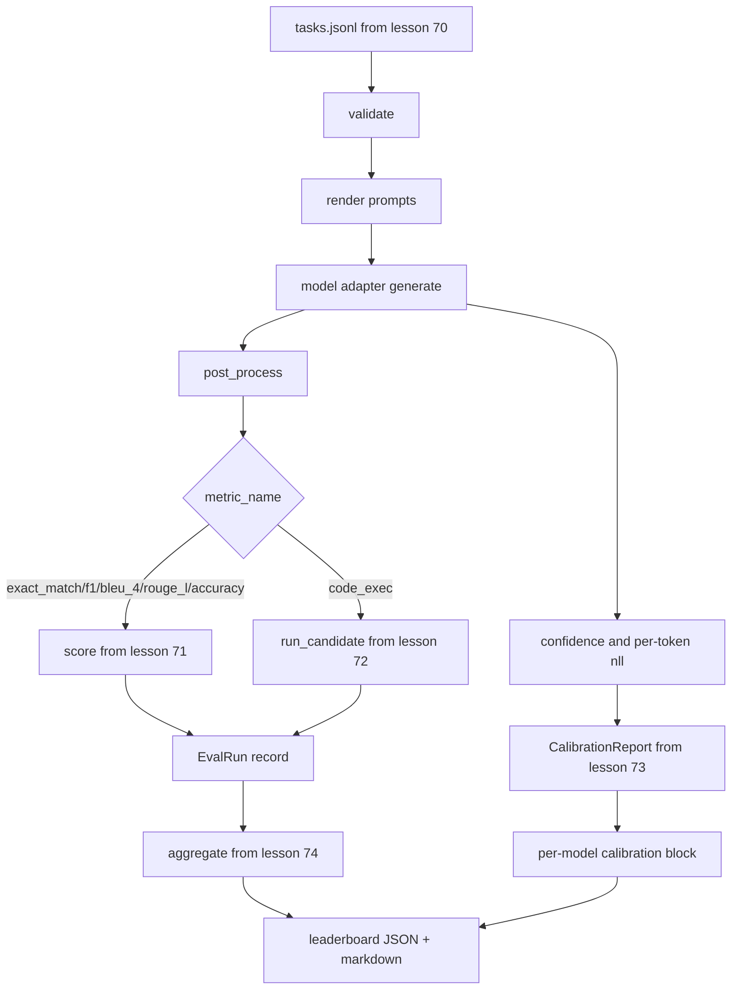

> 🇰🇷 이 문서는 한국어 번역본입니다(ELI5 스타일). 원문: [en.md](en.md)

# End-to-End Eval Runner(종단 간 평가 러너)

> 다섯 개 레슨이 만든 부품을 한 레슨에서 맞춰 보는 시간입니다. 이 러너(runner)는 레슨 70의 과제 명세를 읽고, 어댑터를 통해 모델을 호출한 뒤, 레슨 71과 72로 점수를 매기고, 레슨 73의 캘리브레이션 보고서를 붙인 다음, 레슨 74의 리더보드로 결과를 내보냅니다. 데모는 끝나면 스스로 종료(self-terminate)합니다.

**유형:** 빌드
**언어:** Python
**선수 지식:** 페이즈 19 트랙 B 기초, 레슨 70~74
**시간:** ~90분

## 학습 목표

- Mock, 로컬, API 등 어떤 모델이라도 작은 메서드 면만 갖추면 만족시킬 수 있는 `ModelAdapter` 인터페이스를 정의합니다.
- 픽스처(fixture) JSONL 파일을 대상으로 워커 풀을 통해 과제를 병렬 실행하면서 평가를 수행합니다.
- 지표 계층(exact_match, F1, BLEU-4, ROUGE-L, code_exec)과 캘리브레이션 계층을 한 번의 패스로 합칩니다.
- 모델별 `EvalRun` 레코드를 만들어 그대로 리더보드 집계기로 넘깁니다.
- JSON 보고서와 마크다운 표를 둘 다 출력합니다. 깨끗하게 실행되면 종료 코드 0으로, 검증 실패나 실행 오류가 있으면 0이 아닌 코드로 스스로 종료합니다.

```figure
eval-grid
```

## 파이프라인



이 러너가 바로 통합 지점입니다. 레슨 70부터 74까지 각 레슨은 하나의 모듈을 담당하고, 러너는 그 모듈들을 조립합니다. 러너는 그 모듈들의 로직을 복제하지 않습니다. 대신 임포트해서 씁니다.

## 어댑터 인터페이스

어댑터는 러너와 어떤 모델 사이의 접착 부위(seam)입니다. 인터페이스는 일부러 아주 작게 만들었습니다.

```python
class ModelAdapter:
    model_id: str

    def generate(self, prompt: str, task: TaskSpec) -> Generation: ...
```

`Generation`은 다음 필드를 가진 데이터클래스입니다.

- `text`: 모델이 내놓은 자유 형식의 출력
- `confidence`: `[0, 1]` 범위의 실숫값으로, 모델이 스스로 보고한 정답 확률
- `token_nll`: (선택) 생성된 토큰들에 대한 음의 로그우도 합계
- `token_count`: (선택) 생성된 토큰 개수

러너의 목(mock) 어댑터는 세 가지 맛을 제공합니다. `RuleBasedAdapter`(결정적이고 거의 완벽함), `NoisyAdapter`(과신하는 데 자주 틀림), `BiasedAdapter`(한 카테고리는 잘하고 다른 카테고리는 참담하게 못함). 데모는 이 세 가지를 모두 레슨 70의 픽스처에 돌려 봅니다.

## 병렬 실행

러너는 `concurrent.futures.ThreadPoolExecutor`를 써서 모델별로 과제를 병렬 실행합니다. 워커 수는 기본값으로 8과 과제 개수 중 작은 쪽을 씁니다. 실제 모델 호출의 병목은 네트워크 I/O이기 때문에 스레드로 충분합니다. 코드 실행(code_exec) 경로는 과제 내부에서 자체 서브프로세스를 띄우고, 실행자(executor)는 그 대기만 예약할 뿐입니다.

결정론적 테스트를 위해 러너는 `run_eval(adapters, tasks, parallel=False)`도 노출합니다. 이 옵션으로 테스트가 실행 순서를 고정할 수 있습니다.

## 한 번의 패스로 끝내는 점수 루프

각 과제마다:

1. 프롬프트를 렌더링합니다(퓨샷 접두사 + 프롬프트 본문).
2. 어댑터를 호출하고 호출 시간을 측정합니다.
3. 과제 규칙에 따라 생성 결과를 후처리합니다.
4. 지표 계층으로 디스패치합니다.
5. 점수와 지표 메타데이터로 `EvalRun` 레코드를 만듭니다.
6. `(confidence, correct)` 쌍을 캘리브레이션 버퍼에 추가합니다.

`correct` 신호는 exact_match 계열 지표(`exact_match`, `accuracy`, `code_exec`)에서는 `score >= 1.0`, 등급형 지표에서는 `score >= 0.5`입니다. 이 임곗값은 `_correct_from_score` 안에 있고, 러너는 공개 오버라이드를 제공하지 않습니다.

## 집계

모든 과제가 결과를 갖추면, 러너는 레슨 74의 `aggregate`와 `pairwise_diffs`, 그리고 레슨 73의 `CalibrationReport.from_predictions`를 호출합니다. 출력은 JSON 봉투(envelope) 하나입니다.

```json
{
  "leaderboard": [...],
  "pairwise": [...],
  "calibration": {
    "model_id_a": {"ece": 0.04, "brier": 0.10, "populated_bins": 8, ...},
    ...
  },
  "summary": {
    "tasks": 10,
    "models": 3,
    "wall_seconds": 1.2
  }
}
```

러너는 또한 사용자가 결과를 PR 리뷰에 바로 붙여 넣을 수 있도록 마크다운 표를 stdout에 씁니다.

## 스스로 종료하는 데모

데모는 레슨 70의 열 개 픽스처 과제에 목 어댑터 세 개를 돌립니다. 벽시계 시간은 10초 안에 끝나야 합니다. 깨끗하게 실행되면 종료 코드는 0입니다.

클린런 기준은 다음과 같습니다.

- 모든 과제가 레슨 70 기준으로 검증되었음
- 모든 과제가 레슨 71과 72 기준으로 채점되었음
- 캘리브레이션 보고서가 오류 없이 레슨 73 기준으로 집계되었음
- 리더보드에서 규칙 기반 어댑터가 랜덤 어댑터보다 엄격하게 위에 랭크되었음

이 중 하나라도 깨지면, 러너는 JSON 봉투에 구조화된 오류를 담아 0이 아닌 코드로 종료합니다.

## 이 레슨이 하지 않는 것

실제 모델을 호출하지 않습니다. API 키 처리나 속도 제한(rate limit) 대응도 구현하지 않습니다. 스트리밍이나 부분 생성도 구현하지 않습니다. 어댑터는 호출당 생성 결과 하나만 돌려줍니다. 재시도나 캐싱도 없습니다. 이런 고민은 전부 어댑터 계층에 맡깁니다. 러너는 지표에도, 제공자(provider)에도 중립입니다.

## 코드 읽는 법

`main.py`가 통합 파일입니다. 나머지 다섯 개 레슨 모듈은 상대 경로로 찾아주는 작은 `_load_sibling` 헬퍼를 통해 임포트합니다. 데이터클래스인 `Generation`, `EvalReport`, `ModelAdapter`는 로컬에 정의되어 있고, 목 어댑터들은 파일 맨 아래에 있습니다.

`main.py`를 위에서 아래로 읽으세요. 임포트를 훑고, `run_eval`을 보고, `_score_one`을 보고, 마지막으로 어댑터들을 보세요. 파일 끝의 데모가 진입점입니다.

`code/tests/test_runner.py`의 테스트는 어댑터 인터페이스, 단일 패스 루프, 병렬 대 순차 실행의 동등성, 캘리브레이션 버퍼, JSON 봉투 형태를 고정합니다.

## 더 나아가기

이 러너는 바닥(최소 기준)입니다. 실제 프로덕션(운영 환경) 평가 시스템이라면 다음을 추가합니다. `(task_id, model_id, model_version)`을 키로 하는 결과 캐시, 실행당 달러와 토큰을 추적하는 비용 장부, 속도 제한에 백오프하는 재시도 계층, pass-at-k 과제를 위한 샘플링 정책, 긴 스위트를 위한 스트리밍 출력 형식. 이 각각은 지표 계층이나 집계 계층을 건드리지 않고 러너를 감싸는 단일 관심사입니다. 이 분리가 바로 계약의 핵심입니다.

Mock 어댑터가 돌아가는 걸 확인한 뒤, 실제 제공자용 어댑터를 하나 추가해 보세요. 무료 티어가 있는 곳을 골라 접착 코드 서른 줄을 쓰면 리더보드에 불이 켜지는 걸 볼 수 있습니다. 그다음 두 번째 제공자를 추가하고, 나머지 작업은 하네스에 맡기세요.
