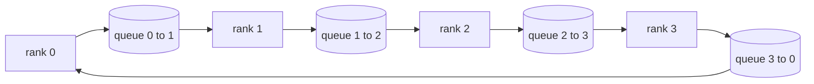

> 🇰🇷 이 문서는 한국어 번역본입니다(ELI5 스타일). 원문: [en.md](en.md)

# Collective Ops From Scratch(집단 통신 연산 직접 만들기)

> 분산 학습을 떠받치는 네 가지 집단 통신 연산(collective ops)은 allreduce, broadcast, allgather, reduce_scatter입니다. 학습 프레임워크가 제공하는 다른 모든 프리미티브(기본 연산)는 이 넷을 감싼 래퍼입니다. `multiprocessing.Queue` 메시 위에서 한 번 만들어 보고, 참조 구현과 대조해서 검증까지 마치면, 이후 트랙의 나머지는 배관 작업에 가까워집니다.

**유형:** 빌드
**언어:** Python
**선수 지식:** 페이즈 19 트랙 C, 레슨 42-49
**시간:** ~90분

## 학습 목표

- 링(ring) allreduce를 두 패스(reduce-scatter 후 allgather)로 구현하고, 랭크당 통신량이 요소당 2(N-1)/N바이트임을 증명합니다.
- `multiprocessing.Queue` 위의 점대점(point-to-point) 전송을 재료로 broadcast, allgather, reduce_scatter를 만듭니다.
- 모든 프리미티브를 같은 입력에 대한 `torch.distributed` gloo 참조 구현과 대조해 검증합니다.
- 클러스터 형태, 지연 시간 하한, 대역폭 상한을 근거로 링 대 트리 선택을 방어할 수 있게 됩니다.

## 문제 상황

N개 랭크 위에서 순진한 allreduce를 돌리면 루트에 텐서를 N번 보내고 다시 N번 브로드캐스트로 받아옵니다. 랭크당 대역폭은 O(N)으로 늘고, 루트는 병목이 되며, 벽시계 시간 하한은 가장 느린 링크 속도의 N배가 됩니다. 링 allreduce는 이것을 크기 T/N짜리 청크 2(N-1)개로 납작하게 만들어, 랭크당 바이트 수를 클러스터 크기와 무관하게 2T(N-1)/N으로 떨어뜨립니다. 트리 allreduce는 깊이가 2(N-1)이 아니라 log2(N) 홉이기 때문에 N이 작거나 지연 시간이 큰 링크에서 이깁니다. 클러스터 형태에 맞지 않는 토폴로지를 고르면 가장 느린 GPU가 스텝 시간을 결정해 버립니다.

이 트랙에서 읽게 될 모든 분산 학습 프레임워크는 이 네 프리미티브에 의존합니다. PyTorch DDP는 파라미터 버킷마다 allreduce 한 번으로 그래디언트를 동기화합니다. ZeRO는 reduce_scatter로 옵티마이저 상태를 샤딩하고, 갱신된 파라미터를 allgather로 브로드캐스트합니다. FSDP는 풀 포워드를 allgather 더하기 reduce_scatter로 바꿉니다. 파이프라인 병렬화는 스테이지 그룹 간 활성화 전달에 broadcast가 필요합니다. 네 가지 집단 연산을 직접 구현해 보지 못하면, 학습이 왜 멈추는지, 그래디언트 불일치가 왜 랭크 3에서 드러나는지, 토폴로지를 바꿨을 때 파이프라인 버블이 왜 두 배가 되는지 이유를 설명할 수 없습니다.

## 개념



### 두 패스로 하는 링 allreduce

텐서를 0..N-1로 번호 붙인 N개의 동일한 청크로 쪼갭니다. 각 랭크는 자기 랭크 번호와 같은 청크를 소유합니다. 패스 1인 reduce-scatter는 N-1스텝을 돕니다. 스텝 s에서 랭크 r은 청크 (r - s) mod N을 랭크 (r + 1) mod N에 보내고, 랭크 (r - 1) mod N에서 청크 (r - s - 1) mod N을 받아 로컬 복사본에 누적합니다. N-1스텝이 끝나면 랭크 r은 청크 r의 완전한 합을 소유합니다. 패스 2인 allgather는 또 N-1스텝을 돌면서 완성된 청크를 링 위로 회전시켜, 모든 랭크가 모든 청크의 완전한 합을 갖도록 합니다.

| 프리미티브 | 랭크당 바이트 | 스텝 수 | 언제 쓰나 |
|-----------|---------------|-------|-------------|
| Ring allreduce | 2T(N-1)/N | 2(N-1) | T가 크고 대역폭이 넉넉한 동질 클러스터 |
| Tree allreduce | T log2(N) | 2 log2(N) | T가 작거나 지연 시간이 큰 링크 |
| Broadcast | T | log2(N) 트리 | 파라미터 초기화, 스칼라 설정값 |
| Allgather | T(N-1)/N | N-1 | 샤딩된 포워드, ZeRO 언샤드 |
| Reduce_scatter | T(N-1)/N | N-1 | ZeRO 그래디언트 샤딩 |

### NCCL 대역 역할을 하는 큐 메시

NCCL은 PCIe와 NVLink 위에서 하드웨어 오프로드된 리덕션(reduction)으로 동작합니다. CPU에는 그런 게 없습니다. 링의 각 에지마다 `multiprocessing.Queue` 하나를 두면 생산자 하나, 소비자 하나인 순서가 보장된 점대점 전달을 얻습니다. 리덕션은 사용자 공간에서 일어나므로 Python 오버헤드를 치르지만, 와이어 패턴 자체는 NCCL 링 allreduce와 동일합니다. 큐 버전으로 정확성을 따져 보면 클러스터에서의 동작도 따라옵니다.

### gloo로 검증하기

모든 프리미티브는 유닛 테스트를 함께 출고합니다. 같은 텐서를 같은 월드 크기(world size)의 gloo 백엔드로 초기화한 `torch.distributed` 결과와 비교하는 테스트입니다. 링 allreduce가 gloo와 float32 엡실론보다 크게 벗어나면 테스트가 실패합니다. 참조 구현 대조 검증은 협상의 여지가 없습니다. 이게 없으면 프리미티브는 실제 학습 10000스텝까지 올바르게 보이지 않습니다(그때 가서야 틀렸음이 드러납니다).

```figure
ci-ring-allreduce
```

## 만들기

`code/main.py`는 다음을 구현합니다.

- N개의 `multiprocessing.Queue` 인스턴스를 링으로 연결하고 랭크별로 `send(dst, tensor)`와 `recv(src)`를 노출하는 `Mesh` 클래스
- 두 패스 알고리즘을 수행하는 `ring_allreduce(mesh, rank, world_size, tensor)`
- 로그 트리로 동작하는 `broadcast(mesh, rank, world_size, tensor, src)`
- N-1회 회전을 사용하는 `allgather(mesh, rank, world_size, tensor)`
- allreduce의 전반부로 동작하는 `reduce_scatter(mesh, rank, world_size, tensor)`
- 같은 입력을 gloo 백엔드의 `torch.distributed`로 돌려 바이트 단위로 동일한지 비교하는 `_gloo_reference(op, world_size, tensor)`

실행:

```bash
python3 code/main.py
```

출력: 큐 메시 결과와 gloo 결과를 비교하는 프리미티브별 검증 표, 그리고 2T(N-1)/N 스케일링을 증명하는 랭크당 바이트 카운터가 이어서 나옵니다.

## 실전에서 쓰는 프로덕션 패턴

출시 가능한 수준으로 프리미티브를 튼튼하게 만드는 패턴 세 가지입니다.

**allreduce 전에 그래디언트를 버킷(bucket)으로 묶습니다.** 10억 파라미터 모델에는 그래디언트 텐서가 수만 개 있습니다. 텐서마다 allreduce를 한 번씩 하면 지연 시간 하한을 N번 치릅니다. DDP는 그래디언트를 ~25MB 청크로 버킷화해 버킷당 allreduce 한 번을 보냅니다. 작은 텐서들은 큰 텐서에 편승하는 셈입니다. 버킷화가 없으면 지연 시간 오버헤드가 스텝 전체를 지배합니다.

**통신과 연산을 겹칩니다.** 백워드는 레이어를 역순으로 훑으며 그래디언트를 계산합니다. 마지막 레이어의 그래디언트가 준비되는 순간, 다음 레이어가 계산을 계속하는 동안 그 그래디언트의 allreduce를 바로 출발시킵니다. PyTorch DDP는 버킷 준비 훅으로 이 배선을 해 둡니다. 네트워크에 여유가 있으면 이 겹침 덕분에 체감 통신 시간이 절반으로 줄어듭니다.

**종교가 아니라 메시지 크기로 링과 트리를 고릅니다.** NCCL은 토폴로지 감지기를 싣고 있습니다. ~1MB보다 큰 메시지에는 링을, 그 아래에는 트리를 고르는 방식입니다. 교차점은 대역폭 대 지연 시간의 싸움입니다. 1MB를 넘으면 대역폭 항 2T(N-1)/N이 지배해서 링이 이기고, 1MB 아래에서는 log2(N) 홉 수가 이깁니다. 토폴로지를 하나로 박아 두면 엉뚱한 메시지 크기에서 처리량을 잃습니다.

## 사용법

프로덕션 패턴:

- **PyTorch DDP.** 백워드 후 버킷화된 그래디언트에 `dist.all_reduce`를 호출합니다. 버킷 크기는 조절 가능하고, 100기가비트 이더넷에는 기본값 25MB가 무난합니다.
- **DeepSpeed ZeRO.** 그래디언트 샤딩에는 reduce_scatter를, 포워드 전에 풀 파라미터를 재구성하는 데는 allgather를 씁니다. 이 레슨의 프리미티브가 바로 ZeRO가 거는 호출들입니다.
- **FSDP.** 포워드는 allgather로 레이어를 언샤드하면서 시작하고, 계산한 뒤 reduce_scatter로 리덕스하고 언샤드를 버립니다. 같은 프리미티브, 다른 스케줄.

## 출시하기

레슨 77-81에서 큐 메시 프리미티브를 사용합니다. 레슨 77은 allreduce를 DDP에 접선합니다. 레슨 78은 reduce_scatter를 ZeRO에 접선합니다. 레슨 79는 broadcast를 파이프라인 활성화 전달에 접선합니다. 레슨 81은 넷을 모두 합쳐 종단 간 데모를 만듭니다.

## 연습 문제

1. 트리 allreduce 변형을 추가하고 메시지 크기에 따라 링과 트리를 전환하세요. 교차점을 측정해 보세요.
2. `recv_timeout_ms`를 추가해서 멈춘 랭크가 영원히 대기하는 대신 데드라인 오류를 드러내게 하세요.
3. 네 프리미티브에서 `multiprocessing.Queue`를 TCP 소켓으로 바꿔 보세요. 테스트는 그대로, 와이어만 진짜로.
4. 대역폭 계측 훅을 추가해서 랭크당 바이트 카운터가 JSONL로 기록되게 하세요.
5. 4랭크에서 크기 1KB, 1MB, 16MB 텐서를 대상으로 링과 트리의 벽시계 시간을 비교하세요. 교차점을 실험 근거로 방어해 보세요.

## 핵심 용어

| 용어 | 사람들이 말하는 것 | 실제 의미 |
|------|----------------|------------------------|
| Allreduce | "랭크 전체에서 합을 구한다" | 호출 후 모든 랭크가 같은 리덕스된 텐서를 보유 |
| Ring | "빠른 토폴로지" | 크기 T/N짜리 청크 N-1개가 순환 고리를 두 바퀴 흐름 |
| Tree | "로그 토폴로지" | 리덕션이 이진 트리를 따름. 깊이는 log2(N) 홉 |
| Allgather | "샤드를 이어 붙인다" | 모든 랭크가 다른 모든 랭크의 샤드로 끝남 |
| Reduce_scatter | "합을 쪼갠다" | 각 랭크가 청크 하나의 합만으로 끝남 |
| Bucket | "작은 텐서를 합친다" | N번의 작은 allreduce를 하나의 큰 allreduce로 병합 |

## 더 읽을거리

- [PyTorch Distributed: NCCL collectives](https://pytorch.org/docs/stable/distributed.html#collective-functions)
- [Horovod ring allreduce paper](https://arxiv.org/abs/1802.05799)
- [NCCL topology and algorithm selection](https://docs.nvidia.com/deeplearning/nccl/user-guide/docs/index.html)
- [Patarasuk and Yuan, Bandwidth optimal allreduce algorithms](https://www.cs.fsu.edu/~xyuan/paper/09jpdc.pdf)
- 페이즈 10 레슨 05 - 분산 학습 개요
- 페이즈 19 레슨 77 - 이 프리미티브 위에 접선한 DDP
