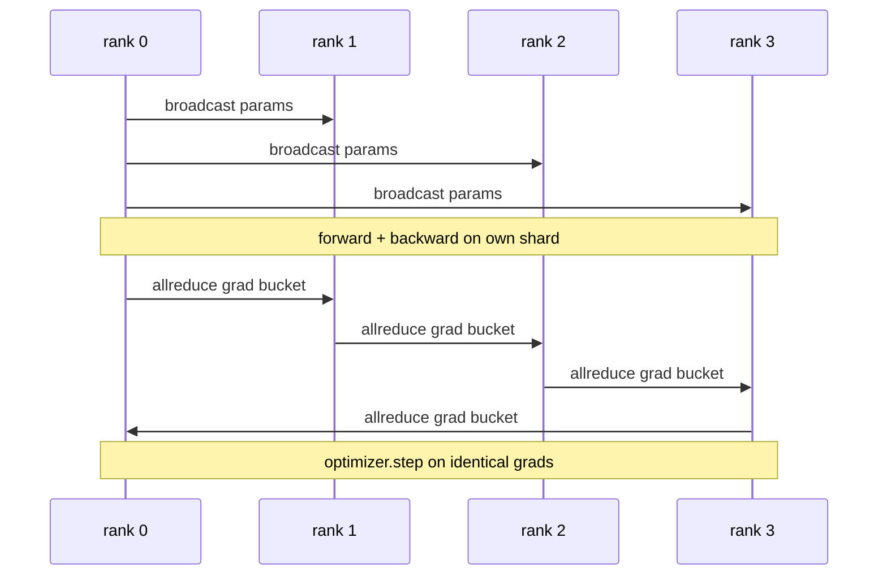

> 🇰🇷 이 문서는 한국어 번역본입니다(ELI5 스타일). 원문: [en.md](en.md)

# Data Parallel DDP From Scratch(데이터 병렬 DDP 직접 만들기)

> DistributedDataParallel(DDP)은 allreduce 위에 얹은 훅입니다. 모델을 감싸고, 랭크 0에서 초기 파라미터를 broadcast해 모든 랭크가 동일한 출발선에 서게 하고, 모든 파라미터에 그래디언트 allreduce를 걸어 주는 백워드 훅을 달면, 나머지는 그냥 경사 하강법입니다. 이 패턴 전체가 200줄입니다.

**유형:** 빌드
**언어:** Python
**선수 지식:** 페이즈 19 트랙 C, 레슨 42-49
**시간:** ~90분

## 학습 목표

- 초기 파라미터를 broadcast하고 백워드 후 그래디언트를 allreduce하는, `DistributedDataParallel` 모양의 래퍼를 접선합니다.
- gloo 백엔드 위에서 파일 기반 랑데부(rendezvous)를 써서 `torch.multiprocessing.spawn`으로 N개의 CPU 랭크를 띄웁니다.
- 같은 모델을 같은 데이터로 순차 학습시켜 스텝별 파라미터가 동일함을 보여 주고, 그래디언트 동기화의 정확성을 증명합니다.
- 버킷(그래디언트 병합)과 겹침(백워드 중 통신)이라는 두 가지 변경이 '동작하는 DDP'를 '프로덕션(운영 환경) DDP'로 바꾼다는 점을 방어할 수 있게 됩니다.

## 문제 상황

활성화만 12GB인 10억 파라미터 모델은 소비자용 GPU 한 장에 들어가지 않습니다. 설령 들어가도 학습에 몇 주가 걸립니다. 데이터 병렬(data parallel)은 배치를 N개 랭크에 나눠 담고, 각 랭크가 자기 샤드로 포워드와 백워드를 계산하며, 매 스텝마다 모든 랭크의 그래디언트를 합산해 N개 복제본이 전부 동일하게 유지되도록 합니다. 합산된 그래디언트를 가지고 옵티마이저가 스텝을 밟습니다.

그래디언트 동기화가 없으면 N개 복제본은 스텝 2에서 이미 갈라집니다. 그 모델은 더 이상 '더 많은 데이터로 학습한 하나의 모델'이 아니라, 초기 가중치만 우연히 같은 N개의 별개 모델입니다. 그래디언트 동기화를 잘못하면(파라미터마다 allreduce 한 번, 겹침 없음, 버킷화 없음) 네트워크가 병목이 되고 GPU들은 와이어를 기다리며 놀게 됩니다. DDP의 기술(크래프트)은 그래디언트 동기화를 연산 대비 거의 공짜에 가깝게 만드는 것입니다. 정석인 PyTorch DDP는 그래디언트 버킷화, allreduce를 다음 레이어 백워드와 겹치기, NVLink 위의 NCCL 사용으로 이를 달성합니다. 우리는 gloo와 CPU로 이 세 가지를 모두 재현하며 같은 교훈을 얻습니다.

## 개념



### DDP에 필요한 세 가지 연산

| 스테이지 | 집단 연산 | 이유 |
|-------|-----------|-----|
| 초기화 | 랭크 0에서 broadcast | 모든 랭크가 같은 파라미터로 시작 |
| 백워드 후 | 그래디언트마다 allreduce | 평균 그래디언트로 옵티마이저가 스텝 |
| 가끔 | 버퍼 broadcast | 배치노멀 실행 통계를 동기화 상태로 유지 |

### 합이 아니라 평균인 이유

Allreduce-SUM을 world_size로 나누면 평균 그래디언트가 됩니다. 평균은 world_size에 불변입니다. 즉 랭크 하나에서 튜닝한 학습률이 네 랭크에서도 그대로 동작합니다. 스텝당 그래디언트 크기가 변하지 않기 때문입니다. 나눗셈 없는 Allreduce-SUM은 클러스터 크기를 바꿀 때마다 학습률을 다시 튜닝하게 만듭니다. DDP는 SUM을 감싸고 나눠 주고, 이 레슨에서도 똑같이 합니다.

### 그래디언트를 버킷으로 묶는 이유

트랜스포머에는 파라미터 텐서가 수천 개 있습니다. 텐서마다 allreduce를 하면 gloo의 지연 시간 하한을 수천 번 치릅니다. DDP는 그래디언트를 ~25MB 버킷으로 묶어 버킷당 allreduce 한 번을 보냅니다. 와이어를 건너는 총 바이트는 같지만 지연 시간이 버킷에 걸쳐 분산(amortise)됩니다. 이 레슨의 작은 모델은 전부 하나의 버킷으로 묶습니다. 중요한 건 구조이고, 그 구조가 그대로 옮겨 갑니다.

### 시드를 고정하는 이유

모든 랭크는 셔플에는 `torch.manual_seed(seed + rank)`를, 파라미터 초기화에는 `torch.manual_seed(seed)`를 호출해야 합니다. 시드를 하나만 공유하면 모든 랭크가 같은 배치 순서를 보게 됩니다(데이터 병렬의 의미 상실). 파라미터 초기화에 랭크별 시드를 쓰면 초기 파라미터가 float 엡실론만큼 어긋나고, 그래디언트 동기화가 있어도 복제본이 더 이상 동일해지지 않습니다. 시드 패턴을 정확히 맞추지 않으면 파라미터 동등성 테스트가 스텝 1에서 실패합니다.

```figure
ci-ddp-grad-sync
```

## 만들기

`code/main.py`는 다음을 구현합니다.

- `MiniMLP`: 몇 초 안에 수렴할 만큼 작지만 배선을 확실히 드러낼 만큼은 큰 3계층 MLP
- `DistributedDataParallel(model, world_size)`: 생성 시점에 파라미터를 broadcast하고, `sync_grads`가 누적된 allreduce 합산 그래디언트를 world_size로 나눠 주는 래퍼를 돌려줌
- `worker(rank, world_size, ...)`: gloo 위에서 `torch.distributed`를 초기화하고 포워드, 백워드, 동기화, 스텝을 도는 전체 학습 루프
- `_reference_single_process_loop(...)`: 같은 모델을 같은 데이터로 한 랭크에서 순차 학습시키는 루프. 테스트가 스텝마다 바이트 단위 파라미터 동등성 비교에 사용

실행:

```bash
python3 code/main.py
```

출력: 단일 프로세스의 손실과 파라미터 체크섬을 4랭크 DDP 실행과 비교하는 스텝별 학습 표. 두 경로는 float 엡실론 수준까지 동일한 손실 곡선을 만들어, 그래디언트 동기화가 올바름을 증명합니다.

## 실전에서 쓰는 프로덕션 패턴

DDP를 출시 가능한 수준으로 튼튼하게 만드는 패턴 세 가지입니다.

**사용되지 않는 파라미터를 찾습니다.** 일부 포워드 경로는 조건에 따라 파라미터를 건너뜁니다(조기 종료, mixture-of-experts 라우터). 건너뛴 파라미터에는 그래디언트가 없지만 DDP의 버킷 준비 훅은 그것들을 계속 기다리고, allreduce는 데드락에 빠집니다. `find_unused_parameters=True`는 리듀스 전에 어떤 파라미터가 그래디언트를 받았는지 먼저 살펴 보라고 DDP에 알려 줍니다. 비용은 스텝마다 그래프 순회 한 번이라, 포워드에 분기가 없다면 끄고 사는 게 좋습니다.

**정적 그래프 최적화.** 포워드가 스텝마다 안정적이라면 `static_graph=True`로 DDP가 버킷 스케줄을 미리 계산하게 할 수 있습니다. 이 최적화는 규모에서 힘을 발휘합니다. 스텝당 몇 ms를 아낀 것이 10000스텝에 걸쳐 누적되기 때문입니다.

**그래디언트 누적은 주의해서 씁니다.** 마이크로배치마다 동기화하지 않고 K개 마이크로배치에 걸쳐 그래디언트를 누적하면 처리량이 10배 좋아집니다. DDP는 백워드 후 allreduce를 잠시 멈추는 컨텍스트 매니저 `no_sync()`를 제공합니다. 이 매니저를 까먹으면 allreduce를 K번 헛돌게 되고, 처리량은 바닥을 칩니다.

## 사용법

프로덕션 패턴:

- **PyTorch DDP.** 정석 구현. `torch.nn.parallel.DistributedDataParallel(model)`이 버킷화, 겹침, no_sync 컨텍스트를 알아서 접선합니다.
- **HuggingFace Accelerate.** `torchrun` 환경 변수 처리와 모델 래핑을 해 주는 런처를 얹습니다. 내부는 같은 DDP입니다.
- **Megatron-LM 데이터 병렬.** 큰 모델을 위해 DDP와 텐서 병렬을 결합합니다. 그중 데이터 병렬 부분은 '백워드 후 allreduce'라는 같은 패턴입니다.

## 출시하기

레슨 78(ZeRO 샤딩)은 파라미터별 allreduce를 reduce_scatter로 바꿔 각 랭크가 옵티마이저 상태의 자기 샤드만 저장하게 만듭니다. 레슨 81은 DDP와 ZeRO를 합쳐 종단 간 데모를 만듭니다.

## 연습 문제

1. 크기를 조절할 수 있는 그래디언트 버킷을 추가하고, 더 깊은 모델에서 '파라미터당 allreduce 한 번' 방식 대비 속도 향상을 측정하세요.
2. `no_sync()`를 컨텍스트 매니저로 구현하고, K개 마이크로배치에 걸친 그래디언트 누적이 단일 프로세스 베이스라인과 일치하는지 검증하세요.
3. 포워드가 가끔 MLP 레이어 하나를 건너뛰는 `find_unused_parameters` 모드를 추가하세요. 플래그 없이는 실행이 데드락에 빠져야 합니다.
4. gloo를 `torch.distributed.barrier()`만 사용하는 동기화로 바꿔서, allreduce 기반 동기화와 배리어 기반 동기화의 차이를 몸으로 느껴 보세요.
5. 배치 크기 1, 16, 256에 대해 스텝 시간에서 그래디언트 동기화가 차지하는 비율을 측정하고 스케일링을 설명하세요.

## 핵심 용어

| 용어 | 사람들이 말하는 것 | 실제 의미 |
|------|----------------|------------------------|
| DDP | "데이터 병렬" | 매 스텝 파라미터를 broadcast하고 그래디언트를 allreduce하는 래퍼 |
| Bucket | "그래디언트 병합" | N번의 작은 allreduce를 하나의 큰 allreduce로 묶음 |
| Overlap | "통신 숨기기" | 뒤 레이어가 아직 백워드를 계산하는 동안 allreduce를 미리 걸어 둠 |
| no_sync | "누적" | 그래디언트 누적을 위해 백워드 후 allreduce 생략 |
| find_unused | "분기 많은 포워드" | 리듀스 전에 그래디언트 없는 파라미터를 탐지 |

## 더 읽을거리

- [PyTorch DistributedDataParallel docs](https://pytorch.org/docs/stable/generated/torch.nn.parallel.DistributedDataParallel.html)
- [PyTorch DDP internals tutorial](https://pytorch.org/tutorials/intermediate/ddp_tutorial.html)
- [Li et al, PyTorch Distributed: Experiences on Accelerating Data Parallel Training](https://arxiv.org/abs/2006.15704)
- 페이즈 19 레슨 76 - DDP가 만들어진 바탕인 집단 연산들
- 페이즈 19 레슨 78 - 파라미터별 allreduce를 reduce_scatter로 바꾸는 ZeRO 샤딩
