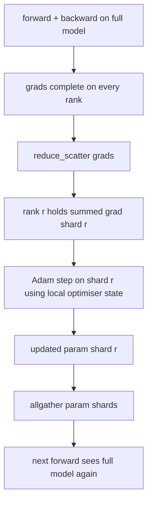

> 🇰🇷 이 문서는 한국어 번역본입니다(ELI5 스타일). 원문: [en.md](en.md)

# ZeRO Optimizer State Sharding(ZeRO 옵티마이저 상태 샤딩)

> Adam은 파라미터마다 모멘트 추정치 두 개를, 그것도 float32로 저장합니다. 70억 파라미터 모델은 옵티마이저 상태만 56GB입니다. ZeRO 스테이지 1은 이 상태를 N개 랭크에 샤딩해서, 각 랭크가 옵티마이저의 1/N만 갖게 합니다. 로컬 스텝이 끝나면 갱신된 파라미터 샤드를 다시 broadcast하고, 모든 랭크가 풀 모델을 재조립한 뒤 다음 스텝을 시작합니다. 이득은 학습 스택에서 가장 큰 단일 메모리 할당이 선형으로 줄어든다는 것입니다.

**유형:** 빌드
**언어:** Python
**선수 지식:** 페이즈 19 트랙 C, 레슨 42-49
**시간:** ~90분

## 학습 목표

- 옵티마이저 상태(1차 모멘트, 2차 모멘트, fp32 마스터 복사본)를 N개 랭크에 샤딩해 각 랭크가 1/N을 갖게 만듭니다.
- reduce_scatter로 각 랭크에게 자기 샤드의 그래디언트 합만 전달하고, 이어서 allgather로 갱신된 파라미터 샤드를 다시 뿌립니다.
- 스테이지 1, 2, 3의 메모리 절감 표를 순수(바닐라) DDP 대비 계산합니다.
- 모델 크기와 대역폭 예산을 근거로 스테이지 1 vs 2 vs 3 선택을 방어할 수 있게 됩니다.

## 문제 상황

바닐라 DDP는 모든 것을 복제합니다. 파라미터, 그래디언트, 옵티마이저 상태가 모든 랭크에 통째로 존재합니다. fp16 기준 70억 파라미터 모델이면 랭크당 파라미터 14GB, 그래디언트 14GB, 옵티마이저 상태 28GB입니다. 옵티마이저 상태가 가장 큰 항인데, 샤딩하기는 가장 쉽습니다. 포워드나 백워드 중에는 건드리지 않고 스텝 때만 쓰이기 때문입니다.

ZeRO 스테이지 1은 옵티마이저 상태를 샤딩합니다. 각 랭크는 Adam 모멘트의 1/N을 보유합니다. 백워드 후, 풀 그래디언트를 allreduce해서 로컬에서 스텝을 밟는 대신, ZeRO는 reduce_scatter를 써서 각 랭크가 자기 샤드의 합산 그래디언트만 받게 합니다. 랭크는 자기 샤드의 마스터 파라미터에 옵티마이저 스텝을 적용합니다. 그다음 갱신된 파라미터 샤드를 allgather해서, 모든 랭크가 다음 포워드를 위해 풀 모델을 갖춥니다. 옵티마이저 메모리는 N분의 1로 줄어듭니다. 스텝당 와이어 트래픽은 DDP와 같습니다. reduce_scatter 한 번 더하기 allgather 한 번이 대역폭 기준으로 allreduce 한 번과 같기 때문입니다. 메모리는 이기고, 처리량은 유지됩니다.

## 개념



### ZeRO의 스테이지

| 스테이지 | 샤딩 대상 | 랭크당 메모리 | 스텝당 통신 |
|-------|----------------|------------------|---------------|
| DDP | 없음 | params + grads + optim | allreduce 1회 |
| ZeRO-1 | 옵티마이저 상태 | params + grads + optim/N | reduce_scatter 1회 + allgather 1회 |
| ZeRO-2 | optim + grads | params + grads/N + optim/N | reduce_scatter 1회 + allgather 1회 |
| ZeRO-3 | optim + grads + params | params/N + grads/N + optim/N | 레이어당 allgather 1회 + 레이어당 reduce_scatter 1회 |

옵티마이저 상태가 예산을 지배하기 때문에 스테이지 1이 가장 값싼 이득입니다. 스테이지 2는 그래디언트 샤드 누적 로직이 필요하지만 대역폭은 같습니다. 스테이지 3(FSDP)은 모든 포워드와 백워드에서 레이어별 통신을 치르고, 그 대가로 파라미터 샤드 메모리 절감을 얻습니다. 이 레슨은 스테이지 1을 온전히 구현합니다.

### 메모리 계산, 실제 숫자로

Adam과 혼합 정밀도(mixed precision)로 학습하는 P개 파라미터 모델의 경우:

| 항목 | 바닐라 | ZeRO-1 | 이유 |
|------|---------|--------|-----|
| fp16 params | 2P바이트 | 2P바이트 | 포워드에 필요 |
| fp16 grads | 2P바이트 | 2P바이트 | 백워드에 필요 |
| fp32 master copy | 4P바이트 | 4P/N바이트 | 옵티마이저만 사용 |
| fp32 first moment | 4P바이트 | 4P/N바이트 | 옵티마이저만 사용 |
| fp32 second moment | 4P바이트 | 4P/N바이트 | 옵티마이저만 사용 |
| 합계 | 16P바이트 | 4P + 12P/N바이트 |   |

N=8이면: 바닐라 16P, ZeRO-1 5.5P로 65% 절감입니다. N=64이면: 바닐라 16P, ZeRO-1 4.19P로 74% 절감입니다.

### reduce_scatter가 'allreduce 후 샤딩'을 이기는 이유

allreduce는 모든 랭크에게 합산 그래디언트 전체를 줍니다. 샤드 r만 필요하다면, 리듀스된 그래디언트 중 (N-1)/N만큼은 랭크 r에서 낭비됩니다. reduce_scatter는 각 랭크가 소유한 샤드 딱 그것만 전달합니다. 랭크당 바이트 수는 allreduce와 같지만(allreduce는 reduce_scatter + allgather이므로), 후반부를 나중의 파라미터 샤드 allgather로 대체하는 셈입니다. 와이어 총량은 DDP와 동일하고, 메모리만 나눠집니다.

```figure
cd-zero-shard
```

## 만들기

`code/main.py`는 다음을 구현합니다.

- `flatten_params(module)`와 `unflatten_into(module, flat)`: 모델의 파라미터를 하나의 연속 텐서로 포장하고 다시 풀어 놓는 함수. 플랫 레이아웃 덕분에 랭크별 샤딩이 단순한 슬라이스가 됩니다.
- `ZeroOptimizer(model, world_size, rank, lr)`: 마스터 복사본과 Adam 모멘트 중 해당 랭크의 샤드를 소유합니다.
- `step()`: 플랫 그래디언트에 reduce_scatter를 실행하고, 랭크의 샤드에 Adam을 적용한 뒤, 갱신된 파라미터를 allgather로 되돌려 받습니다.
- 3계층 MLP를 20스텝 학습시키면서 바닐라 DDP 베이스라인과 나란히 스텝별 메모리 예산을 출력하는 데모

실행:

```bash
python3 code/main.py
```

출력: 스텝별 손실과, DDP의 풀 복사본 대비 ZeRO-1이 각 랭크에 옵티마이저 상태의 1/N만 보유함을 보여 주는 메모리 표.

## 실전에서 쓰는 프로덕션 패턴

ZeRO를 출시 가능한 수준으로 튼튼하게 만드는 패턴 세 가지입니다.

**샤딩된 체크포인트가 중요합니다.** ZeRO-1의 옵티마이저 상태는 랭크에 걸쳐 쪼개져 있습니다. 체크포인트는 어떤 랭크가 무엇을 소유하는지 기록해야 합니다. 레슨 80은 같은 월드 크기에서 ZeRO 실행을 이어받는 샤딩 체크포인트 매니페스트를 만듭니다. 이게 없으면 저장된 상태를 재시작 때 읽을 수 없습니다.

**혼합 정밀도가 핵심입니다.** ZeRO는 혼합 정밀도 기법입니다. 샤딩되는 것은 fp32 마스터 복사본입니다. 혼합 정밀도 없이 ZeRO를 돌리면 fp16 포워드의 이득 없이 fp32 마스터의 메모리 세금만 치릅니다. 프로덕션 실행은 항상 ZeRO를 autocast나 bf16 가중치와 짝지어 씁니다.

**스테이지 1은 거의 공짜 이득입니다.** 대역폭 기준 통신량은 DDP와 동일합니다. 메모리 절감은 N에 선형입니다. 비용이라곤 옵티마이저 샤드 관리(bookkeeping)뿐입니다. 프로덕션 스택은 파라미터 샤드 메모리도 문제가 되지 않는 한 스테이지 1을 기본으로 삼습니다. 문제가 되면 스테이지 2나 3에서 통신을 메모리로 바꿉니다.

## 사용법

프로덕션 패턴:

- **DeepSpeed ZeRO.** 참조 구현. `deepspeed_config.json`에서 스테이지 1/2/3과 파티션 크기를 고릅니다.
- **PyTorch FSDP.** PyTorch 네이티브 대응물. `ShardingStrategy.SHARD_GRAD_OP`가 ZeRO-2, `FULL_SHARD`가 ZeRO-3입니다.
- **HuggingFace Accelerate.** DeepSpeed와 FSDP를 하나의 통일된 설정 아래 감쌉니다.

## 출시하기

레슨 79(파이프라인 병렬)는 직교하는 샤딩 축입니다. 같은 모델의 옵티마이저 상태를 쪼개는 대신, 파이프라인은 레이어를 랭크에 걸쳐 쪼갭니다. 레슨 81은 종단 간 데모 위에 DDP + ZeRO를 조합합니다.

## 연습 문제

1. 그래디언트를 샤딩해서 ZeRO-2로 확장하세요. 각 랭크가 자기 샤드의 그래디언트만 저장하면 되고, 백워드 후 샤드가 아닌 부분을 0으로 만들어 달성합니다.
2. 메모리 프로파일러를 추가해 랭크 0의 실제 fp32 바이트 사용량을 공식 예측치와 함께 출력하세요.
3. 바닐라 DDP와 ZeRO-1의 스텝당 벽시계 시간을 측정하고 포워드, 백워드, 통신으로 분해하세요.
4. ZeRO-1에서 그래디언트 클리핑을 구현하세요. L2 노름은 로컬 노름의 제곱을 allreduce해서 전체 샤드에 걸쳐 계산해야 합니다.
5. reduce_scatter 대신 allreduce를 쓰는 '순진한 ZeRO'를 구현하고 와이어 시간 차이를 측정하세요. 숫자로 reduce_scatter 선택을 방어해 보세요.

## 핵심 용어

| 용어 | 사람들이 말하는 것 | 실제 의미 |
|------|----------------|------------------------|
| ZeRO-1 | "옵티마이저를 샤딩" | 각 랭크가 fp32 마스터 + Adam 모멘트의 1/N을 보유 |
| ZeRO-2 | "그래디언트도 샤딩" | 각 랭크가 reduce_scatter 후 샤드가 아닌 그래디언트까지 버림 |
| ZeRO-3 | "파라미터 샤딩" | 각 랭크가 fp16 파라미터의 1/N을 보유. 포워드에서 레이어별 allgather |
| Master copy | "fp32 가중치" | 옵티마이저가 갱신하는 고정밀 파라미터 복사본 |
| Reduce_scatter | "합을 쪼갠다" | 각 랭크에게 자기 샤드의 합산 그래디언트만 전달 |

## 더 읽을거리

- [Rajbhandari et al, ZeRO: Memory Optimizations Toward Training Trillion Parameter Models](https://arxiv.org/abs/1910.02054)
- [DeepSpeed ZeRO documentation](https://www.deepspeed.ai/tutorials/zero/)
- [PyTorch FSDP documentation](https://pytorch.org/docs/stable/fsdp.html)
- 페이즈 19 레슨 76 - 이 레슨이 서 있는 reduce_scatter와 allgather
- 페이즈 19 레슨 80 - ZeRO 상태가 반드시 써야 하는 샤딩 체크포인트
