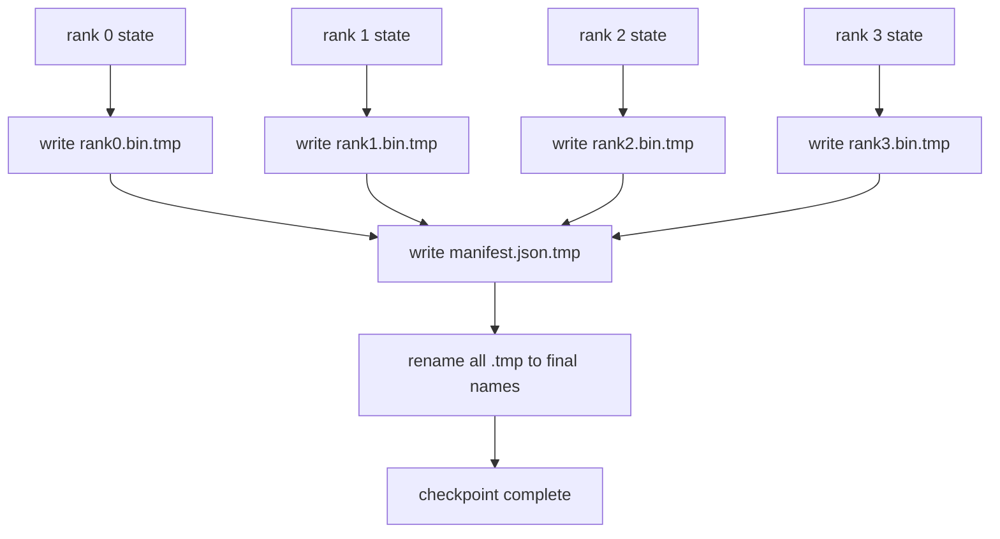

> 🇰🇷 이 문서는 한국어 번역본입니다(ELI5 스타일). 원문: [en.md](en.md)

# Sharded Checkpoint and Atomic Resume(샤딩 체크포인트와 원자적 재개)

> 700억 파라미터 학습 작업은 몇 시간마다 노드 장애로 멈춥니다. 체크포인트 형식이 30분을 잃을지 30시간을 잃을지 결정합니다. 샤딩 체크포인트는 모든 랭크의 샤드를 병렬로 쓰고, 소유 관계를 매니페스트(manifest)에 기록합니다. 재개(resume)는 각 랭크가 자기 샤드를 자기 파일에서 불러오고, 같은 월드 크기에서 상태를 재조립하며, 옵티마이저는 아무 일도 없었던 것처럼 스텝을 이어갑니다. 원자적(atomic) 쓰기는 절반쯤 끝난 체크포인트가 다음 재개를 오염시키지 않게 막아 줍니다.

**유형:** 빌드
**언어:** Python
**선수 지식:** 페이즈 19 트랙 C, 레슨 42-49
**시간:** ~90분

## 학습 목표

- 랭크별 샤드 파일과, 어떤 랭크가 무엇을 소유하는지 기록한 매니페스트로 멀티랭크 체크포인트를 저장합니다.
- 원자적 쓰기 패턴(임시 경로에 쓰고 나서 이름 바꾸기)을 써서, 쓰기 도중 크래시가 발생해도 절반쯤 끝난 체크포인트가 절대 생기지 않게 합니다.
- 매니페스트에서 재개하며, 모든 랭크에서 fp16 파라미터와 ZeRO 옵티마이저 상태가 바이트 단위로 동일한지 검증합니다.
- 매니페스트 스키마가 세 가지 실패 모드, 즉 월드 크기 변경, 샤드 개수 불일치, 부분 쓰기에 맞서 방어할 수 있게 됩니다.

## 문제 상황

바닐라 체크포인트는 모든 파라미터와 옵티마이저 상태를 랭크 0으로 모아(gather) 하나의 파일에 씁니다. 700억 모델이면 한 랭크의 네트워크 포트로 1.1TB짜리 상태가 흘러야 합니다. 쓰기가 진행되는 동안 다른 모든 랭크는 gather를 기다리며 놀기 때문에 멈춥니다. IO 대역폭은 집계량이 아니라 가장 느린 단일 GPU의 네트워크 링크입니다. 실제 클러스터에서는 gather 후 쓰기 단계가 직전 학습 1시간보다 오래 걸릴 수 있는데, 그러면 하루 학습에 체크포인트가 한 개도 안 찍힙니다.

샤딩 체크포인트는 이 패턴을 뒤집습니다. 모든 랭크가 자기 샤드를 자기 파일에 병렬로 씁니다. 매니페스트는 어떤 랭크가 어느 샤드를 소유했는지 기록해서, 재개할 때 각 샤드를 원래 자리로 되돌려 놓을 수 있게 합니다. 집계 쓰기 대역폭은 클러스터와 함께 늘어납니다. 한 랭크로는 4시간이 걸리는 1TB 체크포인트가 64랭크로는 4분이 걸립니다. 게다가 매니페스트는 호환되지 않는 재개를 걸러 내는 계약이 되어 줍니다. 월드 크기 변경은 감지 가능하고, 부분 쓰기도 감지 가능하며, 로드 경로가 조용히 오래된 데이터를 쓰는 대신 큰 소리로 실패할 수 있습니다.

## 개념



### 매니페스트 스키마

```json
{
  "world_size": 4,
  "step": 1234,
  "wall_clock_seconds": 4521,
  "shards": [
    {"rank": 0, "path": "rank0.bin", "sha256": "...", "param_shard_offset": 0, "param_shard_numel": 65536},
    {"rank": 1, "path": "rank1.bin", "sha256": "...", "param_shard_offset": 65536, "param_shard_numel": 65536}
  ],
  "schema_version": 1
}
```

세 필드가 무게를 지탱합니다. `world_size`는 다른 크기에서의 재개가 조용히 오염되는 대신 큰 소리로 실패하게 만듭니다. 샤드별 `sha256`은 부분 쓰기나 깨진 쓰기를 잡아 냅니다. 샤드별 `param_shard_offset`과 `param_shard_numel`은 로더가 플랫 파라미터 텐서를 정확한 위치에 재조립하게 해 줍니다.

### 원자적 쓰기

표준 패턴은 이렇습니다. 모든 샤드를 `<name>.tmp`에 쓰고, 매니페스트를 `manifest.json.tmp`에 쓰고, 각각 fsync한 뒤 이름을 바꿉니다. 같은 파일시스템 안에서의 POSIX rename은 원자적입니다. 즉 새 파일이 온전히 존재하거나, 아니면 기존 파일이 존재하거나 둘 중 하나입니다. 최종 rename 전에 크래시가 나면 이전 체크포인트가 그대로 살아 있는 상태로 남습니다. 원자적 쓰기가 없으면 크래시가 '존재하는 매니페스트가 가리키는 불완전 샤드'를 남길 수 있고, 재개 시 옵티마이저 상태가 오염됩니다.

### 스키마가 방어해야 하는 세 가지 실패 모드

| 실패 | 증상 | 방어 |
|---------|---------|---------|
| 월드 크기 변경 | N=4 매니페스트로 N=8에서 재개 | 매니페스트의 world_size 불일치, 큰 소리로 실패 |
| 샤드 개수 불일치 | 매니페스트의 샤드보다 rank*.bin 파일이 적게 보임 | 샤드를 열거하고 모두 존재하는지 검증 |
| 부분 쓰기 | flush 도중 잘린 샤드 파일 | 로드 시 sha256 검증 |

각 방어는 나쁜 로드를 조기에 거절합니다. 그렇지 않으면 100스텝 뒤에 손실이 NaN으로 떨어지면서야 드러나는 조용한 오염이 됩니다.

### 큰 파일 하나가 아니라 랭크별 파일인 이유

`O_APPEND`로 파일 하나에 동시에 쓰는 것은 바이트 정렬된 쓰기에 한해 POSIX에서 동작하지만, 실제로는 샤드 하나 안의 오프셋이 MB 단위 영역을 건너고 락킹 비용이 지배합니다. 랭크별 파일은 경합이 없고, 기반 파일시스템이 병렬형(Lustre, GPFS)일 때 스트라이핑 이득도 받습니다. 프로덕션 스택(DeepSpeed, FSDP, NeMo)은 모두 이 이유로 랭크별 파일을 씁니다.

```figure
ci-sharded-checkpoint
```

## 만들기

`code/main.py`는 다음을 구현합니다.

- 위 스키마에 `to_json`/`from_json`을 더한 `ShardManifest` 데이터클래스
- 원자적 temp-then-rename 패턴으로 모든 랭크의 바이너리 상태를 각자 파일에 쓰고, 그다음 매니페스트를 쓰는 `save_sharded(state_dict_per_rank, dir, step)`
- 매니페스트를 읽고 각 샤드의 sha256을 검증한 뒤 랭크별 상태 딕셔너리를 돌려주는 `load_sharded(dir, expected_world_size)`
- 왕복 테스트: 랭크별 상태를 만들고 저장하고 불러와서 바이트 단위 동일성을 단언

실행:

```bash
python3 code/main.py
```

출력: 샤드 파일 4개와 매니페스트가 기록되고, 이어서 바이트 단위 동일성 검증과 함께 다시 불러옵니다.

## 실전에서 쓰는 프로덕션 패턴

체크포인트를 출시 가능한 수준으로 튼튼하게 만드는 패턴 세 가지입니다.

**비동기 쓰기.** 프로덕션 스택은 별도 스레드나 프로세스에서 체크포인트 쓰기를 걸어 학습이 계속되게 합니다. 장벽은 다음 체크포인트에 있습니다. 이전 저장이 끝나기 전에는 다음 저장을 시작하지 않습니다. DeepSpeed의 `async_io` 플래그가 정확히 이 일을 합니다. 이 레슨은 단계가 눈에 보이도록 쓰기를 동기로 유지합니다.

**먼저 로컬 고속 디스크, 그다음 비동기 업로드.** 로컬 NVMe(빠름)에 쓰고 나서 S3나 GCS로 비동기 업로드합니다. 이 2계층 패턴 덕분에 클러스터 안 체크포인트는 재개를 위해 빠르게 유지되면서도, 보존용 사본 하나가 클러스터 밖으로 출하됩니다. 매니페스트는 로컬 경로를 담고, 업로드 매니페스트는 원격 경로를 담습니다.

**로테이션이 중요합니다.** 프로덕션 실행은 최근 K개 체크포인트(보통 3~5개)를 유지하고 가장 오래된 것을 돌려 내보냅니다. 로테이션이 없으면 디스크가 실행 도중 차서 다음 체크포인트가 실패합니다. 로테이션이 있으면 다음 저장이 가장 오래된 것을 먼저 지워 예산을 확보합니다.

## 사용법

프로덕션 패턴:

- **DeepSpeed 체크포인팅.** `deepspeed.save_checkpoint(tag=step)`가 랭크별 파일과 활성 태그를 가리키는 `latest` 파일을 씁니다.
- **PyTorch FSDP 체크포인팅.** `torch.distributed.checkpoint`는 랭크별 레이아웃을 결정하는 `Planner`와 함께 샤딩된 상태를 저장합니다.
- **NeMo.** DeepSpeed와 FSDP를 메타데이터를 더해 주는 통일된 `save_to_checkpoint` API로 감쌉니다.

## 출시하기

레슨 81은 종단 간 DDP+ZeRO 실행의 샤딩 체크포인트를 저장하고, 같은 월드 크기에서 다시 불러와 재개 계약이 지켜지는지 증명합니다.

## 연습 문제

1. 비동기 쓰기를 추가하세요. 스레드에서 저장을 걸어 학습을 계속하게 하고, 이전 저장이 끝나기 전에는 다음 저장을 막습니다.
2. `last_5_steps` 로테이션을 추가하세요. 최근 5개 체크포인트를 유지하고, 새 것을 저장하기 전에 가장 오래된 것을 지웁니다.
3. 내부 루프 재로드를 위한 CRC 전용 빠른 검증 경로를 추가하세요(로테이션으로 기존 체크포인트가 새 활성 체크포인트로 넘어갈 때 전체 sha256을 생략).
4. 크로스 월드 크기 로드를 추가하세요. 매니페스트를 읽고 이어 붙여서 N=4에서 N=8로 샤드 재조정(rebalance)합니다.
5. 가짜 S3(두 번째 디렉터리)로의 업로드를 추가하고 업로드 매니페스트를 작성하세요. 2계층 저장 정책을 방어해 보세요.

## 핵심 용어

| 용어 | 사람들이 말하는 것 | 실제 의미 |
|------|----------------|------------------------|
| Sharded checkpoint | "랭크별 저장" | 각 랭크가 자기 샤드 파일을 병렬로 씀 |
| Manifest | "색인" | 샤드 경로, 오프셋, sha256을 기록한 JSON 파일 |
| Atomic write | "tmp 쓰고 rename" | .tmp에 쓰고 POSIX rename. 크래시가 나면 이전 파일이 그대로 살아 있음 |
| Partial write | "잘린 샤드" | 쓰기 도중 크래시가 깨진 샤드를 남김. sha256이 잡아 냄 |
| Rotation | "최근 K개 유지" | 디스크 사용량을 묶으려고 새 체크포인트를 쓰기 전에 가장 오래된 것 삭제 |

## 더 읽을거리

- [DeepSpeed checkpointing](https://deepspeed.readthedocs.io/en/latest/model-checkpointing.html)
- [PyTorch torch.distributed.checkpoint](https://pytorch.org/docs/stable/distributed.checkpoint.html)
- [POSIX rename atomicity](https://pubs.opengroup.org/onlinepubs/9699919799/functions/rename.html)
- 페이즈 19 레슨 78 - 이 체크포인트가 저장하도록 설계된 ZeRO 상태
- 페이즈 19 레슨 81 - 저장된 상태를 왕복 검증하는 종단 간 데모
