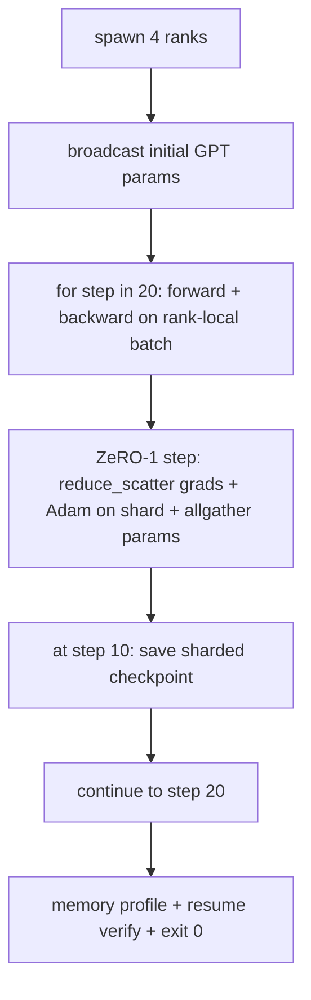

> 🇰🇷 이 문서는 한국어 번역본입니다(ELI5 스타일). 원문: [en.md](en.md)

# End-to-End Distributed Training(종단 간 분산 학습)

> 레슨 76부터 80까지는 각각 부품 하나를 만들었습니다. 이번엔 조립입니다. 작은 GPT를 4개 시뮬레이션 랭크에 걸쳐 학습시키되, 그래디언트 동기화는 DDP, 옵티마이저 상태 샤딩은 ZeRO-1, 중간 지점에는 샤딩 체크포인트를 씁니다. 데모는 20스텝을 돌고 스스로 종료하며, 손실 곡선과 메모리 프로파일을 출력하고, 재개 가능한 체크포인트를 남깁니다.

**유형:** 빌드
**언어:** Python
**선수 지식:** 페이즈 19 트랙 C, 레슨 42-49
**시간:** ~90분

## 학습 목표

- DDP(레슨 77) + ZeRO-1(레슨 78) + 샤딩 체크포인트(레슨 80)를 하나의 학습 루프로 조합합니다.
- 작은 합성 코퍼스 위에서 2계층 트랜스포머 언어 모델을 4개 시뮬레이션 랭크에 걸쳐 20스텝 학습시킵니다.
- 스텝별 손실 표, 랭크별 메모리 프로파일, 그리고 같은 월드 크기에서 바이트 단위로 동일하게 재개되는 체크포인트 매니페스트를 출력합니다.
- 조합을 방어합니다. 각 부품은 앞선 레슨에서 독립적으로 검증 가능했고, 이 레슨은 그것들이 함께 맞물리는 걸 증명합니다.

## 문제 상황

캡스톤이란 부품들이 서로 맞물린다는 증명입니다. 레슨 76은 집단 연산을 구현했습니다. 레슨 77은 그것을 DDP로 감쌌습니다. 레슨 78은 reduce_scatter로 옵티마이저 상태를 샤딩했습니다. 레슨 79는 파이프라인을 분석했습니다. 레슨 80은 샤딩 체크포인트를 저장했습니다. 각 레슨은 자기 테스트를 두고 독립적으로 서 있었습니다. 실제 학습 실행은 모든 프리미티브를 한꺼번에 씁니다. 조합이 잘못되면 손실이 발산하거나, 체크포인트가 재개를 거부하거나, 줄어들어야 할 랭크별 메모리가 늘어납니다.

이 레슨은 종단 간 데모를 돌리고 네 가지 불변식을 검증합니다. (a) 손실이 20스텝에 걸쳐 float 노이즈 범위 안에서 단조 감소한다. (b) 모든 랭크가 매 스텝 같은 파라미터 노름을 갖는다. (c) 랭크별 옵티마이저 메모리가 ZeRO-1 공식인 12P/N바이트와 같다. (d) 스텝 10의 체크포인트가 재시작 시 바이트 단위로 동일하게 다시 로드된다. 데모는 스스로 종료합니다. 20스텝, 명령어 한 줄, 종료 코드 0.

## 개념



### 미니 GPT

모델은 일부러 작게 만듭니다. 트랜스포머 블록 2개, 임베딩 차원 32, 어텐션 헤드 4개, 어휘 64, 시퀀스 길이 16, 배치 4. 파라미터는 수천 개 수준입니다. 모든 배선 결정을 확인하기에는 충분히 큽니다(멀티헤드 어텐션은 표준 마스크 경로를 돌고, LayerNorm은 동기화할 가중치를 갖고, LM 헤드는 어휘로 되돌아가는 별도의 선형 투영입니다). 4개 CPU 랭크에서 20스텝이 몇 초 안에 끝날 만큼은 작습니다.

### 조합 규칙

| 레슨 부품 | 담당하는 것 | 루프에 맡기는 것 |
|--------------|--------------|----------------------------|
| DDP broadcast | 초기 파라미터 동기화 | 생성 시점 호출 한 번 |
| ZeRO-1 step | 그래디언트 동기화, 마스터 복사본 갱신, 파라미터 broadcast | optimiser.step을 대신하는 스텝당 호출 한 번 |
| Sharded checkpoint | 랭크별 상태 저장, sha256을 담은 매니페스트 | allgather로 모은 상태를 랭크 0에서 호출 |
| 학습 루프 | 포워드, 백워드, 손실 로깅 | 위 세 가지를 순서대로 호출 |

루프는 reduce_scatter나 랑데부 파일을 알지 못합니다. ZeRO와 체크포인트 모듈은 좁은 인터페이스를 노출하고, 루프는 그것들을 조합할 뿐입니다.

### 그냥 MLP가 아니라 작은 GPT인 이유

레슨 77의 MLP는 그래디언트 동기화 검증에는 충분했습니다. 작은 GPT는 세 가지를 더합니다. 어휘 위의 별도 LM 헤드(이 레슨에서는 명확성을 위해 언타이(untying) 상태; 실제 GPT는 보통 헤드를 토큰 임베딩과 타이(tie)함), 손실로서의 softmax+교차 엔트로피(MSE보다 수치 엣지 케이스가 많음), 그리고 비대칭 포워드(임베딩, 그다음 어텐션, 그다음 레이어별 MLP). 캡스톤을 MLP로 끝냈다면 조합이 LayerNorm이나 임베딩 레이어의 그래디언트 형태를 올바로 다루는지 알 길이 없었을 겁니다.

### 스스로 종료한다는 것은 종료 코드 0이라는 뜻

루프는 정해진 20스텝을 돌고 종료합니다. `while True`도 없고, 사람의 개입도 없고, 외부 상태에서의 재개도 없습니다. 자리를 비우고 돌려 놓아도 끝나면 완전한 로그가 남는 캡스톤이야말로 시스템이 올바르게 배선됐음을 증명하는 캡스톤입니다. 부품 하나라도 데드락에 빌리면 데모는 영원히 돌아오지 않고, 테스트 설비가 그것을 붙잡습니다.

```figure
ci-distributed-assembly
```

## 만들기

`code/main.py`는 다음을 구현합니다.

- `MiniGPT`: 마스크 셀프 어텐션과 별도 LM 헤드를 갖춘 2계층 트랜스포머
- `make_corpus(seed, total_tokens)`: 결정적인 다음 토큰 예측 데이터
- `_train_worker`: 랭크마다 스폰됨. 초기 파라미터를 broadcast하고, 루프를 돌고, ZeRO 스텝을 호출하고, 스텝 10에 샤딩 체크포인트를 기록
- `verify_resume`: 메인 실행 후, 스텝 10 체크포인트를 프로세스 안에서 다시 로드해 저장된 마스터 샤드가 메모리 속 스냅샷과 바이트 단위로 일치하는지 단언
- `main`: 데모 전체를 지휘하고, 손실 표와 메모리 프로파일, 검증 결과를 출력

실행:

```bash
python3 code/main.py
```

출력: 20행짜리 손실 표, 4행짜리 랭크별 메모리 프로파일, 체크포인트 매니페스트, 성공 시 "RESUME VERIFIED" 한 줄.

## 실전에서 쓰는 프로덕션 패턴

실제 실행을 위해 조합을 완성하는 패턴 세 가지입니다.

**K스텝마다가 아니라 K분마다 체크포인트를 찍습니다.** 스텝 시간은 시퀀스 길이와 마이크로배치 수에 따라 달라집니다. 10분 간격의 체크포인트 케이던스는 모델 크기와 무관하게 같은 양의 연산을 보장합니다. 이 레슨은 단순함을 위해 스텝 기준을 쓰고, 프로덕션은 벽시계 시간 기준을 씁니다.

**발산을 조기에 감지합니다.** 프로덕션 실행은 백워드 뒤 NaN 가드와 손실 급증 감지기를 붙입니다. 한 스텝에 손실이 2배 넘게 뛰면, 옵티마이저가 퇴화 상태로 행군하게 두지 말고 이전 체크포인트로 롤백합니다. 이 레슨의 손실 곡선은 매끄러워서 가드가 쓰이지 않지만, 훅은 그대로 남아 있습니다.

**메모리 프로파일을 랭크에 걸쳐 집계합니다.** 실제 실행에서 랭크별 메모리는 랭크마다 다릅니다(가장 큰 파이프라인 스테이지를 얹은 랭크가 더 많은 활성화를 들고 있음). 프로덕션은 랭크별 최댓값과 평균을 함께 로깅합니다. 이 레슨은 공식과 일치하는지 보여 주려고 랭크별 값을 그대로 출력합니다.

## 사용법

프로덕션 패턴:

- **DeepSpeed.** DDP + ZeRO + 파이프라인 + 활성화 체크포인팅을 하나의 설정 아래 묶습니다. 이 레슨의 조합은 축소판 DeepSpeed 형태입니다.
- **PyTorch FSDP.** 네이티브 대응물. `ShardingStrategy.SHARD_GRAD_OP`을 쓰는 `FullyShardedDataParallel`이 ZeRO-2입니다.
- **NeMo와 Megatron-LM.** 가장 큰 규모의 모델에는 텐서 병렬을 더합니다. 그 외에는 조합의 형태가 같습니다.

## 출시하기

이 트랙의 전체 코스는 여기서 끝납니다. 여섯 레슨을 합치면 실제 팀이 DeepSpeed를 도입하기 전에 만들어 볼 분산 학습 서브시스템입니다. 추상화는 gloo로 검증됐고, 실패 모드도 직접 겪어 봤습니다. 페이즈 17(인프라와 프로덕션)이 이 조합을 실제 클러스터로 옮기는 자리입니다.

## 연습 문제

1. 어텐션 헤드를 텐서 병렬로 쪼개고 손실이 단일 랭크 베이스라인과 일치하는지 확인하세요. 두 랭크: 랭크당 절반 헤드, 어텐션 출력의 allreduce.
2. 4개 마이크로배치에 걸친 그래디언트 누적을 추가하고, 그 그래디언트가 큰 배치 하나의 그래디언트와 같음을 증명하세요.
3. 실제로 스텝 10에서 이어받아 스텝 20까지 학습하고 원래 실행과 같은 최종 손실을 내는 '스텝 10 재개' 경로를 추가하세요.
4. 지표 내보내기(손실, 그래디언트 노름, 스텝 시간)를 JSONL로 추가해서 실행을 사후에 시각화할 수 있게 하세요.
5. 손실 급증 시 이전 체크포인트로 롤백하는 NaN 가드를 추가하고, 한 스텝용 LR 배율로 급증을 강제해 롤백을 직접 겪어 보세요.

## 핵심 용어

| 용어 | 사람들이 말하는 것 | 실제 의미 |
|------|----------------|------------------------|
| End-to-end | "전부 배선" | 부품별 유닛 테스트가 아니라 하나의 실행이 모든 부품을 조합 |
| Memory profile | "랭크당 GB" | 각 랭크가 파라미터, 그래디언트, 옵티마이저 상태로 보유한 바이트 |
| Resume contract | "저장하고 불러오기" | 체크포인트 왕복 후 랭크별 상태가 바이트 단위로 동일 |
| Self-terminating | "경계가 있는 실행" | 고정 스텝 수, 완료 시 종료 코드 0, 개입하는 사람 없음 |

## 더 읽을거리

- [DeepSpeed end-to-end training tutorial](https://www.deepspeed.ai/getting-started/)
- [PyTorch FSDP advanced tutorial](https://pytorch.org/tutorials/intermediate/FSDP_advanced_tutorial.html)
- [Megatron-LM training script reference](https://github.com/NVIDIA/Megatron-LM)
- 페이즈 19 레슨 76-80 - 이 레슨이 조합하는 각 부품
- 페이즈 17 - 조합을 실제 클러스터로 옮기기
