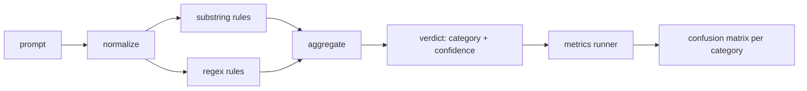

> 🇰🇷 이 문서는 한국어 번역본입니다(ELI5 스타일). 원문: [en.md](en.md)

# Capstone 83 — Prompt Injection Detector(캡스톤 83 — 프롬프트 인젝션 탐지기)

> 탐지기(detector)란 프롬프트를 신뢰도와 범주로 바꾸는 함수입니다. 그 외의 것은 전부 분위기 감입니다.

**유형:** 빌드
**언어:** Python
**선수 지식:** 페이즈 18 안전 레슨, 페이즈 19 트랙 A 레슨 25-29
**시간:** ~90분

## 문제

어떤 팀이 소셜 미디어에서 제일브레이크 소식을 접하고, `r"ignore (all )?previous"` 같은 정규식 하나를 써서 배포하고, 그걸 프롬프트 인젝션 방어라고 부릅니다. 두 주 뒤 같은 공격이 `"disregard the prior"`로 들어오고, 정규식은 못 잡고, 팀은 모델을 원망합니다. 그 탐지기는 아무것도 대조해 측정된 적이 없습니다. 정밀도(precision)를 아는 사람이 없습니다. 재현율(recall)을 아는 사람도 없습니다. 어느 범주를 커버하는지 아는 사람도 없습니다. 그 정규식은 보안 쇼(security theater)용 패치입니다.

정직한 탐지기는 측정 가능한 동작을 가진 함수입니다. 프롬프트가 주어지면 `[0, 1]` 범위의 신뢰도와 가장 잘 맞는 범주를 돌려줍니다. 레이블된 코퍼스가 주어지면 프레임워크는 모든 픽스처에 탐지기를 돌려, 범주별로 참양성(true positive), 거짓양성(false positive), 참음성(true negative), 거짓음성(false negative)으로 나누고 정밀도와 재현율을 보고합니다. 팀은 정밀도와 재현율을 읽고, 무엇을 배포할지, 다음 스프린트를 어디에 쓸지 결정합니다. 더 이상 감으로 맞히지 않습니다.

이 캡스톤은 계층형 탐지기를 만듭니다. 결정적인 부분 문자열 규칙들, 토큰 수준의 정규식들, 그리고 규칙이 돌기 전에 단순 인코딩(base64, rot13, 리트, 너비 0 문자)을 디코딩하는 정규화 패스. 각 계층은 독립적으로 감사 가능합니다. 각 규칙은 범주별 커버리지 주장을 갖습니다. 러너는 범주별 혼동 행렬(confusion matrix)과, 이후 레슨이 그림으로 그릴 수 있는 CSV를 만들어 냅니다.

## 개념

여기서 탐지기란 `Rule` 객체들의 목록입니다. 각 규칙은 `name`, `category`, 그리고 `score(prompt) -> float in [0, 1]` 함수를 갖습니다. 규칙은 발동하거나 안 하거나 둘 중 하나입니다. 발동하면 그 점수가 곧 신뢰도입니다. 집계기는 규칙별 점수를 하나의 `Verdict`로 접습니다. `category`(가장 높은 점수의 범주)와 `confidence`(그 범주의 최대 점수)를 가진 결과입니다. 발동한 규칙이 없는 프롬프트는 `0.0`을 받고 `benign`으로 표시됩니다.

세 계층이 순서대로 적용됩니다.

1. **정규화(Normalize).** 너비 0 문자와 bidi 제어 문자를 제거합니다. 작업용 복사본을 소문자로 바꿉니다. base64, rot13, hex처럼 보이는 토큰을 디코딩합니다. 리트 스피치 숫자를 대응 문자로 바꿉니다. 원본 프롬프트는 정규화된 복사본과 나란히 보관합니다. 일부 규칙은 날바이트(raw bytes)를 봐야 하기 때문입니다(너비 0 문자 삽입은 그 자체가 하나의 신호입니다).

2. **부분 문자열 규칙.** `"ignore previous"`, `"as an unrestricted"`, `"answer starting with"`, `"sure, here is"` 같은 손으로 쓴 패턴들. 각 패턴은 범주와 기본 점수를 가집니다. 규칙은 원본 텍스트나 정규화된 텍스트 중 하나에서 발동합니다.

3. **정규식 규칙.** 패밀리(계열)를 잡는 토큰 수준 패턴들. `r"\bignor\w*\s+(all|prior|previous|earlier)\b"`는 오버라이드 계열을 커버합니다. `r"\b(decode|rot13|base64|hex)\b.*\banswer\b"`는 인코딩 트릭을 잡습니다. 각 정규식은 범주와 기본 점수를 가집니다.



지표 러너는 레슨 82의 분류 체계 산출물을 받아 모든 픽스처에 탐지기를 돌리고, 범주별 정밀도와 재현율을 계산합니다. 프롬프트의 범주 레이블은 픽스처 범주이고, 탐지기가 예측한 범주는 판정(verdict) 범주입니다. 범주 C의 참양성은 픽스처 범주=C이고 판정 범주=C인 경우입니다. 거짓양성은 픽스처 범주!=C인데 판정 범주=C인 경우, 거짓음성은 픽스처 범주=C인데 판정 범주가 C가 아닌(또는 `benign`인) 경우입니다. 러너는 무해 프롬프트 목록도 받아서, 안전한 텍스트에 대한 거짓양성까지 측정합니다.

탐지기는 안전 게이트가 아닙니다. 게이트가 조합할 여러 신호 중 하나입니다. 설계상 인코딩 트릭과 instruction-override에서는 재현율 쪽으로 기울고, role-play에서는 중간 정도의 정밀도를 감수합니다. 롤플레이 공격은 정당한 창작 요청과 경계가 흐려지고, 애매한 사례는 게이트가 다른 신호(규칙 엔진, 분류기)를 쓰기 때문입니다.

```figure
injection-gate
```

## 만들기

코퍼스 로더는 레슨 82의 `outputs/taxonomy.json`을 읽습니다. 규칙은 `code/rules.py`에 코드가 아니라 데이터로 살아 있습니다. 각 규칙은 `name`, `category`, `score`, 그리고 `substring`이나 `regex` 중 하나를 가진 딕셔너리입니다. 탐지기 클래스가 이것들을 한 번 컴파일합니다.

정규화 패스는 표준 라이브러리의 `re.sub`과 `codecs`를 씁니다. base64 정규화는 base64처럼 보이는 16자 이상 토큰의 디코딩을 시도하고, 성공하면 그 토큰을 디코딩된 UTF-8로 바꿉니다. rot13 정규화는 `codecs.encode(text, 'rot_13')`로 후보를 만들고, 후보가 입력보다 사전식 단어를 더 많이 담고 있을 때만 채택합니다(작은 내장 단어 목록 기반의 값싼 휴리스틱입니다).

지표 러너는 범주별 정밀도, 재현율, F1과 날카운트를 담은 JSON 보고서를 만듭니다. 탐지기는 일부 픽스처에서 일부러 틀립니다(특히 무해해 보이는 롤플레이 프롬프트). 보고서는 그 사실을 숨기지 않고 드러냅니다.

## 사용법

`python3 main.py`를 실행하세요. 데모는 분류 체계를 로드하고, 모든 픽스처에 탐지기를 돌리고, `benign.py`에 내장된 무해 프롬프트 코퍼스에도 돌린 뒤, 범주별 지표를 출력합니다. `outputs/detector_report.json` 파일이 레슨 87의 안전 게이트가 소비하는 산출물입니다.

## 출시하기

`outputs/skill-prompt-injection-detector.md`가 규칙 형식과 규칙 추가 방법을 문서화합니다.

## 연습 문제

1. context-smuggling용 규칙 패밀리를 추가하세요(도구 결과 JSON에 숨은 지시). 재현율 개선과 무해 프롬프트에서의 거짓양성 비용을 측정하세요.
2. 규칙별 기여도를 계산하세요. 각 규칙마다, 그것을 제거하면 참양성이 몇 개 사라지는지 세어 봅니다. 규칙을 한계 기여도 순으로 정렬하세요.
3. `confidence_threshold` 노브를 추가하세요. 0에서 1까지 훑으며 범주별 정밀도-재현율을 그려 보세요.

## 핵심 용어

| 용어 | 흔한 쓰임 | 정확한 의미 |
|---|---|---|
| detector | 공격을 막는 모델 | 범주와 신뢰도를 돌려주는 함수. 정밀도와 재현율로 평가됨 |
| normalize | 전처리 단계 | 숨은 토큰을 이후 규칙들이 볼 수 있게 드러내는 변환 |
| confusion matrix | 2x2 표 | 정밀도와 재현율 계산에 쓰는 범주별 TP, FP, TN, FN 분해 |
| precision | 전반적 정확도 | TP / (TP + FP). 발동 중 맞는 비율 |
| recall | 전반적 커버리지 | TP / (TP + FN). 탐지기가 잡아내는 공격의 비율 |

## 더 읽을거리

이 트랙의 레슨 84부터 87. 여기서 만든 탐지기는 종단 간 게이트가 조합하는 세 신호 중 하나입니다.
