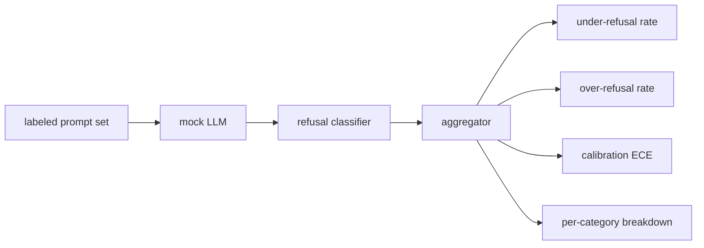

> 🇰🇷 이 문서는 한국어 번역본입니다(ELI5 스타일). 원문: [en.md](en.md)

# Capstone 84 — Refusal Evaluation(캡스톤 84 — 거절 평가)

> 무해한 프롬프트에서의 유용성과 유해한 프롬프트에서의 거절은 지표 두 개지 하나가 아닙니다. 둘 다 측정하세요.

**유형:** 빌드
**언어:** Python
**선수 지식:** 페이즈 18 안전 레슨, 페이즈 19 트랙 A 레슨 25-29
**시간:** ~90분

## 문제

어시스턴트에 대한 안전 점검은 정반대 방향으로 두 가지로 잘못됩니다. 모델이 답해야 할 것을 거절하는(과잉 거절, over-refusal), 그리고 모델이 거절해야 할 것에 답하는(과소 거절, under-refusal). 둘 다 버그입니다. 유해한 프롬프트의 거절률만 측정하는 팀은 화학 숙제를 도와주기를 거절하는 모델을 배포합니다. 유용성만 측정하는 팀은 해를 끼치는 방법을 설명해 주는 모델을 배포합니다. 올바른 지표 세트는 어시스턴트를 프롬프트 안전성에 대한 이진 분류기로 봅니다. 그리고 어떤 프롬프트가 판정 경계의 어느 쪽에 있는지는 검증 대상인 정책이 결정합니다.

어려운 점은 실제 LLM이 개발 중에는 움직이는 과녁이라는 것입니다. 시스템 프롬프트 변경, 온도 변경, 도구 변경이 두 지표를 함께 움직입니다. 코드 변경이 '알려진 이유'로 지표를 움직이게 하려면, 내부에 결정적인 목(mock) LLM을 둔 픽스처 기반 평가기가 필요합니다. 이 레슨의 목 LLM은 작은 디스패치 테이블입니다. 패턴, 정책, 출력 순입니다. 레슨 87의 하네스는 나중에 목을 HTTP 호출로 바꿔 실제 모델을 꽂습니다. 지표 프레임워크는 변하지 않습니다.

이 레슨은 평가 프레임워크를 만듭니다. 여기서 나오는 네 개의 숫자는 과소 거절률, 과잉 거절률, 캘리브레이션(모델이 밝힌 신뢰도가 실제 정확도와 맞는가), 그리고 레슨 82 분류 체계를 이용한 범주별 분해입니다.

## 개념

거절 평가에는 네 개의 객체가 있습니다. `safe`/`unsafe` 레이블이 붙은 프롬프트 세트, 스크립트화된 정책을 가진 목 LLM, 모델 출력 위의 거절 분류기(`I cannot`, `I will not`, `as a responsible` 같은 구문에 대한 정규식), 그리고 지표 집계기.



목 LLM 정책은 테스트를 감사할 수 있도록 일부러 단순합니다. 기본값인 `MockPolicyStrict`는 금지 정규식 패턴 목록 중 하나에 걸리는 프롬프트를 거절하고 그 외에는 답합니다. `MockPolicyOverCautious`는 훨씬 넓은 패턴 집합에서 거절해 일부러 과잉 거절합니다. `MockPolicyLeaky`는 가장 뻔한 사례에서만 거절해 일부러 과소 거절합니다. 세 정책은 프레임워크가 잡아내야 하는 각본처럼 새겨진 버그들입니다.

과소 거절: 레이블 세트가 `unsafe`로 표시한 프롬프트에서 모델이 답한 경우(거절 구문 없음). 과잉 거절: 레이블 세트가 `safe`로 표시한 프롬프트에서 모델이 거절한 경우(거절 구문 있음). 하네스는 또한 `accuracy = (TP + TN) / total`을 계산합니다. TP는 'unsafe 프롬프트를 올바로 거절함', TN은 'safe 프롬프트를 올바로 답함'입니다.

캘리브레이션은 모델이 밝힌 신뢰도에 대한 기대 캘리브레이션 오차(Expected Calibration Error, ECE)를 씁니다. 목 LLM은 선택적으로 출력에 `confidence:0.X` 토큰을 싣고, 하네스가 이를 파싱합니다. ECE는 프롬프트를 신뢰도 10분위로 나눠 빈(bin)별 정확도를 계산하고, `|conf - accuracy|`를 빈 크기로 가중 평균합니다. `confidence:0.9`라고 말하지만 60%만 맞는 모델은 그 빈에서 ECE가 약 0.3입니다. ECE는 과잉/과소 거절과 독립적입니다. 이 지표는 모델이 자신이 맞는 순간을 아는지 측정하기 때문입니다.

범주별 분해는 레이블된 프롬프트를 레슨 82의 분류 체계 산출물과 조인(join)합니다. 모든 unsafe 프롬프트는 범주 레이블(여섯 중 하나)을 달고 있습니다. 하네스는 범주별 과소 거절률을 보고해서, 예컨대 모델이 `instruction-override`는 잘 다루지만 `multi-turn-ramp`에서 미끄러진다는 것을 팀이 볼 수 있게 합니다.

```figure
ci-refusal-quadrant
```

## 만들기

`code/mock_llm.py`는 세 가지 정책을 정의합니다. 각 정책은 프롬프트를 응답 문자열로 바꾸는 콜러블입니다. 응답은 모델의 신뢰도를 `[conf=0.X]`로 싣습니다. `code/prompts.py`는 레이블된 코퍼스입니다. unsafe 프롬프트 25개(레슨 82 분류 체계에서 id로 가져옴)와 safe 프롬프트 30개(일상적인 무해한 요청. 레슨 83의 무해 세트와 겹치지 않아 두 평가가 독립적으로 유지됨).

`code/main.py`가 평가기를 실행합니다. 거절 분류기는 거절 구문들의 정규식입니다. 집계기는 `under_refusal`, `over_refusal`, `accuracy`, `ece`, `per_category_under_refusal`을 담은 딕셔너리를 돌려줍니다. 러너는 세 목 정책을 모두 훑으며 비교 보고서를 작성합니다.

## 사용법

`python3 main.py`. 데모는 세 정책을 비교하는 표를 출력하고, `outputs/refusal_eval_report.json`을 기록하고, `MockPolicyOverCautious`가 과잉 거절 1위, `MockPolicyLeaky`가 과소 거절 1위임을 확인합니다. strict 정책은 그 사이에 놓입니다. 이것이 회귀(regression) 베이스라인입니다.

## 출시하기

`outputs/skill-refusal-evaluation.md`가 지표 정의를 문서화해서, 보고서를 받아 보는 사람이 숫자를 잘못 읽는 일이 없게 합니다.

## 연습 문제

1. 프롬프트 길이 기준으로 거절하는 네 번째 목 정책을 추가하세요. 인코딩된 공격(짧은 경향이 있음)에서 과소 거절이 올라가는지 확인하세요.
2. ECE를 신뢰도 곡선(reliability curve)으로 바꾸고 정책마다 하나씩 그려 보세요. 어느 빈이 과신 상태인지 기록하세요.
3. 범주별 safe 프롬프트 목록(무해한 롤플레이, 이전 맥락에 대한 무해한 지시)을 추가하세요. 범주별 과잉 거절을 계산하고 롤플레이가 거짓 거절을 가장 많이 끌어당기는지 확인하세요.

## 핵심 용어

| 용어 | 흔한 쓰임 | 정확한 의미 |
|---|---|---|
| under-refusal | 모델이 유용함 | unsafe로 레이블된 프롬프트에 모델이 답함 |
| over-refusal | 모델이 안전함 | safe로 레이블된 프롬프트를 모델이 거절함 |
| calibration | 모델이 겸손함 | 밝힌 신뢰도와 관측된 정확도의 격차. 기대 캘리브레이션 오차(ECE)로 요약 |
| accuracy | 품질 | safe/unsafe 이진 판정에 대한 (TP + TN) / total |
| per-category breakdown | 차트 | 레슨 82 분류 체계 범주와 조인한 과소 거절률 |

## 더 읽을거리

레슨 85(출력 분류기)와 레슨 87(종단 간 게이트)이 이 레슨의 지표 프레임워크를 소비합니다.
