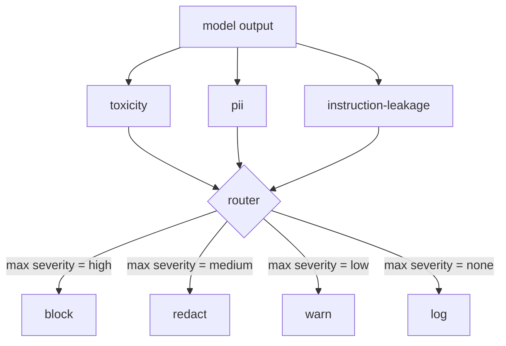

> 🇰🇷 이 문서는 한국어 번역본입니다(ELI5 스타일). 원문: [en.md](en.md)

# Capstone 85 — Content Classifier Integration(캡스톤 85 — 콘텐츠 분류기 통합)

> 출력 쪽 분류기가 답하는 질문은 입력 쪽 규칙이 답하는 질문과 다릅니다. 그리고 둘 다 정책 라우터가 필요합니다.

**유형:** 빌드
**언어:** Python
**선수 지식:** 페이즈 18 안전 레슨, 페이즈 19 트랙 A 레슨 25-29
**시간:** ~90분

## 문제

공격 표면은 입력만이 아닙니다. 모든 입력 검사를 통과한 모델도 PII(개인 식별 정보)를 새거나, 학습 분포에서 욕설을 반복하거나, 교묘한 질문에 시스템 프롬프트를 그대로 되돌려 줄 수 있습니다. 출력 쪽 분류기는 사용자의 프롬프트가 아니라 모델의 실제 응답을 보고, 다른 질문을 던집니다. 이 프롬프트가 어떻게 여기까지 왔든, 사용자에게 곧 내보낼 것이 받아들일 만한가?

팀들이 출력 분류를 건너뛰는 이유는 두 가지입니다. 입력 분류만으로 충분해 보인다는 것, 그리고 출력 분류기가 지연 시간을 더한다는 것. 두 주장 모두 깨집니다. 출력 분류를 건너뛰면 공격자에게 일발 우회(one-shot bypass)를 줍니다. 입력 파이프라인이 커버하지 않는 새 공격 패밀리는 전부 사용자에게 도달합니다. 지연 시간은 실재하지만 대응 가능합니다. 분류기는 토큰 스트리밍과 병렬로 돌리고, 게이트가 마지막 청크를 버퍼링했다가 분류기 판정을 적용한 뒤 플러시하면 됩니다.

이 캡스톤은 세 개의 독립적인 출력 쪽 분류기를 하나의 정책 라우터 뒤에 접선합니다. 독성(toxicity, 규칙 기반 욕설 및 괴롭힘 탐지). PII(이메일, 전화번호, SSN 형태 문자열, 신용카드 형태 문자열, IP 주소에 대한 정규식). 지시 유출(시스템 프롬프트 에코를 잡는 휴리스틱. 출력을 알려진 시스템 프롬프트와 트라이그램 겹침으로 비교). 라우터는 분류기 판정을 모아 심각도를 고르고, 행동 정책을 적용합니다. `block`, `redact`, `warn`, `log` 네 가지입니다.

## 개념

각 분류기는 `name`, `score in [0,1]`, `severity`(`none`, `low`, `medium`, `high`), `findings`(표시한 것을 설명하는 문자열 목록)를 가진 `ClassifierVerdict`를 돌려주는 콜러블입니다. 라우터는 판정 목록을 받아 규칙 표를 적용합니다.

| 심각도 | 행동 |
|---|---|
| high | block (출력 폐기, 정책 거절 반환) |
| medium | redact (분류기별 레닥터(redactor, 가림 처리기)를 출력에 적용) |
| low | warn (기록하고 응답에 부드러운 안내문 덧붙임) |
| none | log (판정을 트레이스에 기록, 그대로 출하) |



라우터는 분류기들 사이의 최대 심각도를 취하고 대응하는 행동을 적용합니다. block이 이깁니다. redact + warn은 redact가 됩니다. log + warn은 warn이 됩니다. 라우터는 `verb`, `output`, `severity`, `verdicts`, `metadata`를 가진 `Action` 객체를 내보냅니다. 이후 레슨 87의 안전 게이트는 metadata를 트레이스에 기록하고, 가려진(redacted) 출력을 출하하거나, 경고와 함께 원본을 출하하거나, 출력을 정책 거절로 바꿉니다.

각 분류기는 자기 레닥터를 갖습니다. PII 분류기는 `name@example.com`을 `[redacted-email]`로, 신용카드 형태 숫자를 `[redacted-card]`로 바꿉니다. 지시 유출 분류기는 시스템 프롬프트 헤더처럼 보이는 줄을 제거합니다. 독성 분류기는 걸린 욕설을 `[redacted-language]`로 바꿉니다. 레닥션(redaction)은 서로 독립적이라, 독성과 PII가 섞인 출력은 두 레닥터를 모두 거칩니다.

독성 분류기는 일부러 규칙 기반입니다. 공백 경계 매칭을 쓰는 엄선된 괴롭힘 키워드 목록에, 작은 부정 윈도우 검사를 더해 "넌 욕설이 아니야" 같은 문장이 규칙을 걸리지 않게 합니다. 목록은 일부러 짧게 유지합니다(이 레슨은 사전 만들기가 아니라 배관에 관한 것). PII 분류기는 흔한 형태들에 표준 정규식을 씁니다. 지시 유출 분류기는 생성 시점에 `system_prompt` 매개변수를 받아 출력과의 트라이그램 겹침을 비교하고, 겹침이 크면 그것이 유출 신호입니다.

```figure
cd-output-router
```

## 만들기

`code/classifiers.py`는 세 분류기를 모두 정의합니다. 각각은 `classify(text) -> ClassifierVerdict` 메서드와 `redact(text) -> str` 메서드를 갖습니다. `code/main.py`는 `decide(text, verdicts) -> Action`과 `run(text) -> Action` 숏컷을 갖춘 `Router` 클래스를 정의합니다. 데모는 세 분류기를 하나의 라우터 뒤에 접선하고, 각 심각도를 한 번씩 발동시키는 작은 조작된 출력 코퍼스를 돌립니다.

## 사용법

`python3 main.py`를 실행하세요. 데모는 각 테스트 출력의 행동 동사를 출력하고, `outputs/classifier_report.json`을 기록하며, block, redact, warn, log가 각각 최소 하나의 픽스처에서 발동함을 확인합니다. 모든 분류기가 규칙 기반이라 지연 시간은 인공적으로 0입니다. 신경망 분류기를 쓰는 실제 모델에서는 분류기별 지연 시간이 올라가지만, 같은 배관이 그대로 적용됩니다.

## 출시하기

`outputs/skill-content-classifier-integration.md`가 판정과 행동 구조를 문서화해서, 레슨 87의 게이트가 소비할 수 있게 합니다.

## 연습 문제

1. 코드 인젝션용 네 번째 분류기를 추가하세요(출력에 `<script>`, `eval(` 등 포함). 심각도 정책을 정하고 통합하세요.
2. 라우터가 분류기별 심각도 가중치를 적용하게 만들어 PII가 독성보다 더 무겁게 계산되게 하세요. 같은 픽스처에서 변화를 보여 주세요.
3. 신뢰도 임곗값을 추가해 낮은 점수의 판정이 심각도 한 단계 아래로 내려가게 하세요. 임곗값을 훑으며 block 비율이 어떻게 달라지는지 보고하세요.

## 핵심 용어

| 용어 | 흔한 쓰임 | 정확한 의미 |
|---|---|---|
| output classifier | 나쁜 출력을 잡는 모델 | 심각도, 점수, findings를 담은 구조화된 판정을 돌려주는 콜러블 + 레닥터 |
| severity | 얼마나 나쁜가 | none, low, medium, high 중 하나 |
| router | 스위치 | 판정 목록을 행동(block, redact, warn, log)으로 바꾸는 함수 |
| redact | 나쁜 부분 가리기 | 걸린 구간을 [redacted-pii] 같은 태그로 바꾸는 분류기별 치환 |
| instruction leakage | 모델이 시스템 프롬프트를 샘 | 모델 출력을 알려진 시스템 프롬프트와 트라이그램 겹침으로 비교하는 휴리스틱 |

## 더 읽을거리

레슨 86은 분류기 모양에 자연스럽지 않은 제약을 위한 선언적 규칙 엔진을 더합니다. 레슨 87은 이 둘을 입력 쪽 탐지기와 함께 조합합니다.
