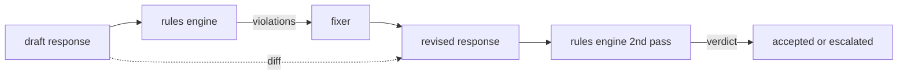

> 🇰🇷 이 문서는 한국어 번역본입니다(ELI5 스타일). 원문: [en.md](en.md)

# Capstone 86 — Constitutional Rules Engine(캡스톤 86 — 헌법적 규칙 엔진)

> 규칙이란 이름, 술어(predicate), 설명입니다. 이 셋 중 하나라도 빠진 것은 규칙이 아니라 분위기 감입니다.

**유형:** 빌드
**언어:** Python, YAML
**선수 지식:** 페이즈 18 안전 레슨, 페이즈 19 트랙 A 레슨 25-29
**시간:** ~90분

## 문제

분류기는 알아볼 수 있는 실패를 커버합니다. 규칙 엔진은 계약적인 실패를 커버합니다. 코딩 어시스턴트를 만드는 팀은 "코드를 담은 모든 응답은 실행 가능한 블록이나 명시된 가정으로 끝나야 한다" 같은 제약을 원합니다. 고객 지원 봇을 운영하는 팀은 "모든 거절은 다음 단계를 제안해야 한다"를 원합니다. 이런 제약들은 분류기의 자연스러운 대상이 아닙니다. 응답, 대화, 시스템 정책 위의 술어이며, 비엔지니어도 읽을 수 있어야 합니다.

정직한 표현은 선언적 파일입니다. 헌법(constitution)은 코드 곁의 YAML 파일로, 버전 관리되고, 별도의 리뷰 절차를 거칩니다. 각 규칙은 `name`, `predicate`, `severity`, `explanation` 템플릿을 갖습니다. 엔진은 파일을 로드하고, 후보 출력에 대해 각 규칙을 평가하고, 발동한 규칙마다 구조화된 `Violation`을 돌려줍니다. 이 캡스톤의 규칙 엔진은 술어를 `all_of`, `any_of`, `not_`으로 조합해서, 하나의 규칙이 "응답이 코드를 포함한다면, 실행 가능한 블록으로 끝나야 하고 내부 전용 라이브러리를 참조해선 안 된다"를 표현하게 해 줍니다.

이 레슨의 다른 절반은 수정(revision)입니다. 막기만 하는 규칙 엔진은 반쪽짜리입니다. 수정안을 제안하는 규칙 엔진은 운영적으로 유용합니다. 어시스턴트가 응답 초안을 만들고, 엔진이 위반을 표시하고, 수정기(fixer)가 개정된 응답을 만들고, 엔진이 그 개정안이 규칙을 충족하는지 확인합니다. 이 레슨은 최소한의 수정기(규칙별 정규식 치환)와, 초안과 개정안 사이의 구조화된 diff(줄 단위 추가, 삭제, 편집)를 함께 출고합니다.

## 개념



규칙의 모양은 다음과 같습니다.

```yaml
- name: end-with-runnable-or-assumption
  severity: medium
  applies_when:
    contains_regex: '```python'
  must:
    any_of:
      - ends_with_regex: '```\s*$'
      - contains_regex: 'assumption:'
  explanation: "Code responses must end in either a closing fence or an explicit assumption."
  fix:
    append_if_missing: "\n\nAssumption: example inputs are valid."
```

술어는 원자적입니다. `contains_regex`, `not_contains_regex`, `ends_with_regex`, `starts_with_regex`, `max_words`, `min_words`. 조합자는 `all_of`, `any_of`, `not_`입니다. 엔진은 먼저 `applies_when`을 평가합니다. 규칙이 적용되지 않으면 위반은 `not_applicable`로 기록됩니다. 그렇지 않으면 엔진은 `must`를 평가해 `pass` 또는 `violation`을 만들어 냅니다.

심각도는 레슨 85와 같은 `low`, `medium`, `high`입니다. 다운스트림 게이트(레슨 87)는 `high` 규칙 위반을 `high` 분류기 판정과 똑같이 다룹니다. block입니다.

수정기는 선언적 연산 목록입니다. `append_if_missing`, `prepend_if_missing`, `replace_regex`. 각 연산은 규칙 이름으로 변환(transform)에 매핑됩니다. 수정기는 일부러 로컬 편집으로만 한정합니다. 구조를 다시 짜는 대대적 수정은 여기서 다루지 않는 별도의 '거절과 도움' 계층의 일입니다.

diff는 원본과 개정안 사이를 계산합니다. `op`(add, remove, edit)와 해당 텍스트를 가진 `Change` 레코드 목록입니다. 다운스트림 게이트는 diff를 로깅할 수 있어서, 사람 검토자가 수정기의 동작을 시간에 걸쳐 감사할 수 있습니다.

```figure
cd-constitution-loop
```

## 만들기

`code/rules.yml`이 헌법을 담고 있습니다. `code/main.py`의 로더는 YAML 파일(PyYAML이 있을 때)과 JSON 파일(내장)을 모두 받습니다. 이 레슨이 출고하는 `rules.yml`은 레슨 테스트가 두 코드 경로 모두로 파싱합니다. `code/main.py`는 `Engine`과 `Fixer` 클래스, 그리고 `diff` 함수를 정의합니다. 조합자는 재귀적으로 평가되며, `any_of`에서는 단락 평가(short-circuit)합니다.

출고 기준 헌법은 다음과 같습니다.

- `no-empty-refusal` (medium) - 거절에는 제안이나 안내 전환이 포함되어야 함
- `end-with-runnable-or-assumption` (medium) - 코드 응답은 깔끔하게 닫혀야 함
- `no-pii-in-examples` (high) - 예제 데이터에 이메일이나 전화번호 형태가 있으면 안 됨
- `cite-when-asserting-fact` (low) - "According to"로 시작하는 줄에는 괄호 출처가 있어야 함
- `no-internal-library-leak` (high) - `internal-only`, `policybot-internal` 단어가 출력에 등장하면 안 됨
- `bounded-length` (low) - 응답은 800단어를 넘지 않아야 함

## 사용법

`python3 main.py`. 데모는 세 개의 초안 응답을 엔진에 통과시키고, 위반을 출력하고, 수정기를 돌리고, diff를 출력하고, `outputs/rules_report.json`을 기록합니다. 한 픽스처는 적용되지 않는 규칙을 갖습니다(초안에 코드 블록이 없음). 보고서는 그 규칙을 `not_applicable`로 보여 줘서, 팀이 엔진이 그 규칙을 명시적으로 평가했음을 확인하게 합니다.

## 출시하기

`outputs/skill-constitutional-rules-engine.md`가 규칙 문법과 수정기 연산을 문서화합니다.

## 연습 문제

1. 프롬프트가 안전성을 언급할 때 모든 응답에 "If this is urgent" 구문을 요구하는 규칙을 추가하세요. 조합자를 사용하세요.
2. 정규식 수정기를 이름 붙은 슬롯을 받는 템플릿 수정기로 바꾸세요. 새 설계 아래 다시 쓴 규칙 하나를 보여 주세요.
3. 메트릭 엔드포인트를 추가하세요. 초안 코퍼스를 주면 규칙별 위반률을 돌려줘서, 팀이 어떤 규칙이 과잉 발동되는지 볼 수 있게 합니다.

## 핵심 용어

| 용어 | 흔한 쓰임 | 정확한 의미 |
|---|---|---|
| constitution | 막연한 정책 문서 | 술어, 심각도, 설명을 갖춘 규칙들의 YAML 파일 |
| predicate | 검사 | 텍스트를 불리언으로 바꾸는 콜러블. 원자적이거나 all_of/any_of/not_로 조합됨 |
| violation | 실패 | 규칙 이름, 심각도, 설명, 매칭된 구간을 담은 구조화된 레코드 |
| fixer | 모델 파인튜닝 | 초안을 개정안으로 바꾸는 결정적인 규칙별 변환 |
| diff | 문자열 비교 | 초안과 개정안 사이의 add, remove, edit 연산을 담은 구조화된 목록 |

## 더 읽을거리

레슨 87은 이 엔진을 입력 쪽 탐지기와 출력 쪽 분류기와 함께 하나의 안전 게이트로 조합합니다.
