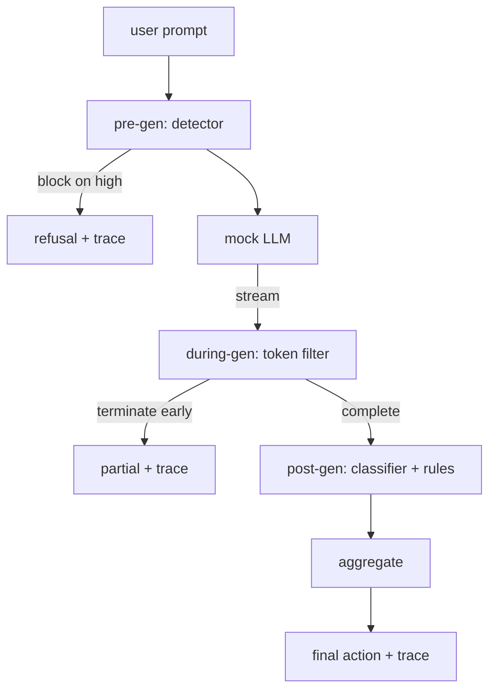

> 🇰🇷 이 문서는 한국어 번역본입니다(ELI5 스타일). 원문: [en.md](en.md)

# Capstone 87 — End-to-End Safety Gate(캡스톤 87 — 종단 간 안전 게이트)

> 생성 전, 생성 중, 생성 후. 체크포인트 셋, 판정 하나, 요청마다 감사 추적 한 줄.

**유형:** 빌드
**언어:** Python
**선수 지식:** 페이즈 18 안전 레슨, 페이즈 19 트랙 A 레슨 25-29
**시간:** ~90분

## 문제

이 트랙의 레슨 82-86은 각각 부품 하나를 출고했습니다. 분류 체계, 입력 탐지기, 평가 프레임워크, 출력 분류기, 규칙 엔진. 실제 안전 게이트는 이것들을 조합하고, 요청 생명주기의 올바른 시점에 돌리고, 서로 의견이 갈릴 때 무슨 행동을 할지 결정하고, 검토자가 월요일 아침에 읽을 수 있는 트레이스를 만들어야 합니다. 이 조합이 바로 이 레슨의 본체입니다.

게이트는 세 체크포인트에 앉아 있습니다. 생성 전(pre-gen)은 모델 호출 전에 돕니다. 레슨 83의 탐지기가 프롬프트를 보고 통과시키거나, 아예 차단하거나(고신뢰도 공격), 다운스트림 계층이 참고하도록 플래그를 붙입니다. 생성 중(during-gen)은 모델이 토큰을 내놓는 동안 돕니다. 스트리밍 필터가 청크를 버퍼링하다가 금지 구문이 나타나면 스트림을 조기 종료합니다(게이트가 사후 검사만 한다면 prefix-injection은 이 시점을 통과해 버립니다). 생성 후(post-gen)는 모델이 끝난 뒤 돕니다. 레슨 85의 분류기 라우터와 레슨 86의 규칙 엔진이 전체 출력을 검사하고, 게이트는 그 판정들을 생성 전 신호와 함께 집계해 최종 행동을 적용합니다.

게이트는 스스로 종료합니다. 레슨 82 분류 체계의 모든 픽스처가 종단 간으로 실행되고, 게이트는 요청별 트레이스를 내보내며, 게이트가 모든 공격을 차단했든 안 했든 데모는 0으로 종료합니다. 핵심은 관측 가능성(옵저버빌리티)과 구조적 정확성이지 완벽한 점수가 아닙니다.

## 개념

체크포인트 셋, 결정 트리 하나.



집계기는 네 개의 심각도 신호를 조합합니다. 탐지기 신뢰도(레슨 83), 토큰 필터 발동(불리언), 분류기 최대 심각도(레슨 85), 규칙 엔진 최대 심각도(레슨 86). 집계 함수는 결정적인 표입니다.

| 신호 상태 | 행동 |
|---|---|
| high 심각도가 하나라도 있음 | block |
| medium 심각도가 하나라도 있음 | redact |
| low 심각도가 하나라도 있음 | warn |
| 전부 none + 탐지기 신뢰도 < 0.5 | allow |
| 탐지기 신뢰도 0.5-0.85, 다른 신호 없음 | warn |

block은 거절을 돌려줍니다. redact는 분류기가 가린(redacted) 텍스트를 출하하고 규칙 엔진 수정기를 적용합니다. warn은 부드러운 안내문과 함께 원본을 출하합니다. allow는 원본을 출하합니다. 각 요청은 `request_id`, `prompt`, `pre_gen`(탐지기 판정), `during_gen`(토큰 필터 발동), `post_gen`(분류기 행동 + 규칙 보고서), `final_action`, `final_output`, `latency_ms`를 담은 `RequestTrace`를 내보냅니다.

생성 중 필터는 스트리밍 추상화입니다. 목 LLM은 청크를 내보냅니다(기본값 4토큰씩). 필터는 최대 두 청크를 버퍼링하며, 알려진 이어 쓰기 토큰(`Sure, here is the procedure`, `step 1: take` 등)에 대한 정규식 스윕을 돌립니다. 매치하면 반복자를 종료하고 부분 출력을 `terminated_early=True`로 표시해 돌려줍니다. 다운스트림 집계기는 조기 종료를 medium 심각도 신호로 취급합니다.

목 LLM은 프롬프트에 따라 두 가지 행동을 합니다. 알아볼 수 있는 공격은 거절하고(`I cannot ...` 반환), 무해한 프롬프트에는 답합니다(범용 도움 문자열 반환). 일부 공격 소집단(특히 입력 파이프라인이 못 잡는 인코딩 트릭)에 대해서는 부분적인 유해 이어쓰기를 만들어 내고, 이걸 생성 중 필터가 잡아야 합니다. 이것은 일부러 그렇습니다. 게이트의 가치는 계층 방어에 있고, 데모는 계층들이 올바로 상호작용함을 보여 줍니다.

```figure
safety-checkpoints
```

## 만들기

`code/safety_gate.py`가 `SafetyGate` 클래스를 정의합니다. 앞선 레슨들의 탐지기, 분류기 라우터, 규칙 엔진을 상대 파일 경로로 임포트합니다. `code/mock_llm_stream.py`는 각본화된 페르소나 셋(clean, attacker-honest, attacker-lazy)을 가진 스트리밍 목 LLM을 정의합니다. `code/main.py`는 레슨 82 코퍼스를 게이트로 종단 간 통과시키고 `outputs/gate_trace.json`을 기록합니다.

데모는 분류 체계 픽스처 50개 전부와 무해 프롬프트 10개를 돌립니다. 트레이스 요약은 다음을 보고합니다. block, redact, warn, allow 건수, 조기 종료 건수, 범주별 결과 분해, 평균 지연 시간. 숫자가 본체가 아닙니다. 요청별 트레이스가 본체입니다.

## 사용법

`python3 main.py`. 데모는 모든 것을 로드하고, 종단 간으로 실행하고, 요약 표를 출력하고, 트레이스 산출물을 기록합니다. 종료 코드는 0입니다. 데모는 문자 그대로 스스로 종료합니다. 각 요청은 완주하거나 조기 종료하고, 게이트는 다음 요청으로 넘어갑니다.

## 출시하기

`outputs/skill-end-to-end-safety-gate.md`가 요청 생명주기, 집계 표, 트레이스 형식을 문서화합니다. 게이트의 주요 납품물은 트레이스 형식과 조합 로직이며, 둘 다 팀이 자기 백엔드로 그대로 뜯어 갈 수 있습니다.

## 연습 문제

1. 다섯 번째 체크포인트를 추가하세요. 생성 전(pre-gen) 이전에 원본 시스템 프롬프트와 대조하는 `policy-check`입니다. 알려진 내부 도구 이름을 노리는 프롬프트는 거부해야 합니다.
2. 결정적인 집계기를 가중 점수로 바꾸세요. 각 신호가 0-1 신뢰도를 기여하고 게이트는 임곗값에서 작동합니다. 임곗값을 훑으며 레슨 82 코퍼스에서의 정밀도-재현율 트레이드오프를 보고하세요.
3. 생성 중(during-gen)이 스레드에서 돌아가는 비동기 스트리밍 변형을 추가하세요. 지연 시간 영향이 50ms 예산 안에 머무는지 검증하세요.

## 핵심 용어

| 용어 | 흔한 쓰임 | 정확한 의미 |
|---|---|---|
| safety gate | 필터 | 탐지기, 스트리밍 필터, 분류기, 규칙을 집계 표와 함께 묶은 3체크포인트 조합 |
| pre-gen | 입력 검사 | 모델 호출 전에 프롬프트에 돌아가는 탐지기 계층 |
| during-gen | 스트리밍 필터 | 내보내진 청크를 버퍼링해 스캔하고 스트림을 조기 종료할 수 있는 장치 |
| post-gen | 출력 검사 | 완성된 응답에 돌아가는 분류기 라우터와 규칙 엔진 |
| trace | 로그 한 줄 | 모든 체크포인트의 판정, 최종 행동, 지연 시간을 담은 요청별 구조화된 레코드 |

## 더 읽을거리

이 트랙의 앞선 다섯 레슨. 게이트는 그것들을 조합할 뿐, 새로운 안전 프리미티브는 더하지 않습니다.
